# Movie Rating Prediction

**An end-to-end machine-learning regression system that predicts the IMDb rating of Indian movies from movie
metadata — release year, runtime, genres, director and lead cast.**

| | |
|---|---|
| **Internship** | CodSoft Data Science Virtual Internship |
| **Task mapping** | Local folder `Task1_Movie_Rating_Prediction` = **CodSoft Task 2 — Movie Rating Prediction with Python** |
| **Problem type** | Supervised **regression** (continuous target) |
| **Target variable** | `Rating` — IMDb rating on a 1–10 scale |
| **Dataset** | `IMDb Movies India.csv` — 15,509 rows × 10 columns |
| **Final model** | `GradientBoostingRegressor` (tuned), persisted as a full preprocessing + model pipeline |
| **Final test performance** | MAE **0.8862** · RMSE **1.1599** · R² **0.3046** on 1,584 held-out films |
| **Core stack** | Python 3.13 · pandas · NumPy · scikit-learn · Matplotlib · Seaborn · joblib · Jupyter · Streamlit · Plotly |
| **Status** | Complete — audit → preprocessing → modelling → validation → final evaluation → persistence → dashboard |

Every number in this document comes from the notebooks and source files in this repository. Nothing is estimated
or carried over from outside the project.

---

## Table of Contents

1. [Project Overview](#1-project-overview)
2. [CodSoft Internship Context](#2-codsoft-internship-context)
3. [Problem Statement](#3-problem-statement)
4. [Project Objectives](#4-project-objectives)
5. [Dataset](#5-dataset)
6. [Dataset Audit (Phase 1)](#6-dataset-audit-phase-1)
7. [Data Cleaning and Preprocessing (Phase 2)](#7-data-cleaning-and-preprocessing-phase-2)
8. [Data Leakage Prevention](#8-data-leakage-prevention)
9. [Train/Test Split Strategy](#9-traintest-split-strategy)
10. [Feature Engineering](#10-feature-engineering)
11. [Machine Learning Pipeline](#11-machine-learning-pipeline)
12. [Model Training and Baseline Comparison (Phase 3)](#12-model-training-and-baseline-comparison-phase-3)
13. [Cross-Validation, Tuning and Ablation (Phase 4)](#13-cross-validation-tuning-and-ablation-phase-4)
14. [Final Evaluation (Phase 5)](#14-final-evaluation-phase-5)
15. [Error Analysis](#15-error-analysis)
16. [Model Persistence (Phase 6)](#16-model-persistence-phase-6)
17. [Prediction API](#17-prediction-api)
18. [Interactive Streamlit Dashboard](#18-interactive-streamlit-dashboard)
19. [Visualizations](#19-visualizations)
20. [Project Structure](#20-project-structure)
21. [Installation](#21-installation)
22. [Usage](#22-usage)
23. [Reproducibility and Validation](#23-reproducibility-and-validation)
24. [Results Summary](#24-results-summary)
25. [Limitations](#25-limitations)
26. [Future Improvements](#26-future-improvements)
27. [Technology Stack](#27-technology-stack)
28. [Phase Index](#28-phase-index)

---

## 1. Project Overview

This project builds, validates and packages a **regression model** that estimates the IMDb rating of an Indian
film from the descriptive information available about it.

### Why this is a regression problem

The target, `Rating`, is a **continuous numeric value** on the IMDb 1–10 scale. In the dataset it takes 84
distinct values recorded to one decimal place, ranging from **1.1 to 10.0** with a mean of **5.842** and a standard
deviation of **1.382**. Because the target is an ordered continuous quantity rather than a set of classes, the task
is formulated as regression and scored with MAE, MSE, RMSE and R² — never with classification "accuracy".

### What is predicted, and from what

| Role | Fields | Notes |
|---|---|---|
| **Prediction target** | `Rating` | Never used as an input to any feature |
| **Model input features** | `Year`, `Duration`, `Genre`, `Director`, `Actor 1`, `Actor 2`, `Actor 3` | The seven fields fed to the pipeline |
| **Training-time only** | `Rating` (label), `Votes` (EDA and diagnostics) | `Votes` is parsed and analysed but excluded from the model |
| **Identifier, not a feature** | `Name` | Near-unique per row; used for grouping and readable output only |

### Why the task is non-trivial

- **The metadata is sparse.** `Duration` is missing for 53.3% of all rows, `Genre` for 12.1%, and the actor columns
  for 10–20%.
- **Half the dataset has no label.** Only **7,919 of 15,509** rows (51.1%) carry a rating and can be used for
  supervised learning.
- **The categorical fields are extremely high-cardinality.** There are 5,938 distinct directors and 10,288 distinct
  actors across the three actor columns; 64.4% of directors in the labelled data appear in exactly one film.
- **Genres are multi-label.** 485 distinct genre strings are built from only 24 individual genre labels.
- **Near-duplicate records exist.** 36 rows share a `Name` + `Year` with another row while differing elsewhere, which
  makes naive random splitting unsafe.
- **Individual signals are weak.** On the labelled rows, `Year` correlates with `Rating` at Pearson r ≈ −0.167
  (Spearman −0.128) and `Duration` at r ≈ −0.031 (Spearman −0.024).

### Overall workflow

Six sequential phases, each in its own notebook, each verifying the raw dataset checksum before doing anything:

```
Phase 1  Dataset Audit                → notebooks/01_dataset_audit.ipynb
Phase 2  Data Cleaning & Preprocessing → notebooks/02_data_preprocessing.ipynb + src/data_preprocessing.py
Phase 3  Model Training & Evaluation   → notebooks/03_model_training.ipynb
Phase 4  Model Improvement & Feature Analysis → notebooks/04_model_improvement.ipynb
Phase 5  Final Evaluation              → notebooks/05_final_evaluation.ipynb
Phase 6  Model Persistence & Prediction Pipeline → notebooks/06_model_persistence.ipynb + src/predict.py
         Interactive dashboard         → app.py
```

---

## 2. CodSoft Internship Context

This project was completed as part of the **CodSoft Data Science Virtual Internship**.

| Item | Detail |
|---|---|
| Internship | CodSoft Data Science Virtual Internship |
| CodSoft task | **Task 2 — Movie Rating Prediction with Python** |
| Local folder | `Task1_Movie_Rating_Prediction` |
| Why the numbering differs | The folder number reflects the author's own ordering of the three projects selected for the internship. `Task1_…` locally is CodSoft's Task 2. The folder name is intentional and is not renamed. |
| Assignment objective | Build a model that predicts the rating of a movie based on features such as genre, director and actors, using regression techniques, and analyse historical movie data to estimate the rating a film receives. |

### Scope of this repository

Included: dataset audit, cleaning, feature engineering, model training and comparison, cross-validation, controlled
tuning, feature ablation, permutation importance, a single final holdout evaluation, model persistence, a reusable
prediction API, and an interactive dashboard.

Not included: any change to the raw dataset, any model beyond the documented candidates, any external data source,
and any deployment to a hosted environment.

---

## 3. Problem Statement

> **Given the descriptive metadata of a movie — its release year, runtime, genre labels, director and three
> credited lead actors — predict the IMDb rating that the movie receives, as a continuous value on the 1–10 scale.**

| Aspect | Definition |
|---|---|
| **Input** | A single movie record with the fields `Year`, `Duration`, `Genre`, `Director`, `Actor 1`, `Actor 2`, `Actor 3`. Any field except `Year` may be missing. |
| **Output** | One floating-point number: the predicted rating on the IMDb 1–10 scale. |
| **Formulation** | Supervised regression, `f(metadata) → rating`, trained by minimising squared error on labelled historical films. |
| **Evaluation** | MAE, MSE, RMSE and R² on films the model has never seen, against a mean-rating baseline. |
| **Practical interpretation** | The output is a **statistical estimate** of where a film's rating is likely to fall given comparable films in the training data. It is not a forecast of any individual film's actual reception, and the project documents exactly where the estimate is weakest (Sections 15 and 25). |

A deliberate modelling assumption shapes the input set: **`Votes` is excluded from the primary model.** Vote counts
accumulate after release, so they may not be available at the moment a prediction is wanted. The project treats this
as an assumption about the prediction scenario, not as a claim that `Votes` is inherently leakage, and documents it
consistently from Phase 2 onward.

---

## 4. Project Objectives

Each objective below is implemented somewhere in this repository; the phase that fulfils it is named.

| # | Objective | Where it is done |
|---|---|---|
| 1 | Audit the raw dataset and record what it actually contains | Phase 1 |
| 2 | Parse the text-encoded fields (`Year`, `Duration`, `Votes`) into usable numbers without guessing values | Phase 2 |
| 3 | Decide and document a missing-value strategy per column instead of applying a blanket fill | Phase 2 |
| 4 | Engineer features for multi-label genres and high-cardinality person columns | Phase 2 |
| 5 | Keep the target out of every feature — no target encoding, no rating-derived statistics | Phases 2–6 |
| 6 | Create a **group-aware** train/test split so near-duplicate films cannot straddle the split | Phase 3 |
| 7 | Establish a mean-rating baseline that any model must beat | Phases 3–5 |
| 8 | Compare several regression models under identical conditions | Phase 3 |
| 9 | Validate with **group-aware 5-fold cross-validation** rather than one split | Phase 4 |
| 10 | Tune candidate models with a small, explainable search | Phase 4 |
| 11 | Quantify each feature group's contribution by ablation and permutation importance | Phase 4 |
| 12 | Check whether the preprocessing thresholds are reasonable | Phase 4 |
| 13 | Produce one unbiased final evaluation on a test set untouched during development | Phase 5 |
| 14 | Analyse where and how the model fails | Phases 3–5 |
| 15 | Persist the fitted preprocessing **and** model as a single artifact | Phase 6 |
| 16 | Expose a simple prediction interface that needs no knowledge of the pipeline | Phase 6 (`src/predict.py`) |
| 17 | Provide an interactive interface for demonstrating the project without notebooks | `app.py` |
| 18 | Make every phase reproducible and verifiable | All phases (92 automated checks in total) |

---

## 5. Dataset

| Property | Value |
|---|---|
| File | `dataset/IMDb Movies India.csv` |
| Rows | **15,509** |
| Columns | **10** |
| Encoding | **`latin-1`** — the file is *not* valid UTF-8 |
| Target column | `Rating` |
| Rows with a target | **7,919** (51.1%) |
| SHA-256 | `68295a15943a675f38fe8c49af8f5d51b4b833aadb8a4da79da74b0a61c36479` |
| Modification policy | Read-only. Every notebook asserts the checksum before and after running. |

### Why `latin-1`

Phase 1 decodes the raw bytes and finds the file is not valid UTF-8 (it fails at byte `0xE1`). All non-ASCII bytes
fall in the `0xA0–0xFF` range, where Latin-1 and Windows-1252 agree, so `latin-1` decodes every character
unambiguously — for example `Haré Rama Haré Krishna`, `Kabhi Ajnabi Thé` and `Vaña Vaasiyon`. The loader
`dp.load_raw_data()` applies this encoding centrally so no notebook has to repeat it.

### Original columns

| Column | Raw type | Description | Role in the project |
|---|---|---|---|
| `Name` | text | Movie title | Identifier; part of the grouping key; **not** a model feature |
| `Year` | text, e.g. `"(2019)"` | Release year in parentheses | Parsed to a number; **model feature** |
| `Duration` | text, e.g. `"109 min"` | Runtime in minutes | Parsed to a number; **model feature** |
| `Genre` | text, comma-separated | One to three genre labels, e.g. `"Drama, Romance"` | Split into individual labels; **model feature** |
| `Rating` | float | IMDb rating, 1–10 | **Prediction target** |
| `Votes` | text, e.g. `"25,732"` | Number of votes behind the rating | Parsed for EDA and error diagnostics; **excluded from the model** |
| `Director` | text | Director name | Frequency + selective one-hot; **model feature** |
| `Actor 1` | text | First credited actor | Frequency + selective multi-hot; **model feature** |
| `Actor 2` | text | Second credited actor | Frequency + selective multi-hot; **model feature** |
| `Actor 3` | text | Third credited actor | Frequency + selective multi-hot; **model feature** |

As loaded by pandas, **only `Rating` is numeric**. `Year`, `Duration` and `Votes` hold numeric information inside
formatted text and require parsing; the remaining columns are free text.

---

## 6. Dataset Audit (Phase 1)

Notebook: **`notebooks/01_dataset_audit.ipynb`** (38 code cells, 14 sections). The audit is strictly read-only: no
rows are dropped, no values are imputed, and the CSV is never written.

### 6.1 Dimensions and column overview

15,509 rows × 10 columns. Distinct values per column, from the audit:

| Column | Non-null | Missing | Distinct values |
|---|---|---|---|
| `Name` | 15,509 | 0 | 13,838 |
| `Year` | 14,981 | 528 | 102 |
| `Duration` | 7,240 | 8,269 | 182 |
| `Genre` | 13,632 | 1,877 | 485 |
| `Rating` | 7,919 | 7,590 | 84 |
| `Votes` | 7,920 | 7,589 | 2,034 |
| `Director` | 14,984 | 525 | 5,938 |
| `Actor 1` | 13,892 | 1,617 | 4,718 |
| `Actor 2` | 13,125 | 2,384 | 4,891 |
| `Actor 3` | 12,365 | 3,144 | 4,820 |

### 6.2 Missing-value analysis

Share of missing values per column, all rows:

| Column | Missing | % |
|---|---|---|
| `Duration` | 8,269 | 53.32% |
| `Rating` | 7,590 | 48.94% |
| `Votes` | 7,589 | 48.93% |
| `Actor 3` | 3,144 | 20.27% |
| `Actor 2` | 2,384 | 15.37% |
| `Genre` | 1,877 | 12.10% |
| `Actor 1` | 1,617 | 10.43% |
| `Year` | 528 | 3.40% |
| `Director` | 525 | 3.39% |
| `Name` | 0 | 0.00% |

Two structural findings:

- **`Rating` and `Votes` are missing together.** A cross-tabulation shows 7,919 rows with both present, 7,589 with
  both absent, and exactly **one** row with `Votes` but no `Rating`.
- **8 rows contain only a title** and nothing else.

Restricted to the 7,919 rows that have a rating — the only rows usable for supervised learning — missingness is far
smaller for everything except `Duration`:

| Column (rated rows only) | Missing | % |
|---|---|---|
| `Duration` | 2,068 | 26.11% |
| `Actor 3` | 292 | 3.69% |
| `Actor 2` | 200 | 2.53% |
| `Actor 1` | 125 | 1.58% |
| `Genre` | 102 | 1.29% |
| `Director` | 5 | 0.06% |
| `Year` | 0 | 0.00% |

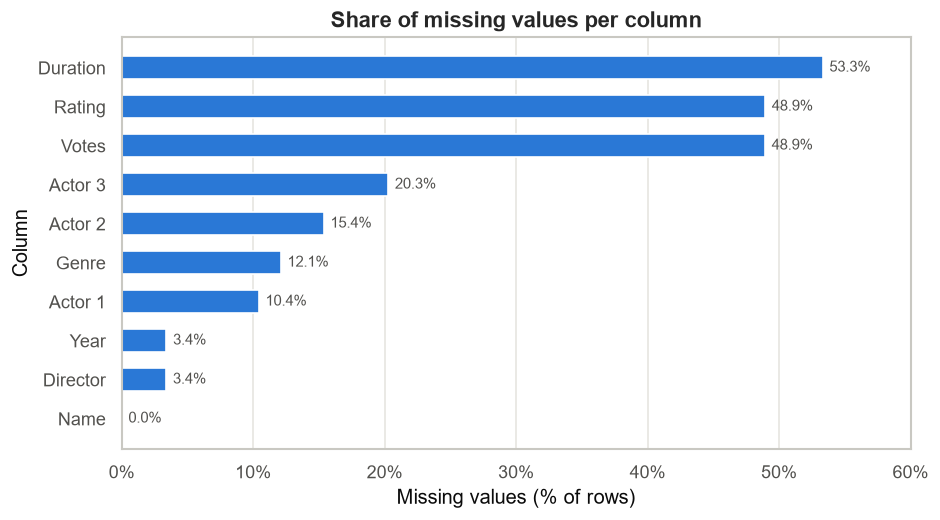

### 6.3 Duplicate analysis

| Check | Result |
|---|---|
| Exact duplicate rows (excluding first occurrence) | **6** (0.04%) — 12 rows involved |
| Exact duplicates among rated rows | **0** |
| Rows sharing `Name` + `Year` but *not* identical | **36** |
| `Name` + `Year` repeats among rated rows | **3** pairs (6 rows) |

The three rated repeats are informative: `India's Daughter (2015)` and `Vikram (1986)` have **different directors
and casts** — likely distinct films sharing a title — whereas `Sant Dnyaneshwar (1940)` has the **same director and
cast** but different genre, duration, vote count and rating, so it may be two records of one film. The project does
not guess; it retains all of them, flags them with a `name_year_repeat` column, and handles them through group-aware
splitting (Section 9).

### 6.4 Target variable analysis

| Statistic | Value |
|---|---|
| Rows with a rating | 7,919 (51.06%) |
| Mean | 5.842 |
| Median | 6.000 |
| Standard deviation | 1.382 |
| Minimum / maximum | 1.1 / 10.0 |
| Skewness | −0.346 |
| Distinct values | 84 |
| Decimal places | 1 (verified for every value) |
| Values outside [1, 10] | 0 |

The distribution is unimodal with a longer left tail, so the mean sits slightly below the median.

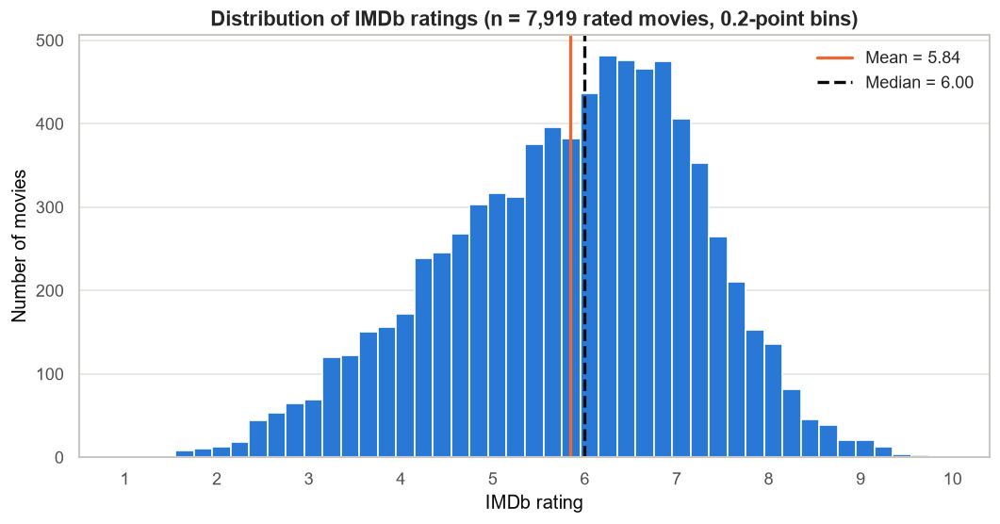

### 6.5 Data-quality investigation

| Field | Finding |
|---|---|
| `Year` | All 14,981 non-null values match the exact pattern `"(YYYY)"`. Parsed range **1913–2022**; among rated rows **1917–2021**. No implausible years. |
| `Duration` | All 7,240 non-null values match `"<N> min"`. Parsed range **2–321 minutes**. Entries of **2, 21 and 37 minutes** were investigated individually. |
| `Votes` | 7,919 of 7,920 values are digits with thousands separators (1,371 contain a comma). **One value is `"$5.16M"`** — a currency-like string that is not a vote count, and the only row with `Votes` but no `Rating`. |
| `Rating` | All values lie in [1, 10] with one decimal. The smallest vote count behind a rating is **5**, so some ratings rest on very few votes. |
| `Name` | One blank (whitespace-only) title; 3 titles begin with `#`; 3 titles contain accented characters. |
| Genres | 485 distinct genre strings built from **24** individual labels. `Music` and `Musical` exist as **separate** labels and are not merged. |
| People | 5,938 directors; 10,288 distinct actors across the three columns. 65.6% of directors and about 67% of names in each actor column appear exactly once. |

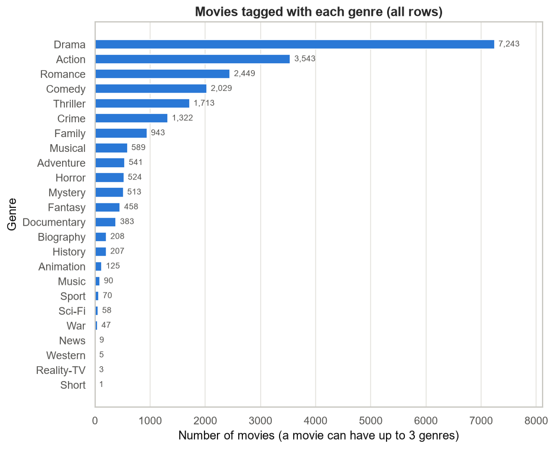

### 6.6 Initial relationships with the target

Measured on the 7,919 rated rows (exploratory; associations only, not causes):

| Feature | Pairs | Pearson r | Spearman ρ |
|---|---|---|---|
| `Year` | 7,919 | −0.167 | −0.128 |
| `Duration` (minutes) | 5,851 | −0.031 | −0.024 |
| `log10(Votes)` | 7,919 | +0.140 | +0.137 |

Grouped views add nuance that the linear correlations miss: median ratings are highest for 1940s–1970s films,
lowest for the 1990s–2000s, and rise again for the 2010s–2020s, while genre medians range from 7.70 (Documentary)
down to 4.70 (Horror).

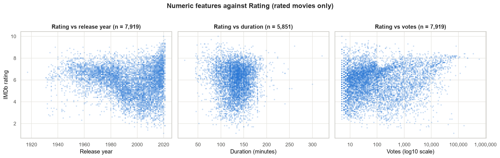
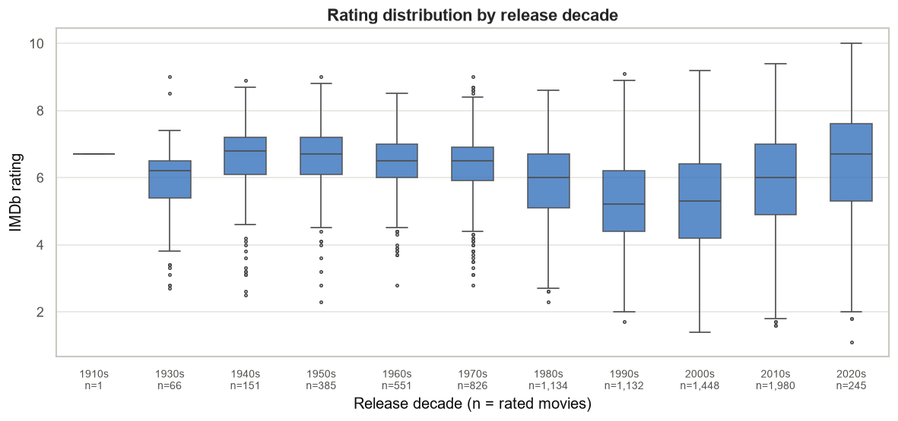
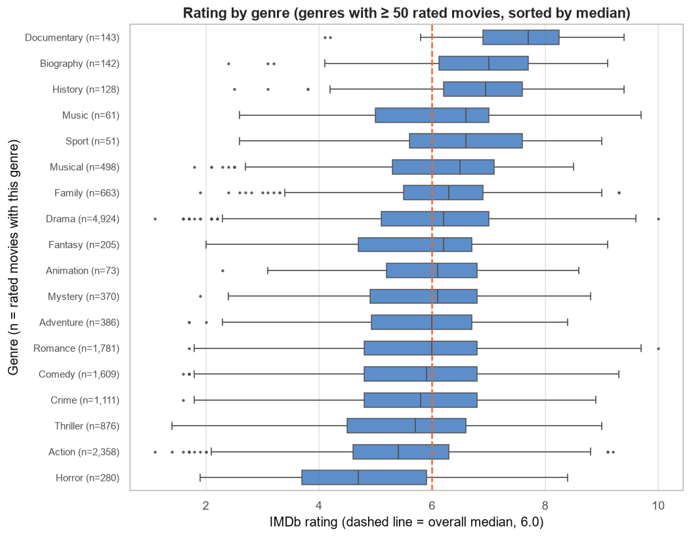

### 6.7 Audit conclusions carried into Phase 2

1. Only rated rows can be training examples; missing ratings must never be imputed.
2. `Year`, `Duration` and `Votes` need parsing; the `"$5.16M"` anomaly must not be silently coerced.
3. `Duration` needs a deliberate missing-value strategy, not a global mean.
4. `Genre` must be split into individual labels rather than treated as 485 classes.
5. `Director` and the actor columns are long-tailed and cannot be one-hot encoded wholesale.
6. `Name` + `Year` repeats require group-aware splitting.
7. `Votes` exists only where `Rating` does, which raises the question of its availability at prediction time.

---

## 7. Data Cleaning and Preprocessing (Phase 2)

Notebook: **`notebooks/02_data_preprocessing.ipynb`** (34 code cells, 17 sections).
Reusable implementation: **`src/data_preprocessing.py`**.

The module is deliberately split into **two layers**, and this split is what makes the pipeline leakage-safe:

| Layer | Functions | Computes statistics across rows? | Safe before splitting? |
|---|---|---|---|
| **Row-wise cleaning** | `clean_movies`, `build_modeling_frame` | No — each row is processed independently | **Yes** |
| **Fitted transformers** | `NumericFeatureTransformer`, `GenreMultiHotEncoder`, `PeopleEncoder`, combined by `build_feature_transformer` | Yes — medians, vocabularies, name frequencies | **No** — must be fitted on training data only |

### 7.1 Target filtering

Rows without a `Rating` have no label and are excluded from the modelling dataframe. **Missing ratings are never
imputed**, because a fabricated target would train the model on invented supervision and corrupt every metric
derived from it. The unrated rows remain in the raw file and are simply unused.

Row accounting produced by `build_modeling_frame`:

| Step | Rows |
|---|---|
| Raw rows | 15,509 |
| Exact duplicates removed | 6 (of which rated: **0**) |
| After de-duplication | 15,503 |
| Unrated rows excluded | 7,584 |
| **Final modelling dataframe** | **7,919** |

### 7.2 `Year`

- **Raw representation:** `"(2019)"`.
- **Parsing:** the strict pattern `^\((\d{4})\)$`. Anything not matching becomes missing rather than being guessed.
- **Result:** all 14,981 non-null values parse; 0 unparseable; 0 outside the plausible range 1888–present.
- **Missing behaviour:** 528 missing overall, but **0 among rated rows**. The fitted transformer still carries a
  training-median fallback so the pipeline cannot fail on future input; on this dataset it is never triggered.

### 7.3 `Duration`

- **Raw representation:** `"109 min"`, parsed with `^(\d+) min$`. All 7,240 non-null values parse.
- **Short values investigated:** the 2-minute (`Documentary, Short`) and 37-minute entries have **no rating**, so they
  leave through target filtering, not because of their length. The single rated sub-40-minute film (21 minutes,
  `Pratibimbo`) is **retained** and flagged in an audit column (`duration_questionable`) that is not a model feature.
  Of 50 rated films under 60 minutes, 22 are documentaries, so short runtimes are consistent with their genres.
- **Missing-value strategy — the key decision:** the imputation is **era-aware**. Missingness and typical runtime both
  vary strongly by decade:

| Decade | Rated films | Duration missing | Median duration |
|---|---|---|---|
| 1930s | 66 | 34.8% | 141 min |
| 1940s | 151 | 51.0% | 138 min |
| 1950s | 385 | 40.8% | 142 min |
| 1960s | 551 | 33.9% | 146 min |
| 1970s | 826 | 37.2% | 137 min |
| 1980s | 1,134 | 38.2% | 140 min |
| 1990s | 1,132 | 32.1% | 148 min |
| 2000s | 1,448 | 22.7% | 135 min |
| 2010s | 1,980 | 8.2% | 120 min |
| 2020s | 245 | 11.8% | 111 min |

  Therefore `NumericFeatureTransformer` imputes the **median duration of the film's release decade**, learned from
  the training split, falling back to the overall training median for decades with fewer than 30 known durations.
  A global mean was rejected because it ignores this era structure.
- **Missingness indicator:** a `duration_missing` flag is always added, because rated films without a duration differ
  from those with one (mean rating 5.59 vs 5.93; median vote count 15 vs 119), so the fact of being missing may
  itself carry information.

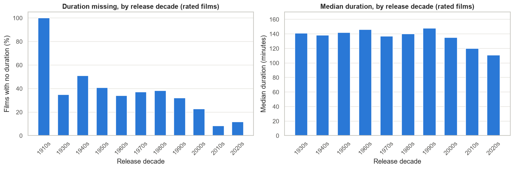

### 7.4 `Votes`

| Question | Answer |
|---|---|
| Used for EDA? | **Yes** — parsed to `Votes_eda` and used in the audit and in error diagnostics |
| Used for model training? | **No** |
| Used at prediction time? | **No** — `src/predict.py` ignores it even when supplied |

Parsing accepts only digit strings with optional thousands separators. The single `"$5.16M"` value is **not**
converted: it becomes missing and is recorded by a `votes_malformed` flag. The project explicitly declines to
interpret it, noting that the dataset offers no way to confirm what it means, and that the row is unrated and
therefore outside the modelling data anyway.

The exclusion of `Votes` from the model is documented as a **modelling assumption about the prediction scenario**:
vote counts accumulate after release and may be unavailable when a prediction is wanted. The project states plainly
that this is not a claim that `Votes` is inherently leakage, and leaves a `Votes`-inclusive secondary experiment as
future work.

### 7.5 `Genre`

- **Multi-label by nature:** a film lists 1–3 genres. Among rated rows the split is 2,711 films with one genre,
  2,294 with two and 2,812 with three.
- **Representation:** `GenreMultiHotEncoder` produces one binary column per genre in the **training** vocabulary
  (`genre=<Label>`), plus `genre_missing` and `genre_count`.
- **Missing genre is explicit:** all genre columns are 0 and `genre_missing = 1`. No genre is invented.
- **Vocabulary:** 22 labels appear among rated rows; `Reality-TV` and `Short` occur only in unrated rows and so are
  absent from the modelling vocabulary. `Music` and `Musical` are kept separate, since merging them would be an
  assumption.
- **Rare labels are retained** (e.g. `News` with 2 films, `Western` with 3); the encoder exposes a `min_count`
  parameter if pruning is ever wanted, and genres unseen at fit time are ignored at transform time.

### 7.6 `Director`

Direct one-hot encoding is impossible: 3,139 directors appear among rated rows, and 2,021 of them (64.4%) have
exactly one film. Coverage at various thresholds, computed from film counts only (never from ratings):

| Minimum films | Directors kept | Films covered | % of rated films |
|---|---|---|---|
| 2 | 1,118 | 5,893 | 74.4% |
| 3 | 697 | 5,051 | 63.8% |
| 5 | 375 | 3,974 | 50.2% |
| **10** | **157** | **2,572** | **32.5%** |
| 15 | 70 | 1,547 | 19.5% |
| 20 | 30 | 880 | 11.1% |

`PeopleEncoder(prefix="director", min_count=10)` therefore emits:

| Output | Meaning |
|---|---|
| `director_count` | Number of **training** films by that director; 0 for unseen or missing names |
| `director_missing` | 1 when the field is empty |
| `director=<Name>` | One-hot columns only for directors with **≥ 10** training films |

All counts and the kept-name set are learned inside `fit`, so they come from training data only. **No target
encoding is used at any point.**

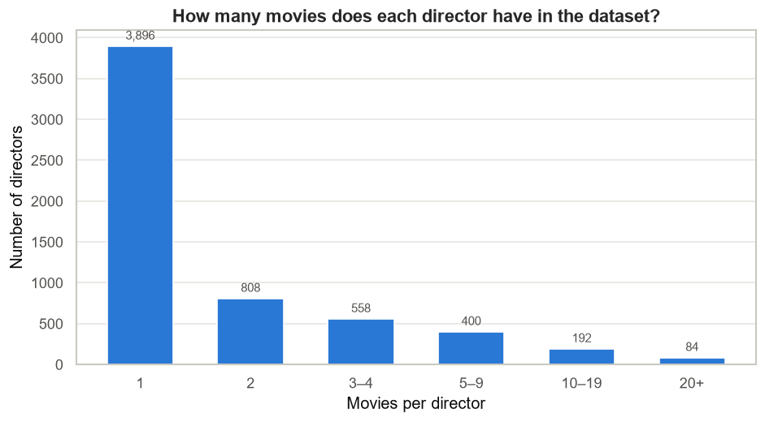

### 7.7 Actors

The same person can appear as `Actor 1` in one film and `Actor 3` in another, so **frequencies are pooled across all
three slots**. Among rated rows there are 6,153 distinct actors, 4,092 of whom (66.5%) appear in one film. 18 films
list the same actor twice; such a person is counted once for that film. Missing actors are always in the trailing
slots — a film lists 3, 2, 1 or 0 actors, never with a gap in the middle (7,627 / 92 / 75 / 125 films respectively).

Coverage by threshold:

| Minimum films | Actors kept | Films with ≥ 1 such actor | % of rated films |
|---|---|---|---|
| 5 | 823 | 6,683 | 84.4% |
| 10 | 430 | 6,106 | 77.1% |
| 15 | 291 | 5,664 | 71.5% |
| **20** | **220** | **5,301** | **66.9%** |
| 30 | 137 | 4,632 | 58.5% |

`PeopleEncoder(prefix="actor", min_count=20)` over `Actor 1`–`Actor 3` emits:

| Output | Meaning |
|---|---|
| `actor_1_count`, `actor_2_count`, `actor_3_count` | Pooled training-film count for the person in that slot; 0 if unseen or missing |
| `actor_1_missing`, `actor_2_missing`, `actor_3_missing` | Missing-slot indicators |
| `actor_listed` | Number of actors listed (0–3) |
| `actor=<Name>` | Slot-independent multi-hot columns for actors with **≥ 20** training films |

### 7.8 Duplicate handling

| Case | Decision |
|---|---|
| **6 exact duplicates** | Removed from the derived modelling frame only (the CSV is untouched). Identical rows add no information and, if rated, could land on both sides of a split. On this dataset all 6 are unrated, so removal changes nothing — the step exists for correctness if the source data changes. |
| **36 `Name` + `Year` repeats** | **All retained** and flagged via `name_year_repeat`. Some are clearly different films sharing a title; others may be duplicate records of one film. The data cannot settle it, so the project handles the risk through group-aware splitting instead of deleting rows. |

### 7.9 Missing-value strategy summary

| Feature | Missing (rated rows) | Strategy |
|---|---|---|
| `Year` | 0 (0.00%) | None needed; training-median fallback for robustness |
| `Duration_min` | 2,068 (26.11%) | Release-decade median from training data + `duration_missing` indicator |
| `Genre` | 102 (1.29%) | No imputation; all genre columns 0 + `genre_missing` |
| `Director` | 5 (0.06%) | No imputation; `director_count = 0` + `director_missing` |
| `Actor 1` | 125 (1.58%) | No imputation; count 0 + missing indicator |
| `Actor 2` | 200 (2.53%) | No imputation; count 0 + missing indicator |
| `Actor 3` | 292 (3.69%) | No imputation; count 0 + missing indicator |

The reasoning is explicit: only `Duration` has substantial missingness and is imputed. For the categorical fields,
filling with the most frequent name or genre would invent information, so missingness is encoded as an indicator
rather than disguised as a real category. Scaling is not applied in preprocessing, because whether it is needed
depends on the model; Phase 3 adds it inside the Linear Regression pipeline only.

---

## 8. Data Leakage Prevention

Leakage prevention is treated as a first-class requirement rather than an afterthought, and each claim below is
backed by an automated check that runs inside the notebooks.

### 8.1 The four mechanisms

| # | Mechanism | Implementation |
|---|---|---|
| 1 | **The target never becomes a feature** | `FEATURE_COLUMNS` contains only the seven metadata fields. No target encoding, no rating-derived aggregates anywhere in the codebase. |
| 2 | **Statistics are fitted on training data only** | All learned values — decade medians, genre vocabulary, director and actor counts, which names clear the thresholds — live inside transformer `fit` methods. `build_feature_transformer()` returns an **unfitted** object. |
| 3 | **Group-aware splitting** | Splits are made over normalised `Name` + `Year` groups, so near-duplicate films cannot straddle train and test. |
| 4 | **The test set is opened once** | Phase 4 explicitly reconstructs and then excludes the Phase 3 test rows; Phase 5 is the first and only evaluation on them. |

### 8.2 Evidence recorded in the notebooks

| Evidence | Where | Result |
|---|---|---|
| Fitted director counts equal counts recomputed by hand from the training rows | Phases 3, 5 | Match |
| Directors appearing **only** in the test set are absent from the fitted statistics | Phases 3, 5 | 448 test-only directors, **0** present in fitted stats |
| Fitted duration median equals the training-rows median | Phases 3, 5 | Match |
| An independent transformer fitted on the training rows reproduces the test matrix exactly | Phase 3 | Identical |
| Per-fold checks that fold statistics come from fold-training rows only | Phase 4 | 40 fold × configuration checks, all pass |
| A manual fold loop reproduces scikit-learn's own `cross_validate` on a `Pipeline` | Phase 4 | Fold RMSEs identical |
| Train/test group overlap | Phases 3, 4, 5 | **0** everywhere |
| No holdout row appears in any cross-validation fold | Phase 4 | Confirmed |
| `Rating`, `Votes` and `Votes_eda` absent from the feature matrix | Phases 2–6 | Confirmed |

### 8.3 Why fold-local fitting matters here

The director and actor **frequency** features are exactly the kind of feature that leaks silently. If counts were
computed over the whole dataset, a validation film would contribute to its own director's count, so the model would
see information derived from data it is being scored on. The project therefore refits the entire transformer inside
every fold, accepting the extra computation. Phase 4 verifies this fold by fold rather than asserting it.

---

## 9. Train/Test Split Strategy

### 9.1 The grouping key

Implemented by `dp.make_group_id()`:

- the title is stripped, inner whitespace collapsed, and case-folded;
- the year is appended as an integer, or `NA` when missing;
- a blank or missing title receives a **unique** key derived from its original row index, so unrelated untitled rows
  are never merged into one group.

This yields **7,916 groups** over the 7,919 modelling rows — 3 groups contain two rows each, corresponding to the
rated `Name` + `Year` repeats.

### 9.2 Why grouping matters

A plain random row split could place `Sant Dnyaneshwar (1940)` — two records with the same director and cast — on
both sides of the split. The model would then be evaluated on a film nearly identical to one it trained on, which
inflates the score without reflecting real generalisation. Group-aware splitting removes that possibility by
construction.

### 9.3 The split

`GroupShuffleSplit(n_splits=1, test_size=0.20, random_state=42)` over those groups:

| Quantity | Value |
|---|---|
| Total modelling rows | 7,919 |
| Training rows | **6,335** (80.0%) |
| Test rows | **1,584** |
| Training groups | 6,332 |
| Test groups | 1,584 |
| **Group overlap** | **0** |
| Random state | 42 |

All three repeated `Name` + `Year` groups landed entirely in the training portion. The target distributions of the
two sides are close (train mean 5.834, std 1.379; test mean 5.873, std 1.391).

### 9.4 Reproducibility of the split

Phase 5 **recreates** the split with the identical function, parameters and grouping key, and asserts all four
counts against the Phase 3 values before proceeding:

| Check | Phase 3 | Phase 5 | Match |
|---|---|---|---|
| Training rows | 6,335 | 6,335 | ✔ |
| Test rows | 1,584 | 1,584 | ✔ |
| Training groups | 6,332 | 6,332 | ✔ |
| Test groups | 1,584 | 1,584 | ✔ |

If any count differed, the notebook would stop rather than continue on a different split.

### 9.5 Cross-validation folds (Phase 4)

`GroupKFold(n_splits=5, shuffle=True, random_state=42)` over the **training rows only**:

| Fold | Training rows | Validation rows | Training groups | Validation groups | Group overlap |
|---|---|---|---|---|---|
| 1 | 5,068 | 1,267 | 5,065 | 1,267 | 0 |
| 2 | 5,068 | 1,267 | 5,065 | 1,267 | 0 |
| 3 | 5,068 | 1,267 | 5,066 | 1,266 | 0 |
| 4 | 5,068 | 1,267 | 5,066 | 1,266 | 0 |
| 5 | 5,068 | 1,267 | 5,066 | 1,266 | 0 |

The fold assignment is computed once and reused by every experiment — model comparison, tuning, ablation and
threshold analysis — so all Phase 4 results are directly comparable. A hash of the fold assignment is recorded and
checked for every experiment.

---

## 10. Feature Engineering

The transformer maps the 7 input columns to a fully numeric matrix. Column counts depend on the fitting data,
because vocabularies and frequent-name sets are learned: **322 columns** when fitted on the 6,335 training rows
(Phases 3 and 5), and **413 columns** when fitted on all 7,919 rated rows for the final artifact (Phase 6).

### 10.1 Feature table

| Feature group | Source column(s) | Transformation | Output columns | Purpose |
|---|---|---|---|---|
| **Year** | `Year` | Parse `"(YYYY)"` → integer; training-median fallback | `Year` | Captures era effects; the strongest single feature by permutation importance |
| **Duration** | `Duration` | Parse `"N min"` → integer; impute with the release-decade median learned from training rows | `Duration_min` | Runtime as a numeric signal, imputed without ignoring era structure |
| **Duration missingness** | `Duration` | Binary indicator | `duration_missing` | Preserves the information that a runtime was unknown |
| **Genre** | `Genre` | Split on commas; multi-hot over the training vocabulary | `genre=<Label>` × vocabulary | Represents films as combinations of individual genres, not as 485 opaque classes |
| **Genre missingness** | `Genre` | Binary indicator | `genre_missing` | Encodes "no genre recorded" explicitly instead of inventing one |
| **Genre count** | `Genre` | Number of labels listed | `genre_count` | Distinguishes single-genre films from multi-genre ones |
| **Director frequency** | `Director` | Count of training films per director; 0 for unseen | `director_count` | A history/experience signal that covers every director, including rare ones |
| **Director missingness** | `Director` | Binary indicator | `director_missing` | Keeps missing names distinct from unseen names |
| **Director identity** | `Director` | One-hot for directors with **≥ 10** training films | `director=<Name>` × kept names | Lets the model learn specific prolific directors without 3,000 sparse columns |
| **Actor frequency** | `Actor 1`–`Actor 3` | Pooled count across all three slots, per slot | `actor_1_count`, `actor_2_count`, `actor_3_count` | Cast prominence, robust to which slot a name occupies |
| **Actor missingness** | `Actor 1`–`Actor 3` | Binary indicators | `actor_1_missing`, `actor_2_missing`, `actor_3_missing` | Records incomplete cast information |
| **Actor count** | `Actor 1`–`Actor 3` | Number of listed actors (0–3) | `actor_listed` | Summarises how much cast information exists |
| **Actor identity** | `Actor 1`–`Actor 3` | Slot-independent multi-hot for actors with **≥ 20** training films | `actor=<Name>` × kept names | Captures recurring prominent actors regardless of billing position |

### 10.2 Column counts by fit

| Group | Fitted on 6,335 training rows | Fitted on all 7,919 rated rows |
|---|---|---|
| Numeric | 3 | 3 |
| Genre | 24 | 24 |
| Director | 115 (incl. 113 one-hot) | 115+ (157 one-hot) |
| Actors | 180 (incl. 173 multi-hot) | 180+ (220 multi-hot) |
| **Total** | **322** | **413** |

The larger artifact matrix is expected: with more rows, more names clear the **unchanged** thresholds.

### 10.3 What the features are not

No feature is derived from `Rating`. No feature uses `Votes`. `Name` is not a feature. The engineered columns
describe availability and prominence of metadata, and the importance results in Section 13 describe **what the
model's predictions depend on** — not what causes a film to be rated highly.

---

## 11. Machine Learning Pipeline

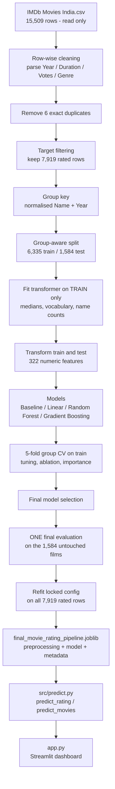

Textual form of the same flow:

```
Raw movie metadata
        ↓  row-wise cleaning (no cross-row statistics)
Target filtering  →  7,919 labelled rows
        ↓
Group-aware train/test split (Name + Year, 80/20, random_state=42)
        ↓
Preprocessing fitted on TRAINING rows only
        ↓
Feature engineering → numeric matrix
        ↓
Model training and cross-validated selection
        ↓
Final evaluation on untouched test data
        ↓
Persisted pipeline → prediction API → dashboard
```

---

## 12. Model Training and Baseline Comparison (Phase 3)

Notebook: **`notebooks/03_model_training.ipynb`** (33 code cells, 21 sections).

### 12.1 Setup

- Split: the group-aware 80/20 split from Section 9 (6,335 / 1,584 rows, 0 group overlap).
- Preprocessing: fitted on the training rows only, producing a 322-column matrix for both sides.
- Matrix validation: no NaN values, no infinite values, identical columns in both matrices, and a numerical rank of
  321 of 322 — one column is an exact linear combination of others, which matters for interpreting linear
  coefficients but not for predictions.

### 12.2 Models compared

| Model | Configuration |
|---|---|
| **Baseline** | `DummyRegressor(strategy="mean")` — predicts the **training** mean (5.8339) for every test film |
| **Linear Regression** | `StandardScaler` → `LinearRegression`, both fitted inside a pipeline on training data |
| **Random Forest** | `n_estimators=300, min_samples_leaf=3, max_features=0.33, n_jobs=-1, random_state=42` |
| **Gradient Boosting** | `n_estimators=300, learning_rate=0.05, max_depth=3, random_state=42` |

On scaling: the notebook verifies empirically that ordinary least squares is scale-invariant — scaled and unscaled
predictions differ by at most `1.59e-12` — and keeps the scaler only so coefficients are comparable in magnitude.
Tree ensembles are left unscaled.

### 12.3 Results on the Phase 3 test set

| Model | MAE | MSE | RMSE | R² |
|---|---|---|---|---|
| Gradient Boosting | 0.9044 | 1.3903 | 1.1791 | 0.2813 |
| Random Forest | 0.9101 | 1.3999 | 1.1832 | 0.2764 |
| Linear Regression | 0.9424 | 1.4876 | 1.2197 | 0.2311 |
| Baseline (training mean) | 1.1243 | 1.9361 | 1.3914 | −0.0008 |

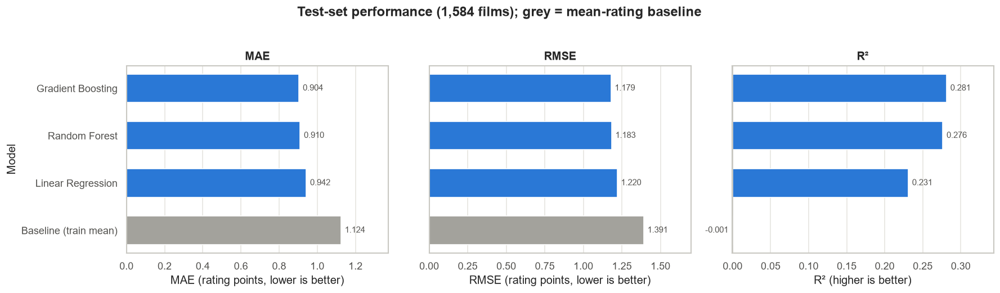

### 12.4 Is the ranking meaningful?

Rather than declaring a winner from a 0.004 RMSE gap, Phase 3 runs a **paired bootstrap** (2,000 resamples of the
test films, same resample for every model):

| Comparison | RMSE difference | 95% interval | Interpretation |
|---|---|---|---|
| Random Forest vs Gradient Boosting | +0.0041 | **[−0.0104, +0.0194]** | Interval includes 0 → **not separable** on this test set |
| Linear Regression vs Gradient Boosting | +0.0406 | [+0.0177, +0.0631] | Clearly worse |
| Baseline vs Gradient Boosting | +0.2123 | [+0.1820, +0.2421] | Clearly worse |

### 12.5 Overfitting check

| Model | Train RMSE | Test RMSE | Train R² | Test R² |
|---|---|---|---|---|
| Gradient Boosting | 1.1116 | 1.1791 | 0.3505 | 0.2813 |
| Random Forest | 0.7843 | 1.1832 | 0.6767 | 0.2764 |
| Linear Regression | 1.1627 | 1.2197 | 0.2894 | 0.2311 |

Random Forest fits the training data far more closely than the test data — the first sign of the overfitting gap
that later influences model selection.

### 12.6 Phase 3 observations

- Every model beats the mean baseline on all four metrics.
- Predictions are already visibly **compressed**: actual test ratings span 1.6–9.7 (std 1.391) while Gradient
  Boosting predictions span 4.2–8.3 (std 0.643).
- Errors concentrate at the extremes: mean residual −2.154 for films rated ≤ 4 and +1.989 for films rated > 8.
- Error falls as a director's training history grows: MAE 0.996 for unseen directors down to 0.740 for directors
  with 10+ films.
- **A pre-registered hypothesis was refuted.** The expectation that films with few votes would dominate the largest
  errors was not supported: films with < 20 votes are 28.3% of the largest-error decile versus 28.1% elsewhere, and
  MAE is actually **highest** for films with more than 1,000 votes. The notebook records the refutation rather than
  quietly dropping it.

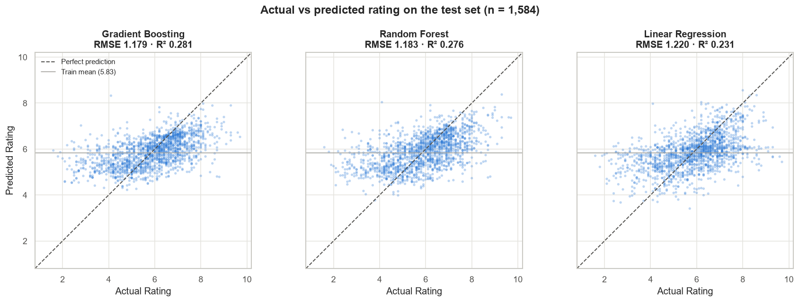
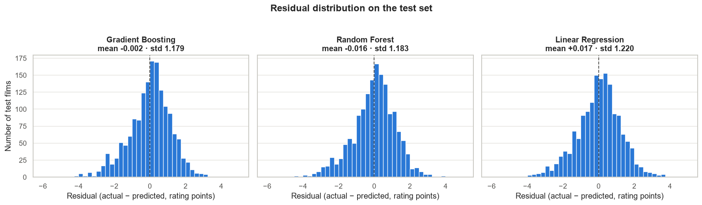

**Diagnostics:** 15 automated checks, all passing.

---

## 13. Cross-Validation, Tuning and Ablation (Phase 4)

Notebook: **`notebooks/04_model_improvement.ipynb`** (42 code cells, 23 sections). Everything here runs on the
**6,335 training rows only**; the Phase 3 test set is reconstructed solely so its rows can be excluded.

### 13.1 Cross-validated model comparison

5-fold group-aware CV, mean ± standard deviation across folds:

| Model | CV RMSE | CV MAE | CV MSE | CV R² | Train RMSE | Train−val gap |
|---|---|---|---|---|---|---|
| **Gradient Boosting (tuned)** | **1.1549 ± 0.0363** | 0.9009 ± 0.0256 | 1.3348 ± 0.0845 | 0.2980 ± 0.0126 | 0.9915 | 0.1634 |
| Random Forest | 1.1733 ± 0.0344 | 0.9167 ± 0.0233 | 1.3775 ± 0.0813 | 0.2755 ± 0.0120 | 0.7904 | 0.3828 |
| Gradient Boosting (Phase 3 settings) | 1.1761 ± 0.0318 | 0.9213 ± 0.0246 | 1.3840 ± 0.0753 | 0.2720 ± 0.0070 | 1.1045 | 0.0716 |
| Linear Regression | 1.2232 ± 0.0237 | 0.9624 ± 0.0182 | 1.4966 ± 0.0583 | 0.2123 ± 0.0084 | 1.1778 | 0.0454 |
| Baseline (fold-train mean) | 1.3794 ± 0.0318 | 1.1242 ± 0.0299 | 1.9034 ± 0.0884 | −0.0016 ± 0.0018 | 1.3792 | 0.0002 |

With the Phase 3 settings, Random Forest and Gradient Boosting are **effectively tied**: the mean per-fold RMSE
difference is 0.0028 against a fold-to-fold standard deviation of 0.0046, confirming that Phase 3's single-split
ordering was not a stable result.

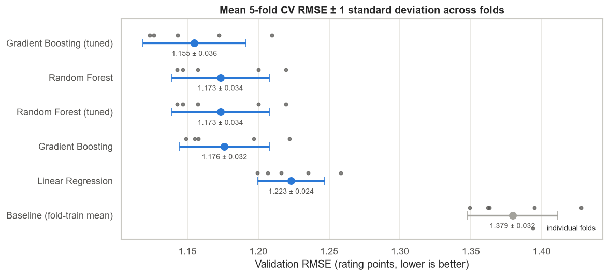

### 13.2 Controlled hyperparameter search

`RandomizedSearchCV` on the same folds, scored with `neg_root_mean_squared_error`, with the preprocessing refit
inside every fold via an sklearn `Pipeline`:

| Model | Candidates | Parameter | Values searched |
|---|---|---|---|
| Gradient Boosting | 12 | `n_estimators` | 200, 400, 600 |
| | | `learning_rate` | 0.02, 0.05, 0.1 |
| | | `max_depth` | 2, 3, 4 |
| | | `min_samples_leaf` | 1, 10, 30 |
| | | `subsample` | 0.8, 1.0 |
| Random Forest | 10 | `n_estimators` | 300, 500 |
| | | `max_depth` | None, 15, 30 |
| | | `min_samples_leaf` | 1, 3, 5, 10 |
| | | `max_features` | 0.2, 0.33, 0.5, 1.0 |

Best configurations found:

| Model | Best parameters | Mean CV RMSE |
|---|---|---|
| **Gradient Boosting** | `n_estimators=600, learning_rate=0.05, max_depth=4, min_samples_leaf=10, subsample=0.8` | **1.1549** |
| Random Forest | `n_estimators=300, min_samples_leaf=3, max_features=0.33, max_depth=None` | 1.1733 |

Two honest caveats are recorded in the notebook:

1. **The Random Forest search found nothing better than the Phase 3 settings** — the best sampled configuration is
   identical to them.
2. **Two winning Gradient Boosting values sit at the edge of their searched ranges** (`n_estimators=600`,
   `max_depth=4`). A wider search might do better; the project documents this rather than expanding the search
   indefinitely.
3. The tuned score is selected and evaluated on the same folds, so it is mildly **optimistic**; nested CV was not
   used, and the untouched test set provides the unbiased estimate instead.

### 13.3 Feature-group ablation

Same model, same folds, feature groups added one at a time:

| Configuration | Features | CV MAE | CV RMSE | CV R² | ΔRMSE vs previous |
|---|---|---|---|---|---|
| A: Year + Duration | 3 | 1.0065 | 1.2839 | 0.1323 | — |
| B: + Genre | 27 | 0.9489 | 1.2106 | 0.2285 | −0.0732 |
| C: + Director | 98 | 0.9282 | 1.1843 | 0.2618 | −0.0263 |
| D: + Actors (full) | 239 | 0.9009 | 1.1549 | 0.2980 | −0.0294 |

Every step improved RMSE **on all five folds**, so each feature group earns its place.

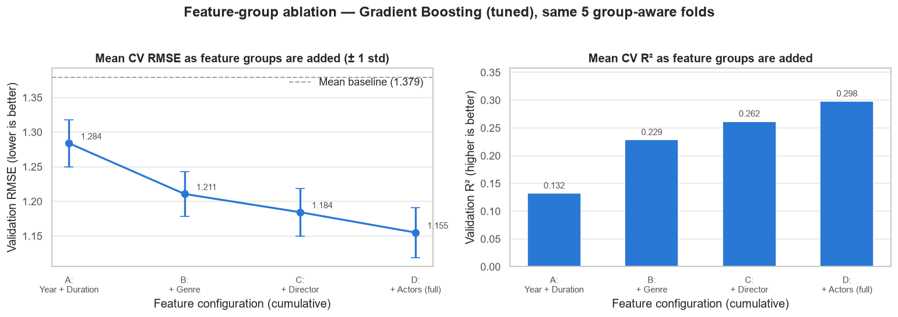

### 13.4 Director / actor threshold analysis

One factor varied at a time, thresholds applied inside each fold's `fit`:

| Configuration | Avg. features | CV MAE | CV RMSE | CV R² | ΔRMSE vs default | Folds better |
|---|---|---|---|---|---|---|
| director ≥ 5, actor ≥ 20 | 403.0 | 0.9012 | 1.1551 | 0.2978 | +0.0002 | 2 / 5 |
| **director ≥ 10, actor ≥ 20** (default) | 241.8 | 0.9009 | 1.1549 | 0.2980 | 0.0000 | — |
| director ≥ 20, actor ≥ 20 | 182.6 | 0.9036 | 1.1587 | 0.2934 | +0.0038 | 1 / 5 |
| director ≥ 10, actor ≥ 10 | 399.2 | 0.8939 | 1.1469 | 0.3078 | −0.0080 | 5 / 5 |
| director ≥ 10, actor ≥ 40 | 153.4 | 0.9078 | 1.1643 | 0.2866 | +0.0094 | 0 / 5 |

**Conclusion recorded in the project:** threshold changes are **not material** — the largest effect is 0.0094 RMSE,
well inside the fold-to-fold spread of about 0.036. The Phase 2 defaults (10 / 20) were therefore kept, explicitly
to avoid another selection made on the same folds for a gain that does not matter.

### 13.5 Feature importance

**Permutation importance on the validation folds** (group-level: all columns of a group shuffled together,
5 repeats, averaged over folds):

| Feature group | Mean RMSE increase when shuffled | Std across folds |
|---|---|---|
| Year | **0.1995** | 0.0107 |
| Genre | 0.1253 | 0.0072 |
| Actors | 0.0953 | 0.0072 |
| Director | 0.0395 | 0.0098 |
| Duration | 0.0330 | 0.0061 |

Most influential individual columns:

| Column | Mean RMSE increase | Group |
|---|---|---|
| `Year` | 0.1944 | Year |
| `director_count` | 0.0284 | Director |
| `genre=Action` | 0.0225 | Genre |
| `genre=Drama` | 0.0193 | Genre |
| `Duration_min` | 0.0166 | Duration |
| `actor_1_count` | 0.0159 | Actors |
| `genre=Documentary` | 0.0153 | Genre |
| `duration_missing` | 0.0152 | Duration |

A secondary, impurity-based view ranks the groups differently — Actors 0.2786, Year 0.2753, Genre 0.2419,
Duration 0.1206, Director 0.0836 — because that measure favours features with many possible split points and is
computed on training data. The **permutation ranking on validation folds is treated as primary**, and both are
described as dependence of predictions, never as causal effects.

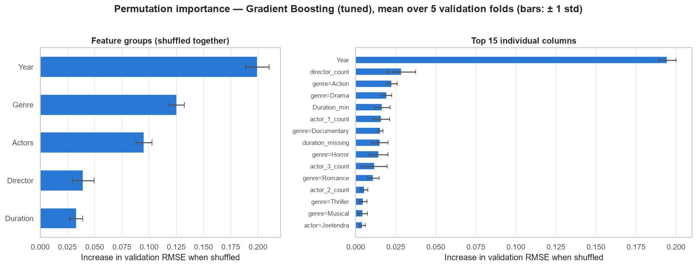

### 13.6 Prediction range under cross-validation

Out-of-fold predictions show that tuning **reduces but does not remove** the compression:

| Model (OOF) | Min | p5 | Median | p95 | Max | Std | p95 − p5 |
|---|---|---|---|---|---|---|---|
| Actual rating | 1.100 | 3.300 | 6.000 | 7.900 | 10.000 | 1.379 | 4.600 |
| Gradient Boosting (tuned) | 3.529 | 4.569 | 5.865 | 7.087 | 9.326 | **0.793** | 2.518 |
| Gradient Boosting (Phase 3 settings) | 3.772 | 4.791 | 5.828 | 6.820 | 8.442 | 0.644 | 2.029 |
| Random Forest | 3.814 | 4.756 | 5.871 | 6.919 | 8.278 | 0.690 | 2.163 |

Out-of-fold MAE by rating band:

| Model | Low (< 4), n = 676 | Mid (4–7), n = 4,267 | High (≥ 7), n = 1,392 |
|---|---|---|---|
| Baseline | 2.553 | 0.703 | 1.723 |
| Gradient Boosting (Phase 3 settings) | 2.056 | 0.626 | 1.276 |
| **Gradient Boosting (tuned)** | **1.913** | 0.658 | **1.155** |

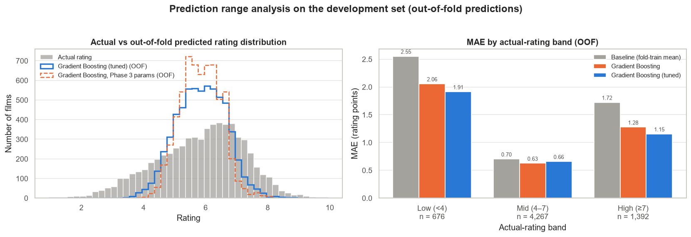

### 13.7 Final candidate selection

The tuned Gradient Boosting model was selected on the **complete** CV evidence, not a single metric:

- lowest mean CV RMSE and MAE and the highest R²;
- better than every alternative **on all five folds**, with a mean advantage over Random Forest of 0.0184 — about
  2.7× the fold-to-fold standard deviation of that difference (0.0067);
- fold-to-fold variability comparable to the other tree models (0.036 vs 0.032–0.034);
- a much smaller overfitting gap than Random Forest (0.1634 vs 0.3828).

**Diagnostics:** 23 automated checks, all passing.

---

## 14. Final Evaluation (Phase 5)

Notebook: **`notebooks/05_final_evaluation.ipynb`** (34 code cells, 23 sections).

This is the **only** time the 1,584-row test set is used. The notebook trains the locked configuration once on the
6,335 training rows, predicts once, and makes no changes afterwards.

### 14.1 Final model

```python
GradientBoostingRegressor(
    n_estimators=600,
    learning_rate=0.05,
    max_depth=4,
    min_samples_leaf=10,
    subsample=0.8,
    random_state=42,
)
```

with the full primary feature set and the Phase 2 thresholds (director ≥ 10, actor ≥ 20), trained on a 322-column
matrix produced by a transformer fitted on the training rows only.

### 14.2 Final holdout results

| Model | MAE | MSE | RMSE | R² |
|---|---|---|---|---|
| **Gradient Boosting (tuned) — FINAL** | **0.8862** | **1.3453** | **1.1599** | **0.3046** |
| Baseline (training mean, 5.8339) | 1.1243 | 1.9361 | 1.3914 | −0.0008 |

**Improvement over the baseline: 21.2% MAE, 16.6% RMSE.**

Secondary metrics: median absolute error **0.6966**, maximum absolute error **5.1441**, explained variance
**0.3046**.

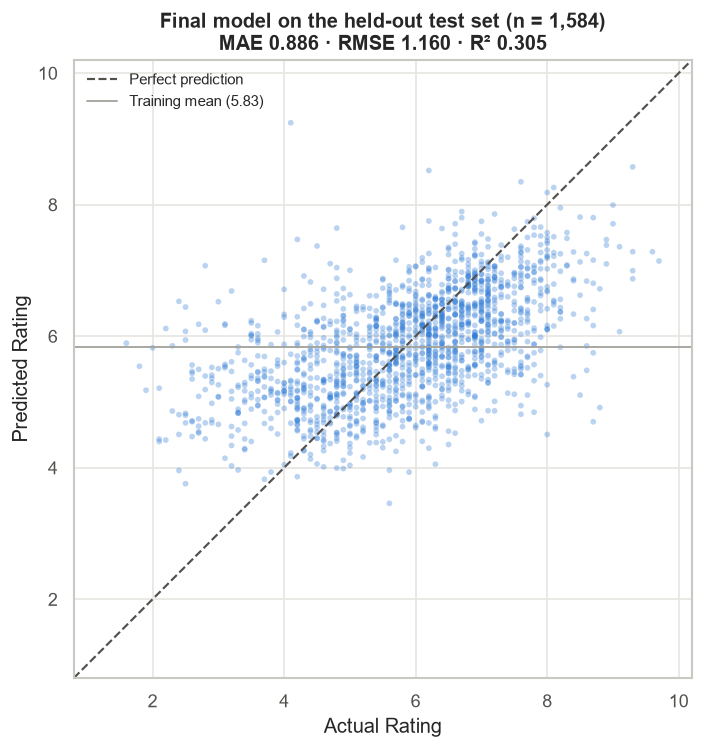

### 14.3 Three evaluation methods, clearly separated

| Phase | Method | What it answers | Gradient Boosting RMSE |
|---|---|---|---|
| 3 | One 80/20 holdout | How did first-pass models compare on one unseen split? | 1.1791 (initial settings) |
| 4 | 5-fold group CV on the training rows | Which configuration generalises best, and how variable is it? | 1.1549 ± 0.0363 (tuned) |
| 5 | The same holdout, one evaluation | How does the finally selected model perform on unseen data? | **1.1599** (tuned) |

The Phase 5 result falls **inside** the Phase 4 cross-validation interval, which indicates the CV estimate was not
noticeably optimistic despite the model having been selected on those folds. Phase 3 and Phase 5 numbers are
directly comparable because they use the same test films; the Phase 4 mean is a different kind of measurement and
is never mixed with them.

Improvement of the final model over the Phase 3 Gradient Boosting on the same test films:

| Metric | Phase 3 | Phase 5 final | Change |
|---|---|---|---|
| MAE | 0.9044 | 0.8862 | −0.0182 |
| RMSE | 1.1791 | 1.1599 | −0.0192 |
| R² | 0.2813 | 0.3046 | +0.0233 |

**Diagnostics:** 22 automated checks, all passing.

---

## 15. Error Analysis

All figures below come from the Phase 5 final test set (1,584 films).

### 15.1 Residual behaviour

`residual = actual − predicted`; a positive residual means the model predicted too low.

| Statistic | Value |
|---|---|
| Mean residual | +0.0067 |
| Median residual | +0.0859 |
| Standard deviation | 1.1602 |
| Share positive | 54.3% |
| Within ±0.5 | 38.0% |
| Within ±1.0 | **64.6%** |
| Beyond ±2.0 | **8.8%** |

The near-zero mean residual shows the model is unbiased **overall**, but that hides strong bias **within** rating
bands, shown next.

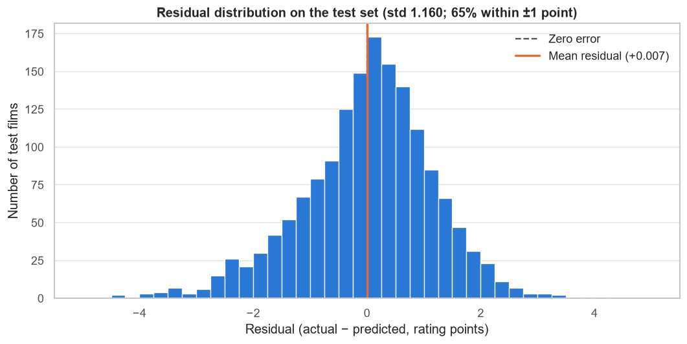

### 15.2 Performance by rating group

| Rating group | Films | MAE | RMSE | Mean actual | Mean predicted | Mean residual |
|---|---|---|---|---|---|---|
| Low (< 4) | 152 | 2.039 | 2.195 | 3.191 | 5.230 | −2.039 |
| Medium (4 – < 7) | 1,076 | **0.642** | 0.833 | 5.682 | 5.751 | −0.069 |
| High (≥ 7) | 356 | 1.133 | 1.354 | 7.593 | 6.485 | +1.108 |

Mid-range films are predicted roughly three times more accurately than films at the low extreme.

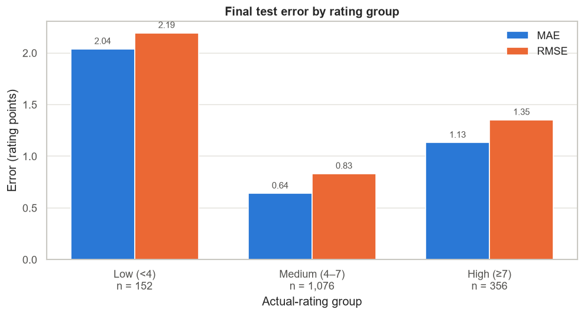

### 15.3 Prediction compression

| Statistic | Actual rating | Predicted rating |
|---|---|---|
| Minimum | 1.600 | 3.457 |
| 5th percentile | 3.315 | 4.546 |
| Median | 6.000 | 5.874 |
| Mean | 5.873 | 5.866 |
| 95th percentile | 7.900 | 7.188 |
| Maximum | 9.700 | 9.244 |
| Standard deviation | **1.391** | **0.819** |
| p95 − p5 span | 4.585 | 2.643 |

### 15.4 Calibration by rating bin

| Actual-rating bin | Count | Mean actual | Mean predicted | Mean residual | MAE | Small sample |
|---|---|---|---|---|---|---|
| < 4 | 152 | 3.191 | 5.230 | −2.039 | 2.039 | no |
| 4 – < 5 | 256 | 4.515 | 5.347 | −0.832 | 0.896 | no |
| 5 – < 6 | 349 | 5.497 | 5.580 | −0.084 | 0.534 | no |
| 6 – < 7 | 471 | 6.455 | 6.097 | +0.357 | 0.583 | no |
| 7 – < 8 | 277 | 7.358 | 6.397 | +0.961 | 0.990 | no |
| 8 – < 9 | 69 | 8.293 | 6.714 | +1.579 | 1.589 | no |
| ≥ 9 | 10 | 9.270 | 7.327 | +1.943 | 1.943 | **yes (n = 10)** |

The mean predicted value moves only from 5.23 to 7.33 while the actual mean moves from 3.19 to 9.27: the model
**over-predicts poorly rated films and under-predicts highly rated ones**. The ≥ 9 bin is flagged as a small sample
in the notebook itself.

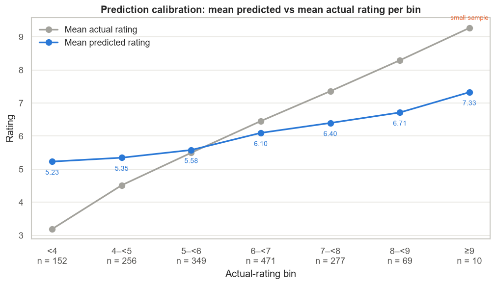

### 15.5 Error by data characteristics

**By director history in the training data** — a consistent gradient:

| Director history | Films | MAE | Mean residual |
|---|---|---|---|
| Unseen in training | 476 | 0.984 | −0.045 |
| 1–4 films | 466 | 0.956 | +0.008 |
| 5–9 films | 294 | 0.828 | +0.002 |
| 10+ films | 348 | **0.708** | +0.079 |

**By duration band:**

| Duration | Films | MAE | Mean residual |
|---|---|---|---|
| < 60 min | 10 | 1.674 | −1.624 |
| 60–90 | 72 | 0.937 | −0.176 |
| 90–120 | 296 | 0.974 | +0.064 |
| 120–150 | 555 | 0.827 | −0.056 |
| > 150 | 262 | 0.866 | +0.073 |

The < 60 min group contains only 10 films, and the notebook explicitly warns against over-interpreting it.

**By release decade** — recent films are harder:

| Decade | Films | MAE | Decade | Films | MAE |
|---|---|---|---|---|---|
| 1930s | 16 | 0.547 | 1980s | 227 | 0.713 |
| 1940s | 29 | 0.667 | 1990s | 207 | 0.871 |
| 1950s | 63 | 0.602 | 2000s | 292 | 1.051 |
| 1960s | 110 | 0.540 | 2010s | 410 | 1.067 |
| 1970s | 174 | 0.652 | 2020s | 56 | 1.402 |

**By missing metadata:**

| Condition | Films | MAE |
|---|---|---|
| Duration present | 1,195 | 0.886 |
| Duration missing | 389 | 0.887 |
| Genre present | 1,561 | 0.883 |
| Genre missing | 23 | 1.106 |
| 3 actors listed | 1,524 | 0.878 |
| Fewer than 3 actors | 60 | 1.098 |

**By genre** (genres with ≥ 30 test films; a film counts in each of its genres):

| Genre | Films | MAE | Genre | Films | MAE |
|---|---|---|---|---|---|
| Biography | 36 | 1.039 | Romance | 340 | 0.835 |
| Horror | 50 | 0.995 | Thriller | 191 | 0.829 |
| Comedy | 298 | 0.962 | Musical | 113 | 0.819 |
| Documentary | 36 | 0.960 | Mystery | 89 | 0.801 |
| Crime | 230 | 0.928 | Fantasy | 41 | 0.742 |
| Action | 466 | 0.894 | Adventure | 67 | 0.737 |
| Drama | 971 | 0.857 | Family | 139 | 0.709 |

### 15.6 The largest errors

The five largest absolute errors on the test set:

| Film | Year | Actual | Predicted | Residual |
|---|---|---|---|---|
| Searching for Sheela | 2021 | 4.1 | 9.24 | −5.14 |
| Mumbai Can Dance Saalaa | 2015 | 1.6 | 5.89 | −4.29 |
| Lahore Confidential | 2021 | 2.8 | 7.07 | −4.27 |
| The Dirty MMS | 2014 | 2.4 | 6.53 | −4.13 |
| Man on Mission Taqatwar | 2005 | 8.7 | 4.70 | +4.00 |

Profile of the 20 largest errors against the rest of the test set:

| Characteristic | Top 20 errors | Other 1,564 films |
|---|---|---|
| Mean actual rating | 3.805 | 5.899 |
| Share rated < 4 | 75.0% | 8.8% |
| Share rated ≥ 8 | 20.0% | 4.8% |
| Share over-predicted | 80.0% | 45.3% |
| Share with a director unseen in training | 35.0% | 30.0% |
| Share with duration missing | 20.0% | 24.6% |
| Median votes (diagnostic only) | 102.5 | 56.0 |

The dominant pattern is unambiguous: **large errors are films with extreme ratings**, and four out of five of them
were over-predicted. These are recorded as observed patterns and hypotheses for future work, not as causes, and the
model was **not** modified after seeing them.

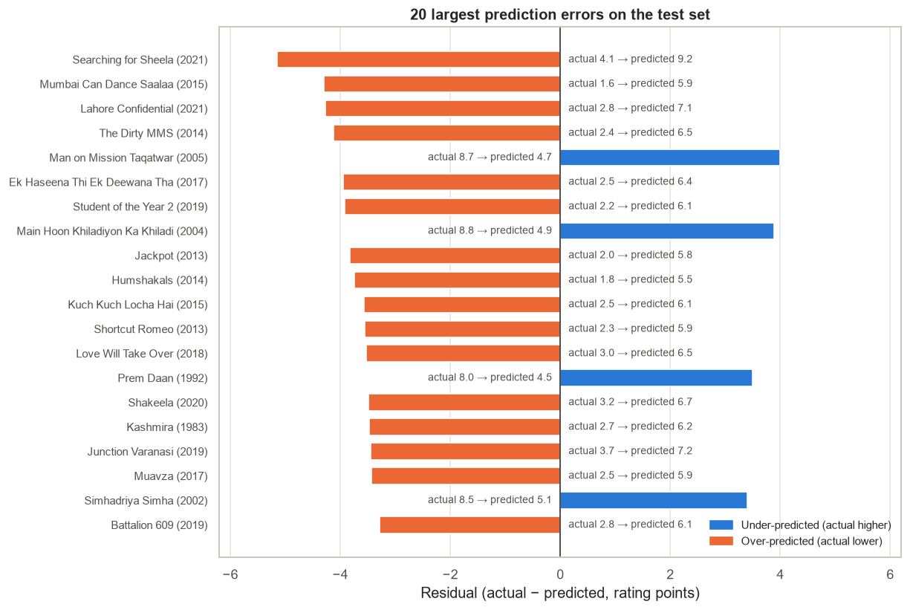

---

## 16. Model Persistence (Phase 6)

Notebook: **`notebooks/06_model_persistence.ipynb`** (16 code cells, 14 sections).

### 16.1 What is saved, and how it differs from Phase 5

| Phase | Trained on | Purpose |
|---|---|---|
| 5 | 6,335 training rows | The **unbiased evaluation** on the untouched 1,584-film test set |
| 6 | **All 7,919 rated rows** | The reusable artifact, so it uses every labelled observation |

The locked configuration is unchanged; only the amount of training data differs. **No metric is computed in
Phase 6**, because a model trained on all rated rows has no unseen data left to be evaluated on honestly. The
project's reported performance therefore remains the Phase 5 holdout result.

### 16.2 The artifact

| Property | Value |
|---|---|
| Path | `models/final_movie_rating_pipeline.joblib` |
| Size | **0.33 MB** (345,420 bytes) |
| Structure | `sklearn.pipeline.Pipeline([("preprocess", ColumnTransformer), ("model", GradientBoostingRegressor)])` plus a metadata dictionary |
| Training rows | 7,919 |
| Engineered features | **413** |
| Genre vocabulary | 22 labels |
| Directors counted / one-hot | 3,139 / 157 |
| Actors counted / multi-hot | 6,153 / 220 |
| Raw data embedded? | **No** — only the source checksum is stored |

Metadata stored with the pipeline: model name and type, project phase, hyperparameters, accepted input fields,
feature columns, output feature count, both thresholds, excluded fields with reasons, training row count, target
name, observed training rating range, a `predictions_clipped: false` flag, training date, scikit-learn / pandas /
Python versions, the source-data SHA-256, and the Phase 5 holdout results labelled as reference only.

### 16.3 Validation performed at persistence time

32 automated checks, all passing, including:

| Area | Checks |
|---|---|
| Artifact | Exists after saving; size sane; contains **both** a fitted transformer and a fitted model; metadata complete |
| Configuration | Parameters match the Phase 5 locked configuration exactly; thresholds unchanged; model input width equals transformer output width |
| Predictions | Single prediction returns a finite float; batch returns one row per input; batch and single agree |
| Robustness | Unseen director → `director_count = 0`; unseen actors → counts 0; missing Actor 3 → indicator set; year-only input works |
| Contract | `Rating` and `Votes` are not required and are **ignored** when supplied; a missing required field raises a clear error |
| Integrity | The reloaded artifact reproduces the in-memory pipeline exactly; the transformer is **not** refitted at prediction time |
| Independence | A **separate Python process** loads the artifact from disk and reproduces identical predictions |
| Data | Raw CSV checksum unchanged |

---

## 17. Prediction API

Module: **`src/predict.py`**.

### 17.1 Public interface

| Function | Signature | Returns |
|---|---|---|
| `load_pipeline` | `load_pipeline(path=None, use_cache=True)` | `{"pipeline": ..., "metadata": ...}` |
| `predict_rating` | `predict_rating(movie_data, path=None)` | `float` — the predicted rating |
| `predict_movies` | `predict_movies(movie_data, path=None, column="Predicted Rating")` | `DataFrame` with the prediction column added |
| `prepare_input` | `prepare_input(movie_data)` | `DataFrame` of model-ready feature columns |
| `describe_artifact` | `describe_artifact(path=None)` | `Series` of artifact metadata |

Module constants: `MODEL_FILENAME`, `MODEL_PATH`, `INPUT_FIELDS`, `REQUIRED_FIELDS` (`("Year",)`),
`IGNORED_FIELDS` (`("Rating", "Votes")`), `OBSERVED_RATING_RANGE` (`(1.1, 10.0)`). A dedicated `ArtifactError` is
raised when the artifact is missing or malformed.

### 17.2 Behaviour

| Aspect | Behaviour |
|---|---|
| Accepted input | A dict, a list of dicts, or a `DataFrame` |
| Accepted fields | `Name`, `Year`, `Duration`, `Genre`, `Director`, `Actor 1`, `Actor 2`, `Actor 3` |
| Required field | **`Year` only** — it is the most influential feature; everything else may be missing |
| `Year` formats | `"(2024)"`, `"2024"`, `2024`, `2024.0` |
| `Duration` formats | `"120 min"`, `"120"`, `120`, `120.0` |
| `Genre` format | Comma-separated, e.g. `"Action, Comedy, Crime"` |
| Missing optional fields | Passed through to the pipeline's existing missing-value handling; **no values are invented** |
| Unseen names | Handled safely — frequency features become 0 and no name-specific column is set |
| `Rating` / `Votes` if supplied | **Ignored** — they never reach the feature matrix |
| Missing `Year` | Raises a clear `ValueError` naming the required field |
| Refitting | Never — prediction uses the already-fitted artifact |
| Output clipping | **None.** The raw model value is returned; the observed training range (1.1–10.0) is documented rather than enforced, so unusual behaviour stays visible |
| Path handling | The artifact is located relative to the project via `pathlib`, not the current working directory |
| Version safety | A `RuntimeWarning` is emitted if the loading environment's scikit-learn version differs from the one recorded in the metadata |

### 17.3 Example

Run from inside `Task1_Movie_Rating_Prediction`:

```python
from src.predict import predict_rating

# Demonstration input only — invented metadata, not a real film
movie = {
    "Name": "Example Movie",          # identifier only; not a model feature
    "Year": "2024",                   # "(2024)", "2024" or 2024 all work
    "Duration": "120 min",            # "120 min" or "120" both work
    "Genre": "Drama, Thriller",
    "Director": "Example Director",
    "Actor 1": "Actor One",
    "Actor 2": "Actor Two",
    "Actor 3": "Actor Three",         # optional
}

print(predict_rating(movie))
```

Batch prediction:

```python
import pandas as pd
from src.predict import predict_movies

results = predict_movies(pd.DataFrame([movie, movie]))
print(results[["Name", "Predicted Rating"]])
```

A quick self-check is built in: `python src/predict.py` prints the artifact metadata and one demonstration
prediction.

> Any value produced by these examples is **model output for demonstration input** — not an actual or claimed IMDb
> rating.

---

## 18. Interactive Streamlit Dashboard

Application: **`app.py`**; theme: **`.streamlit/config.toml`**.

The dashboard is a **presentation layer only**. It calls `src.predict.predict_rating`, loads the persisted artifact
once through `@st.cache_resource`, and computes dataset statistics with the project's own
`src/data_preprocessing.py` functions. It contains no training code, no model definition and no duplicated feature
engineering, and it never writes to the dataset or the artifact.

### 18.1 Pages

| Page | Contents |
|---|---|
| 🏠 **Overview** | Project summary, KPI cards (dataset size, rated rows, final RMSE / MAE / R², improvements), the end-to-end flow, and a button that jumps to the prediction page |
| 🎯 **Predict Rating** | A two-column form (name, year, duration, genre, director, three actors), a prominent result card, a Plotly gauge on the 0–10 scale, a band interpretation, the input summary, and an explicit "used / not used" feature breakdown |
| 📊 **Data Analysis** | Six KPIs computed live from the CSV plus four tabs of interactive Plotly charts: ratings, missing data, genres & people, and relationships, with a read-only raw-data preview |
| 📈 **Model Performance** | Final metrics, an expandable explanation of the evaluation setup, and four tabs: final evaluation charts, cross-validation evidence, the earlier single-split comparison, and the limitations |
| 🧠 **Model Details** | Hyperparameters, live artifact metadata, feature-engineering description, permutation importance and the ablation curve |
| ℹ️ **About Project** | Internship context, workflow, technologies and a phase table |

### 18.2 Prediction bands

The result card labels the prediction with a band describing **model output**, not guaranteed film quality:

| Predicted value | Band |
|---|---|
| < 4 | Low predicted rating range |
| 4 – < 7 | Moderate predicted rating range |
| 7 – < 8 | High predicted rating range |
| ≥ 8 | Very high predicted rating range |

### 18.3 Robustness

Unknown directors, unknown actors, a missing Actor 3, multiple genres, a missing duration (enter 0) and a blank
movie name are all handled. A missing model file or dataset produces a clear Streamlit error message rather than a
traceback.

---

## 19. Visualizations

All 21 charts live in [`visualizations/`](visualizations/) and are generated by the notebooks.

| Phase | File | What it shows |
|---|---|---|
| 1 | `01_missing_values.png` | Share of missing values per column |
| 1 | `02_genre_frequency.png` | Films per individual genre label |
| 1 | `03_movies_per_director.png` | Distribution of films per director |
| 1 | `04_rating_distribution.png` | Rating distribution with mean and median |
| 1 | `05_numeric_vs_rating.png` | Rating vs year, duration and votes |
| 1 | `06_rating_by_decade.png` | Rating distribution per release decade |
| 1 | `07_rating_by_genre.png` | Rating distribution per genre (≥ 50 rated films) |
| 2 | `08_duration_missingness_by_decade.png` | Duration missingness and median runtime by decade |
| 3 | `09_model_comparison.png` | Baseline vs the three first-pass models |
| 3 | `10_actual_vs_predicted.png` | Actual vs predicted for the first-pass models |
| 3 | `11_residual_distribution.png` | Residual distributions of the first-pass models |
| 4 | `12_cv_model_comparison.png` | Mean cross-validation RMSE and MAE per model |
| 4 | `13_cv_error_bars.png` | Mean CV RMSE ± 1 std with individual fold scores |
| 4 | `14_feature_group_ablation.png` | RMSE and R² as feature groups are added |
| 4 | `15_feature_importance.png` | Permutation importance, group level and top columns |
| 4 | `16_prediction_range_analysis.png` | Actual vs out-of-fold predicted distribution; MAE by band |
| 5 | `17_final_actual_vs_predicted.png` | Final test scatter with the perfect-prediction diagonal |
| 5 | `18_final_residual_distribution.png` | Final residual distribution |
| 5 | `19_final_error_by_rating_group.png` | MAE and RMSE for low / medium / high ratings |
| 5 | `20_final_prediction_calibration.png` | Mean predicted vs mean actual per rating bin |
| 5 | `21_final_top_errors.png` | The 20 largest prediction errors |

---

## 20. Project Structure

```
Task1_Movie_Rating_Prediction/
│
├── dataset/
│   └── IMDb Movies India.csv              # raw data, never modified (SHA-256 verified in every notebook)
│
├── models/
│   └── final_movie_rating_pipeline.joblib # fitted preprocessing + fitted model + metadata (0.33 MB)
│
├── notebooks/
│   ├── 01_dataset_audit.ipynb             # Phase 1 — dataset audit and data-quality findings
│   ├── 02_data_preprocessing.ipynb        # Phase 2 — cleaning decisions and feature design
│   ├── 03_model_training.ipynb            # Phase 3 — group split, baseline and first models
│   ├── 04_model_improvement.ipynb         # Phase 4 — cross-validation, tuning, ablation, importance
│   ├── 05_final_evaluation.ipynb          # Phase 5 — final holdout evaluation (test set used once)
│   └── 06_model_persistence.ipynb         # Phase 6 — artifact creation and pipeline tests
│
├── src/
│   ├── data_preprocessing.py              # cleaning + leakage-safe fitted transformers
│   └── predict.py                         # load_pipeline / predict_rating / predict_movies / describe_artifact
│
├── visualizations/                        # 21 generated charts (01–21)
│
├── .streamlit/
│   └── config.toml                        # dashboard theme
│
├── app.py                                 # interactive Streamlit dashboard
├── requirements.txt                       # pinned dependencies
└── README.md                              # this document
```

### Module reference — `src/data_preprocessing.py`

| Object | Kind | Purpose |
|---|---|---|
| `load_raw_data` | function | Reads the CSV with `latin-1` and validates the expected columns |
| `parse_year`, `parse_duration`, `parse_votes` | functions | Strict text → number parsers; non-matching values become missing |
| `split_genres` | function | Splits the genre string into a de-duplicated list of labels |
| `clean_movies` | function | Row-wise cleaning; adds parsed and audit columns without touching the input |
| `build_modeling_frame` | function | Cleaning → exact-duplicate removal → rated rows, with a row-count log |
| `make_group_id` | function | Normalised `Name` + `Year` grouping key used by every split |
| `NumericFeatureTransformer` | class | Year fallback + decade-median duration imputation + missing indicator |
| `GenreMultiHotEncoder` | class | Genre vocabulary, multi-hot columns, missing indicator, genre count |
| `PeopleEncoder` | class | Frequency counts, missing indicators, listed count, threshold multi-hot |
| `build_feature_transformer` | function | Returns the **unfitted** `ColumnTransformer` combining the above |
| `get_features_and_target` | function | Splits the modelling frame into `X` (feature columns) and `y` (target) |
| `FEATURE_COLUMNS`, `TARGET`, `RAW_ENCODING`, `FEATURE_GROUPS`, `NON_FEATURE_COLUMNS` | constants | The project's single source of truth for column roles |

---

## 21. Installation

Requires **Python 3.13** (the project was developed and verified on 3.13.0).

### Windows (PowerShell or Command Prompt)

```bat
git clone <your-repository-url>
cd CODSOFT
python -m venv .venv
.\.venv\Scripts\activate
pip install -r Task1_Movie_Rating_Prediction\requirements.txt
```

### macOS / Linux

```bash
python -m venv .venv
source .venv/bin/activate
pip install -r Task1_Movie_Rating_Prediction/requirements.txt
```

### Pinned dependencies

```
pandas==3.0.6
numpy==2.5.3
matplotlib==3.11.2
seaborn==0.13.2
scikit-learn==1.9.1
joblib==1.6.0
jupyter==1.1.1

# Dashboard (presentation layer only)
streamlit==1.64.0
plotly==7.1.0
```

> The saved artifact is a joblib/pickle object tied to these versions — in particular **scikit-learn 1.9.1**.
> `load_pipeline()` warns when the loading environment differs.

---

## 22. Usage

### 22.1 Run the dashboard (fastest way to see everything)

```bat
cd Task1_Movie_Rating_Prediction
streamlit run app.py
```

Opens at `http://localhost:8501`. Stop it with `Ctrl+C` in the same terminal.

### 22.2 Predict from Python

```python
from src.predict import predict_rating, predict_movies, describe_artifact

print(describe_artifact())            # what the saved artifact contains
print(predict_rating({"Year": 2024, "Genre": "Drama"}))   # Year is the only required field
```

### 22.3 Run the notebooks

```bat
cd Task1_Movie_Rating_Prediction
jupyter notebook          ::  or:  jupyter lab
```

Run them in order — each phase builds on the previous one:

| Order | Notebook | Purpose |
|---|---|---|
| 1 | `notebooks/01_dataset_audit.ipynb` | Dataset audit and data-quality findings |
| 2 | `notebooks/02_data_preprocessing.ipynb` | Cleaning decisions and feature design |
| 3 | `notebooks/03_model_training.ipynb` | Group-aware split, baseline and first models |
| 4 | `notebooks/04_model_improvement.ipynb` | Cross-validation, tuning, feature analysis |
| 5 | `notebooks/05_final_evaluation.ipynb` | Final holdout evaluation |
| 6 | `notebooks/06_model_persistence.ipynb` | Saves the artifact and tests the prediction pipeline |

Every notebook re-reads the raw CSV and asserts its checksum; none of them modify it. Phase 6 rewrites
`models/final_movie_rating_pipeline.joblib`.

### 22.4 Command-line self-check

```bat
python src\predict.py
```

Prints the artifact metadata and one demonstration prediction.

---

## 23. Reproducibility and Validation

### 23.1 Determinism

| Control | Detail |
|---|---|
| Random seed | `RANDOM_STATE = 42` throughout — splits, cross-validation, models and the bootstrap |
| Split reproducibility | Phase 5 recreates the Phase 3 split and asserts all four counts before proceeding |
| Fold reproducibility | The fold assignment is hashed, and every Phase 4 experiment is checked against that signature |
| Verified reruns | Phases 3–6 were each executed at least twice from a fresh kernel and produced identical metrics, tables and error rows |
| Data integrity | The raw CSV's SHA-256 is asserted at the start (and, in several phases, at the end) of every notebook |

### 23.2 Automated checks per phase

| Phase | Checks | Focus |
|---|---|---|
| 3 | **15** | Matrix integrity, prediction lengths, group overlap, training-only fitting, baseline correctness, checksum |
| 4 | **23** | Fold isolation, fold-local preprocessing, search using group-aware folds, no holdout leakage, determinism |
| 5 | **22** | Exact split reproduction, training-only preprocessing, single fit, parameters unchanged after evaluation, no model file written |
| 6 | **32** | Artifact contents, configuration lock, prediction contract, unseen-name handling, fresh-process reproducibility |
| **Total** | **92** | All passing |

Each notebook asserts its checks and fails loudly rather than reporting a passing summary over a failed condition.

### 23.3 Documented environment

Python 3.13.0 · scikit-learn 1.9.1 · pandas 3.0.6 · NumPy 2.5.3 · Matplotlib 3.11.2 · Seaborn 0.13.2 ·
joblib 1.6.0 · Jupyter 1.1.1 · Streamlit 1.64.0 · Plotly 7.1.0.

The library versions are also embedded in the artifact metadata at save time.

---

## 24. Results Summary

### Final holdout performance (Phase 5 — the project's headline result)

| Model | MAE | MSE | RMSE | R² |
|---|---|---|---|---|
| **Gradient Boosting (tuned)** | **0.8862** | **1.3453** | **1.1599** | **0.3046** |
| Baseline (training mean) | 1.1243 | 1.9361 | 1.3914 | −0.0008 |

Measured once on 1,584 films held out since Phase 3, with zero group overlap with the training data.
**21.2% better MAE and 16.6% better RMSE than the baseline.**

### Model development results (Phase 4 — cross-validation, for selection only)

| Model | CV RMSE | CV MAE | CV R² |
|---|---|---|---|
| Gradient Boosting (tuned) | 1.155 ± 0.036 | 0.901 ± 0.026 | 0.298 ± 0.013 |
| Random Forest | 1.173 ± 0.034 | 0.917 ± 0.023 | 0.276 ± 0.012 |
| Gradient Boosting (initial) | 1.176 ± 0.032 | 0.921 ± 0.025 | 0.272 ± 0.007 |
| Linear Regression | 1.223 ± 0.024 | 0.962 ± 0.018 | 0.212 ± 0.008 |
| Baseline (fold-train mean) | 1.379 ± 0.032 | 1.124 ± 0.030 | −0.002 ± 0.002 |

### Earlier single-split comparison (Phase 3 — same test films, before tuning)

| Model | MAE | RMSE | R² |
|---|---|---|---|
| Gradient Boosting | 0.9044 | 1.1791 | 0.2813 |
| Random Forest | 0.9101 | 1.1832 | 0.2764 |
| Linear Regression | 0.9424 | 1.2197 | 0.2311 |
| Baseline | 1.1243 | 1.3914 | −0.0008 |

> Cross-validation means and holdout scores answer **different questions** and are not interchangeable. The first
> averages performance over several validation splits of the training data; the second measures one model on films
> it had never seen.

### What the numbers mean in practice

- A typical prediction is off by about **0.89 rating points** (median 0.70).
- **64.6%** of test films are predicted within 1 rating point; **8.8%** are off by more than 2.
- The model explains about **30%** of the variance in ratings — R², **not** an accuracy percentage.
- Accuracy is strongly uneven: MAE 0.64 mid-range versus 2.04 for films rated below 4.

---

## 25. Limitations

1. **R² is about 0.30.** Roughly 70% of the variation in ratings is not explained by this metadata.
2. **Predictions are compressed toward the middle of the scale** — prediction standard deviation 0.819 against 1.391
   for actual ratings, and a 5–95% span of 2.64 versus 4.59.
3. **Low-rated films are over-predicted and high-rated films under-predicted** — mean residual −2.04 below 4 and
   +1.11 at 7 or above.
4. **Extreme ratings carry much higher error** — MAE 2.039 (low) and 1.133 (high) versus 0.642 (mid-range). 75% of
   the twenty largest errors are films rated below 4.
5. **Movie metadata alone is limited.** Script quality, budget, marketing, release scale, competition and critical
   reception are not in the dataset.
6. **`Votes` is excluded by design**, as a documented modelling assumption. Its effect on performance has not been
   quantified.
7. **Dataset scope** is Indian films up to roughly 2021–22; applying the model outside that scope is extrapolation,
   and error already rises for recent decades (MAE 1.402 for 2020s films).
8. **Unseen directors and actors carry no history**, so their predictions rely on year, duration and genre alone and
   are less accurate (MAE 0.984 for unseen directors versus 0.708 for directors with 10+ films).
9. **Noisy targets.** Some ratings rest on as few as 5 votes, which limits how well any model can do.
10. **One final evaluation on 1,584 films** yields a single number with no spread; the Phase 4 ± 0.036 RMSE is the
    better guide to how much it could move.
11. **Tuning was deliberately small** — 12 Gradient Boosting and 10 Random Forest candidates — and two winning values
    sit at the edge of their searched ranges.
12. **The artifact is version-sensitive.** It is a joblib/pickle scikit-learn object tied to the pinned versions and
    requires `src/` to be importable; prefer `load_pipeline()` over calling `joblib.load` directly.
13. **The system is not production-ready.** It is an internship project with documented weaknesses, not a deployed
    service, and predictions are estimates rather than guaranteed ratings.

---

## 26. Future Improvements

None of the following are implemented; each follows from a limitation above.

| Idea | Motivation |
|---|---|
| A clearly separated **secondary experiment including `Votes`** | Quantify what the documented exclusion costs, without replacing the primary results |
| Add richer metadata if it can be sourced (budget, language, production house, release scale) | Section 25.5 — metadata is the binding constraint |
| Explore **text features** from plot summaries or synopses | Adds signal the current columns cannot express |
| Models or objectives that handle **rating extremes** better | Errors concentrate there (Section 15.2) |
| Expand the hyperparameter search beyond the current edges, ideally with nested CV | Removes the selection-bias caveat and the boundary finding |
| Group-aware **repeated** cross-validation or a second holdout | Gives the final estimate a spread rather than a single number |
| Evaluate on a **newer, out-of-time** dataset | Tests whether performance holds for recent releases |
| Wrap the pipeline in a small **web API** alongside the dashboard | Makes the model callable from other applications |

---

## 27. Technology Stack

| Technology | Version | Role in this project |
|---|---|---|
| Python | 3.13.0 | Implementation language |
| pandas | 3.0.6 | Data loading, cleaning, tabular analysis |
| NumPy | 2.5.3 | Numeric arrays, bootstrap resampling |
| scikit-learn | 1.9.1 | Transformers, pipelines, models, metrics, group-aware splitters, permutation importance |
| Matplotlib | 3.11.2 | Static charts saved to `visualizations/` |
| Seaborn | 0.13.2 | Statistical plot styling |
| joblib | 1.6.0 | Model artifact serialisation; parallel execution in Phase 4 |
| Jupyter | 1.1.1 | The six phase notebooks |
| Streamlit | 1.64.0 | Interactive dashboard |
| Plotly | 7.1.0 | Interactive dashboard charts |

Models used: `DummyRegressor` (baseline), `LinearRegression` (with `StandardScaler`), `RandomForestRegressor`,
`GradientBoostingRegressor` (final). Splitters: `GroupShuffleSplit`, `GroupKFold`. Search: `RandomizedSearchCV`.

---

## 28. Phase Index

| Phase | Notebook / file | Sections | Key output |
|---|---|---|---|
| **1 — Dataset Audit** | `notebooks/01_dataset_audit.ipynb` | 14 | 15,509 × 10 documented; 7,919 usable rows; parsing and duplicate findings |
| **2 — Data Cleaning & Preprocessing** | `notebooks/02_data_preprocessing.ipynb`, `src/data_preprocessing.py` | 17 | Modelling frame of 7,919 rows; leakage-safe transformer design |
| **3 — Model Training & Evaluation** | `notebooks/03_model_training.ipynb` | 21 | Group-aware split; four models compared; 15 checks |
| **4 — Model Improvement & Feature Analysis** | `notebooks/04_model_improvement.ipynb` | 23 | 5-fold group CV; tuning; ablation; importance; 23 checks |
| **5 — Final Evaluation** | `notebooks/05_final_evaluation.ipynb` | 23 | MAE 0.8862 · RMSE 1.1599 · R² 0.3046; 22 checks |
| **6 — Model Persistence** | `notebooks/06_model_persistence.ipynb`, `src/predict.py` | 14 | 0.33 MB artifact; prediction API; 32 checks |
| **Dashboard** | `app.py`, `.streamlit/config.toml` | 6 pages | Demonstrates the whole project without notebooks |

---

### Acknowledgements and notes

- Dataset: `IMDb Movies India.csv`, used as provided for the CodSoft Data Science internship. The file is included
  unmodified, and its checksum is verified throughout the project.
- Any predicted rating shown in this README, in the notebooks or in the dashboard is **model output for
  demonstration input** — it is not an actual or officially claimed IMDb rating.
- Feature-importance and error-analysis results describe what the model's predictions **depend on**; they are not
  causal claims about what makes a film good or badly received.
