# Sales Prediction using Machine Learning

**CodSoft Data Science Virtual Internship — Task 4: Sales Prediction Using Python**

> This folder is named `Task2_Sales_Prediction` as my own project numbering; it corresponds to
> **CodSoft Task 4: Sales Prediction Using Python**.

A supervised regression project that estimates the sales a campaign achieves from the money spent
advertising it across three platforms — **TV**, **Radio** and **Newspaper**. The project runs end to end:
dataset audit, exploratory analysis, a reusable preprocessing pipeline, a comparison of six modelling
approaches, cross-validated model selection with hyperparameter tuning, a single final evaluation on a
held-out test set, model persistence, a prediction API and an interactive dashboard.

The data is the **Advertising** dataset (200 observations × 4 columns) that the CodSoft task links to. Three
columns record advertising expenditure per platform; the fourth, `Sales`, is the quantity predicted. Nothing
else is available — there is no date, market, audience or campaign context in the file — so the model works
from advertising expenditure and platform allocation alone.

Six approaches were investigated: a mean baseline, Linear Regression, Ridge, Lasso, Random Forest and
Gradient Boosting. The final model is a **tuned Gradient Boosting Regressor**, selected by 5-fold
cross-validation on the training set and then evaluated exactly once on 40 rows it had never seen. The
finished pipeline is persisted to disk and served through a prediction API and a Streamlit dashboard.

This is classical machine learning regression — gradient-boosted decision trees on three numeric features.
It is not an AI system, and the figures below are estimates from a 200-row benchmark dataset rather than
guarantees about future advertising campaigns.

**Final result:** test **RMSE 1.2173 · MAE 0.9354 · R² 0.9520** on 40 held-out observations.

```bash
streamlit run app.py
```

---

## Table of contents

| | | |
|---|---|---|
| [1. Project Overview](#1-project-overview) | [12. Phase 4 — Cross-Validation & Tuning](#12-phase-4--cross-validation--hyperparameter-tuning) | [23. Technology Stack](#23-technology-stack) |
| [2. Problem Statement](#2-problem-statement) | [13. Phase 5 — Final Evaluation](#13-phase-5--final-evaluation--model-persistence) | [24. Project Structure](#24-project-structure) |
| [3. Project Objectives](#3-project-objectives) | [14. Final Model](#14-final-model) | [25. Installation](#25-installation) |
| [4. Dataset](#4-dataset) | [15. Final Test Results](#15-final-test-results) | [26. Running the Notebooks](#26-running-the-jupyter-notebooks) |
| [5. Dataset Structure](#5-dataset-structure) | [16. Error Analysis](#16-error-analysis) | [27. Running the Prediction API](#27-running-the-prediction-api) |
| [6. Exploratory Data Analysis](#6-exploratory-data-analysis) | [17. Model Persistence](#17-model-persistence) | [28. Running the Dashboard](#28-running-the-streamlit-dashboard) |
| [7. Data Quality Findings](#7-data-quality-findings) | [18. Prediction API](#18-prediction-api) | [29. Example Prediction](#29-example-prediction) |
| [8. Machine Learning Workflow](#8-machine-learning-workflow) | [19. Streamlit Dashboard](#19-streamlit-dashboard) | [30. Limitations](#30-limitations) |
| [9. Phase 1 — Dataset Audit](#9-phase-1--dataset-audit) | [20. Dashboard Pages](#20-dashboard-pages) | [31. Key Technical Learnings](#31-key-technical-learnings) |
| [10. Phase 2 — Preprocessing](#10-phase-2--data-preprocessing) | [21. Project Visualizations](#21-project-visualizations) | [32. Future Improvements](#32-future-improvements) |
| [11. Phase 3 — Model Training](#11-phase-3--model-training) | [22. Project Architecture](#22-project-architecture) | [33. Conclusion](#33-conclusion) |

---

## 1. Project Overview

Given advertising expenditure across **TV**, **Radio** and **Newspaper**, predict **Sales**.

This is a **supervised regression** problem: the target is continuous, every training row carries a known
answer, and the model learns a mapping from three numeric inputs to one numeric output. There are no classes
and no classification accuracy anywhere in this project.

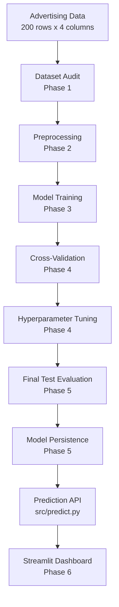

The work is organised into six phases, each one a notebook, with a strict rule carried throughout: **the
40-row test set is used exactly once**, at the very end, and never for choosing anything.

---

## 2. Problem Statement

The CodSoft task statement describes the problem as:

> Sales prediction involves forecasting the amount of a product that customers will purchase, taking into
> account various factors such as advertising expenditure, target audience segmentation, and advertising
> platform selection.

A note on scope, stated up front rather than in a footnote: the dataset supports the **advertising
expenditure** and **platform selection** parts of that statement. It contains no audience, demographic,
geographic or time information, so **target audience segmentation cannot be studied here**. That is a
property of the data, not an omission in the analysis.

---

## 3. Project Objectives

1. Verify and document the exact dataset the CodSoft task refers to, rather than substituting a similar one.
2. Audit the data for missingness, duplicates, outliers and leakage before any modelling.
3. Build a reusable preprocessing pipeline that every later stage imports unchanged.
4. Establish a naive baseline so that every model's improvement is measured against something.
5. Compare several regression families on identical data.
6. Select a model honestly — using cross-validation on the training set only.
7. Evaluate the selected model once on a held-out test set and report that number as the result.
8. Persist the complete fitted pipeline and expose it through a prediction API.
9. Deliver an interactive dashboard that consumes the persisted model without retraining.

---

## 4. Dataset

The dataset is the one the CodSoft source document links to, traced end to end rather than substituted:

| | |
|---|---|
| **Source document** | `DATA SCIENCE.pdf`, page 9 — "TASK 4 · SALES PREDICTION USING PYTHON · DATASET CLICK HERE" |
| **Link behind "CLICK HERE"** | `https://www.kaggle.com/code/ashydv/sales-prediction-simple-linear-regression/input` |
| **Dataset behind that notebook** | Kaggle dataset `ashydv/advertising-dataset` (read from the notebook's own `datasetDataSources` metadata) |
| **Dataset URL** | https://www.kaggle.com/datasets/ashydv/advertising-dataset |
| **Filename** | `dataset/advertising.csv` |
| **Size** | 4,062 bytes |
| **SHA-256** | `137f755ad6fd3bc6471085f7631a2fba6c04cb8acd71eaf5cc9af6839d43fdd5` |
| **Shape** | **200 observations × 4 columns** |
| **Origin** | the *Advertising* dataset from *An Introduction to Statistical Learning* (ISLR) |

**Verification.** Before being used, the downloaded file was checked against the saved outputs of the linked
Kaggle notebook — identical shape `(200, 4)`, identical first five rows and an identical `describe()` table.

**The raw file is treated as read-only.** Its SHA-256 is re-computed and asserted at the end of every
notebook, and no phase of the project writes to `dataset/`.

---

## 5. Dataset Structure

| Column | Role | Description | Type |
|---|---|---|---|
| `TV` | Feature | Advertising spend through TV | `float64` |
| `Radio` | Feature | Advertising spend through Radio | `float64` |
| `Newspaper` | Feature | Advertising spend through Newspaper | `float64` |
| `Sales` | **Target** | Sales outcome recorded for that campaign | `float64` |

Each row is one observation, pairing three platform budgets with the sales that followed. The file carries
**no identifier, date or text column**, so the data is **cross-sectional, not a time series** — there is no
chronology to respect when splitting.

The monetary and sales units are not stated anywhere in the source. ISLR conventionally uses thousands of
dollars and thousands of units, but since the file ships without a data dictionary, this README refers to
them simply as *sales units* and *spend*.

### Descriptive statistics

| Column | Count | Mean | Std | Min | 25% | Median | 75% | Max | Skew |
|---|---|---|---|---|---|---|---|---|---|
| `TV` | 200 | 147.0425 | 85.8542 | 0.7 | 74.375 | 149.75 | 218.825 | 296.4 | −0.070 |
| `Radio` | 200 | 23.2640 | 14.8468 | 0.0 | 9.975 | 22.90 | 36.525 | 49.6 | +0.094 |
| `Newspaper` | 200 | 30.5540 | 21.7786 | 0.3 | 12.750 | 25.75 | 45.100 | 114.0 | +0.895 |
| `Sales` | 200 | 15.1305 | 5.2839 | 1.6 | 11.000 | 16.00 | 19.050 | 27.0 | −0.074 |

`TV` spans a range roughly six times wider than `Radio` — the reason the pipeline standardises features.
`Newspaper` is the only visibly right-skewed predictor. The target is close to symmetric, so **no target
transformation was applied**.

---

## 6. Exploratory Data Analysis

> **These charts describe the original 200-row dataset.** They are not predictions, and they are not
> influenced by any input a user enters in the dashboard.

### Target distribution

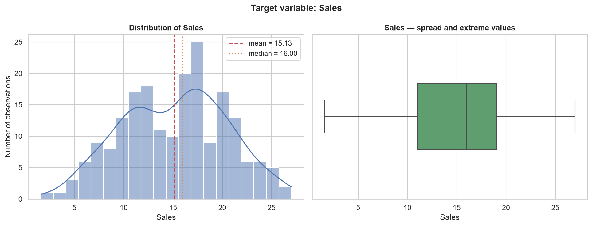

`Sales` ranges from 1.6 to 27.0 with a mean of 15.13 and a median of 16.00. Skewness is −0.074 — close
enough to symmetric that no transformation is indicated — and kurtosis is −0.64, meaning the distribution is
flatter than a normal one rather than heavy-tailed. No observation lies beyond the box-plot whiskers.

### Advertising spend versus Sales

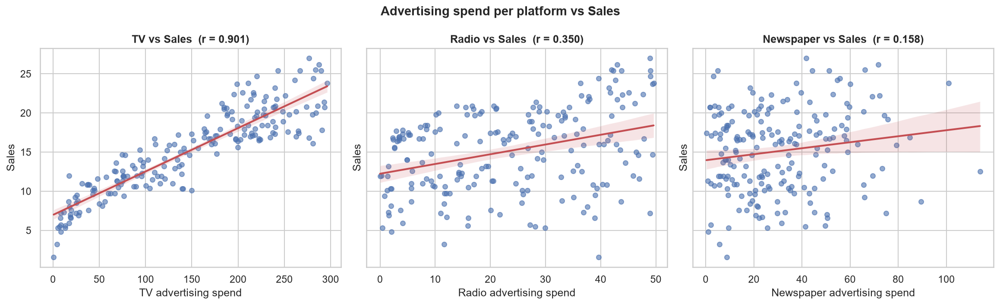

Each platform examined individually against `Sales`. The fitted lines are visual guides to the trend, not
models. `TV` shows a clear, close-to-linear upward pattern; `Radio` a real but much looser one; `Newspaper`
a nearly shapeless cloud. The `TV` panel also hints at non-constant variance — the vertical spread of
`Sales` appears wider at high TV spend.

### Correlation

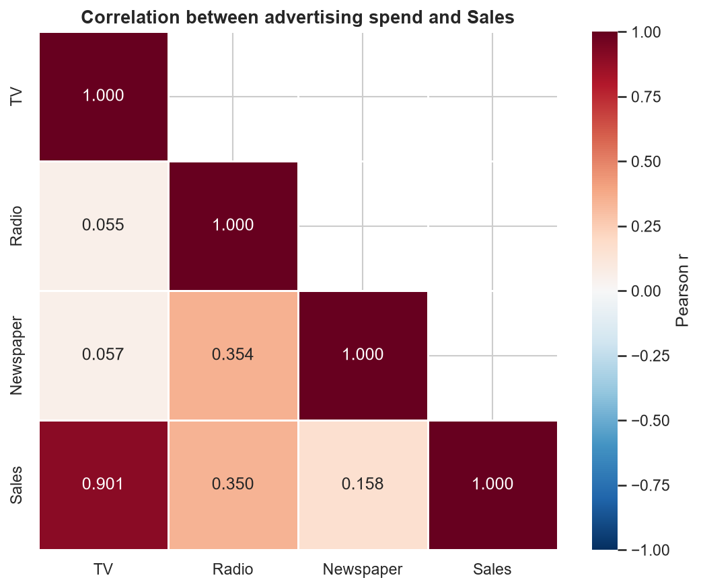

| Pair | Pearson *r* |
|---|---|
| `TV` ↔ `Sales` | **0.901** |
| `Radio` ↔ `Sales` | **0.350** |
| `Newspaper` ↔ `Sales` | **0.158** |
| `Radio` ↔ `Newspaper` | 0.354 |
| `TV` ↔ `Newspaper` | 0.057 |
| `TV` ↔ `Radio` | 0.055 |

**These are correlations, not causal effects.** A correlation describes how two quantities move together in
observational data. It does **not** establish that spending more on a platform causes sales to rise —
budgets were set by someone for reasons the dataset does not record, and no experiment is involved.

The predictors are only weakly correlated with each other (strongest pair 0.354), so there is **no
meaningful multicollinearity** and a linear model's coefficients should be individually interpretable.

---

## 7. Data Quality Findings

Established in Phase 1 and carried unchanged through every later phase.

| Aspect | Finding |
|---|---|
| **Shape** | 200 rows × 4 columns |
| **Missing values** | **none** — 0 of 800 cells |
| **Duplicate rows** | **none** — 0 exact duplicates, 0 duplicated feature combinations |
| **Data types** | all four columns `float64`; no conversion needed |
| **Categorical / text / ID / date columns** | none |
| **Constant or near-constant columns** | none |
| **Negative values** | none |
| **Sentinel values** (−1, 999, −999) | none |
| **Suspicious zeros** | one legitimate `Radio = 0.0` — a campaign with no radio spend |
| **Outliers** | **2 rows (1.0%)**, both high `Newspaper` budgets (114.0 and 100.9) |
| **Leakage** | no feature derived from `Sales`; no future information; no ID used as a predictor |

### The outlier decision

Rows 16 and 101 were flagged by the standard **IQR rule** — `Newspaper` above Q3 + 1.5 × IQR, i.e. above
93.625. Both were flagged by the 3-standard-deviation criterion as well.

**Both were retained in every phase.** They are plausible advertising budgets, not data errors: neither is
negative, a sentinel code, a duplicate or an impossible magnitude, and the corresponding `Sales` values
(12.5 and 23.8) sit comfortably inside the normal range of the target. Statistical unusualness alone is not
evidence that an observation is invalid, and with only 200 rows, discarding real data costs more than it
gains.

This was not merely asserted — Phase 4 tested it directly. See
[outlier sensitivity analysis](#outlier-sensitivity-analysis).

---

## 8. Machine Learning Workflow

```
advertising.csv
      ↓
Raw data validation          (schema, dtypes, missing, finite, row count, checksum)
      ↓
Separate X / y               (X = TV, Radio, Newspaper   ·   y = Sales)
      ↓
Train/test split             (80 / 20, random_state=42 — BEFORE anything is learned)
      ↓
Fit preprocessor on X_train only
      ↓
Transform X_train  →  Transform X_test   (same fitted object, no refit)
      ↓
Model-ready datasets
      ↓
Cross-validated selection and tuning  (training set only)
      ↓
One-time test evaluation  →  Persisted pipeline  →  Prediction API  →  Dashboard
```

| Phase | Notebook | What it produced | Test set used? |
|---|---|---|---|
| **1** | `01_dataset_audit.ipynb` | Verified dataset, EDA, leakage audit | No |
| **2** | `02_data_preprocessing.ipynb` | Reusable pipeline, locked 160/40 split | No |
| **3** | `03_model_training.ipynb` | Baseline plus five models, first comparison | Scored once per model |
| **4** | `04_model_validation_tuning.ipynb` | Cross-validated selection and tuning | **No** |
| **5** | `05_final_evaluation_persistence.ipynb` | One-time test evaluation, persisted pipeline | Scored once |
| **6** | `app.py` | Streamlit dashboard | No |

All five notebooks run top to bottom from a fresh kernel with **zero errors**, use repository-relative paths
and contain no absolute paths.

---

## 9. Phase 1 — Dataset Audit

**Notebook:** [`notebooks/01_dataset_audit.ipynb`](notebooks/01_dataset_audit.ipynb) — 65 cells, 18 sections

The dataset was traced to its source, downloaded, verified against the linked notebook's published outputs,
and audited before any modelling decision was taken.

**Target identification.** `Sales` was not assumed — it follows from the task statement (the only column
measuring an amount purchased), from the structure of the data (the other three columns are inputs a
business controls; `Sales` is the outcome it observes), and from the source notebook's own problem
statement.

**Leakage audit.** Checked explicitly and programmatically: no predictor is a deterministic function of the
target (no |r| > 0.98, no constant ratio to `Sales`), there is no future information, no ID column exists,
and there are no duplicate rows that could cross a train/test boundary.

**Charts deliberately not produced.** Two planned chart slots were left empty rather than filled with
misleading figures: a missing-values chart (there is no missingness to plot) and a sales-by-category chart
(there are no categorical variables). Both findings are reported in text instead.

---

## 10. Phase 2 — Data Preprocessing

**Notebook:** [`notebooks/02_data_preprocessing.ipynb`](notebooks/02_data_preprocessing.ipynb) — 61 cells
**Module:** [`src/data_preprocessing.py`](src/data_preprocessing.py)

The implementation lives in the module and is *imported* by every later phase rather than copied — if the
preprocessing existed only as notebook cells, each phase would need its own copy and the copies would drift.

### Architecture

```
ColumnTransformer
  └── "numeric"  →  Pipeline([("scaler", StandardScaler())])   on  ["TV", "Radio", "Newspaper"]
      remainder = "drop"
```

A `ColumnTransformer` keyed on column **names** is used even though all predictors are numeric: it pins the
transformation to names rather than positions, so a caller that supplies columns in a different order — or
an extra column — is rejected instead of silently mis-transformed.

### Decisions

| | |
|---|---|
| **Split** | 80 / 20 → **160 train / 40 test**, `random_state = 42`, performed **before** anything is fitted |
| **Split type** | plain random — the data is cross-sectional, with no group or time column |
| **Outliers** | **retained**; all 200 observations kept |
| **Missing values** | **no imputation** — there are none, and a silent imputer would later mask a genuinely absent input at prediction time. Missing or non-finite input is validated and *raised on* instead |
| **Encoding** | none — no categorical, text, ID or date column exists |
| **Feature engineering** | none — no derived feature, and nothing derived from the target |
| **Scaling** | `StandardScaler`, fitted on `X_train` only |

**Why scaling, given trees do not need it.** Ridge and Lasso penalise coefficients and so depend on
predictor scale; `TV` spans 0.7–296.4 while `Radio` spans 0.0–49.6, so without scaling the penalty would
fall unevenly. Ordinary least squares is unaffected by a linear rescaling, and tree ensembles are invariant
to it. One standardised pipeline shared by every candidate is therefore simpler and safer than maintaining
two competing preprocessing paths, at no cost to the models that do not need it.

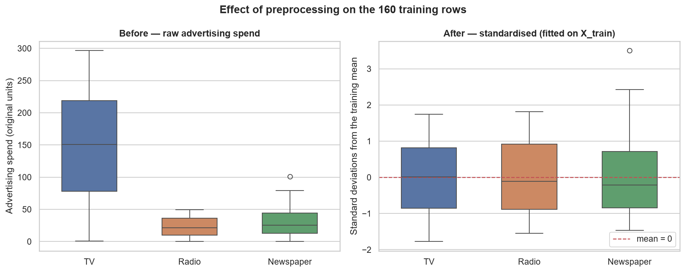

*Left:* three budgets on incomparable scales. *Right:* the same 160 training rows after standardisation,
centred on zero. The retained `Newspaper` outlier is still plotted on both panels — standardisation shifts
and rescales an axis, it does not delete extreme observations.

### Leakage prevention — demonstrated, not asserted

| Check | Result |
|---|---|
| Scaler's `mean_` equals the **training** mean `[150.02, 22.88, 29.95]`, not the full-dataset mean `[147.04, 23.26, 30.55]` | ✅ |
| Transforming the test set leaves `mean_`, `scale_` and `n_samples_seen_` unchanged (`n_samples_seen_` stays 160) | ✅ |
| Transformed **training** set is centred on exactly 0; transformed **test** set is not (means ≈ −0.18, 0.13, 0.15) | ✅ |
| A frame containing `Sales` is rejected outright rather than silently transformed | ✅ |

Nine deliberately broken inputs (missing column, unexpected column, absent target, non-numeric column,
missing value, infinite value, wrong row count, target inside `X`, absent file) are each rejected with a
specific error — a validator that never fails would be no evidence of anything.

---

## 11. Phase 3 — Model Training

**Notebook:** [`notebooks/03_model_training.ipynb`](notebooks/03_model_training.ipynb) — 78 cells

A first comparison. Every configuration was fixed in advance and scored once; **no tuning, no search, no
saved model**.

**Baseline.** Predict the mean of `y_train` (**15.3306**) for every test observation. This is a reference
point, not a machine learning model. The mean is taken from the training rows only — using the full
dataset's mean would leak the test rows into the reference.

### Results on the 40-row hold-out

| Model | Test MAE | Test RMSE | Test R² | Train RMSE | Gap |
|---|---|---|---|---|---|
| Gradient Boosting (200 stages, lr 0.05, depth 3) | 0.8679 | **1.1451** | 0.9576 | 0.4438 | 0.7013 |
| Random Forest (300 trees) | 0.9025 | **1.1798** | 0.9550 | 0.4716 | 0.7082 |
| Lasso (α = 0.01) | 1.2725 | 1.7050 | 0.9059 | 1.6360 | 0.0691 |
| Linear Regression | 1.2748 | 1.7052 | 0.9059 | 1.6359 | 0.0693 |
| Ridge (α = 1.0) | 1.2734 | 1.7074 | 0.9057 | 1.6362 | 0.0713 |
| Baseline (training mean) | 4.9315 | 5.6482 | −0.0324 | 5.1768 | 0.4714 |

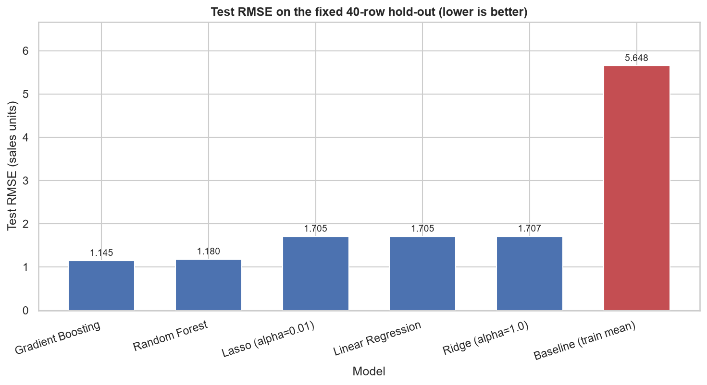

**Findings.**

- Every model beats the naive baseline by roughly 70–80% on test RMSE — the advertising budgets carry real
  signal.
- **The three linear models are indistinguishable** (1.7050–1.7074, a range of 0.0024). With three weakly
  correlated predictors and 160 training rows there is nothing for a regularisation penalty to fix. Lasso at
  α = 0.01 drove no coefficient to zero.
- **The two tree ensembles form a clearly better cluster** (~1.15–1.18), about 31% below the linear group,
  suggesting the relationship is not purely additive.
- Gradient Boosting and Random Forest differ by 0.0347 RMSE on 40 rows — **not a meaningful separation**.

Linear coefficients (standardised units) put `TV` at +4.59, `Radio` at +1.49 and `Newspaper` at +0.09 — the
same ordering as the correlations, with `Newspaper` contributing almost nothing once the others are
accounted for.

---

## 12. Phase 4 — Cross-Validation & Hyperparameter Tuning

**Notebook:** [`notebooks/04_model_validation_tuning.ipynb`](notebooks/04_model_validation_tuning.ipynb) — 64 cells

**The 40-row test set was not touched anywhere in this phase.** Its fingerprint was recorded at the start
and verified unchanged at the end. All selection used **5-fold `KFold` (`shuffle=True`, `random_state=42`)
on the 160 training rows**; each fold trains on 128 rows and validates on 32.

Every model is a `Pipeline` whose first step is the Phase 2 preprocessor, so the scaler is **refitted inside
each fold**. Verified empirically: a fold's scaler has `n_samples_seen_ = 128` and matches that fold's mean
(155.27), not the full training mean (150.02).

### Cross-validation results

| Model | CV RMSE | CV MAE | CV R² | Train RMSE | Gap |
|---|---|---|---|---|---|
| Random Forest | **1.3044** ± 0.2354 | 0.9481 | 0.9324 | 0.4940 | 0.8104 |
| Gradient Boosting | **1.3603** ± 0.1695 | 1.0396 | 0.9248 | 0.3586 | 1.0017 |
| Lasso (α = 0.01) | 1.6789 ± 0.2787 | 1.2777 | 0.8797 | 1.6267 | 0.0522 |
| Ridge (α = 1.0) | 1.6805 ± 0.2810 | 1.2791 | 0.8796 | 1.6271 | 0.0534 |
| Linear Regression | 1.6808 ± 0.2825 | 1.2782 | 0.8793 | 1.6266 | 0.0542 |
| Baseline (training mean) | 5.2061 ± 0.4784 | 4.3316 | −0.0712 | 5.1697 | 0.0364 |

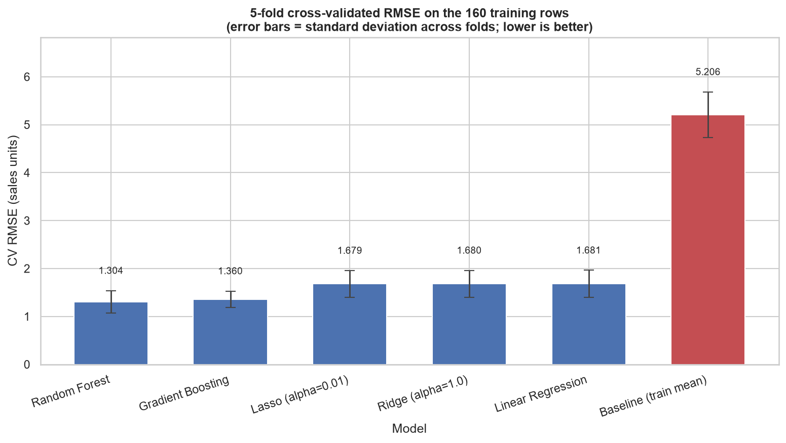

**Cross-validation reversed the Phase 3 ordering.** On the hold-out, Gradient Boosting beat Random Forest by
0.0347; across the five training folds, Random Forest beats Gradient Boosting by 0.0559 and **wins 3 of 5
folds**. Neither ordering is trustworthy: the models sit ~0.05 apart while each varies by 0.17–0.24 between
folds. The Phase 3 ranking was an artefact of which 40 rows happened to land in the test set.

### Overfitting analysis

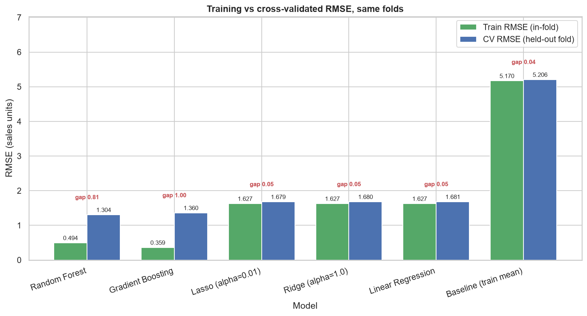

| Model | Train RMSE | CV RMSE | Gap | Gap as % of CV RMSE | Train R² | CV R² |
|---|---|---|---|---|---|---|
| Gradient Boosting | 0.3586 | 1.3603 | 1.0017 | **74%** | 0.9952 | 0.9248 |
| Random Forest | 0.4940 | 1.3044 | 0.8104 | **62%** | 0.9908 | 0.9324 |
| Linear / Ridge / Lasso | ~1.627 | ~1.680 | ~0.053 | **3%** | ~0.901 | ~0.879 |

Both ensembles fit training noise substantially — 62–74% of their apparent accuracy does not survive unseen
data, with train R² above 0.99. The linear models' 3% gaps reflect having almost no capacity to memorise:
three coefficients and an intercept fitted to 128 rows.

**A large gap is not on its own grounds for rejection.** The ensembles still beat the linear models by ~0.38
RMSE on held-out folds. The gap indicates unused capacity, which is what tuning then tested.

### Hyperparameter search

Exhaustive `GridSearchCV`, `scoring="neg_root_mean_squared_error"`, `cv=5`, on the training set only.

**Gradient Boosting — 216 configurations (1,080 fits)**

| Parameter | Values searched |
|---|---|
| `n_estimators` | 100, 200, 400, 600 |
| `learning_rate` | 0.02, 0.05, 0.1 |
| `max_depth` | 2, 3, 4 |
| `min_samples_leaf` | 2, 5, 10 |
| `subsample` | 0.8, 1.0 |

**Random Forest — 72 configurations (360 fits)**

| Parameter | Values searched |
|---|---|
| `n_estimators` | 200, 500 |
| `max_depth` | None, 5, 10 |
| `min_samples_leaf` | 1, 2, 5 |
| `max_features` | "sqrt", 1.0 |
| `max_samples` | None, 0.8 |

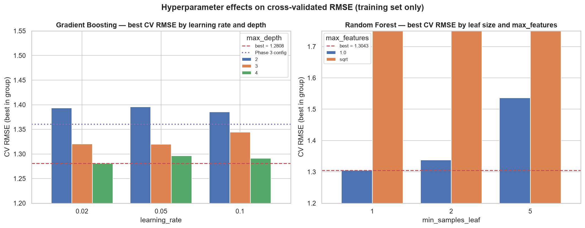

| Model | Phase 3 config CV RMSE | Tuned CV RMSE | Improvement |
|---|---|---|---|
| Gradient Boosting | 1.3603 | **1.2808** | 0.0795 (5.85%) |
| Random Forest | 1.3044 | **1.3043** | 0.0001 (0.01%) |

**Tuning the Random Forest achieved nothing** — the search reproduced the default configuration. That is
reported as such rather than dressed up as a 0.0001 improvement. The only parameter that mattered for the
forest was `max_features`: restricting splits to 1 of 3 features (`"sqrt"`) averaged 2.106 RMSE against
1.419 for using all 3. With three predictors, one of which carries most of the signal, forcing two-thirds of
splits to ignore it is a handicap rather than useful decorrelation.

### Stability analysis

Repeating the cross-validation over five different partitions (`RepeatedKFold`, 25 held-out evaluations):

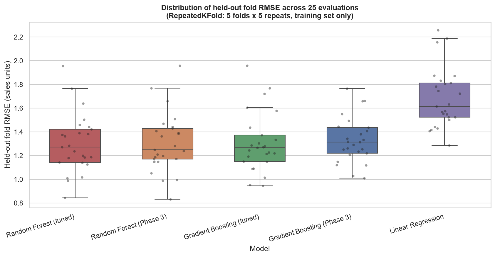

| Model | Repeated CV RMSE | Std | Min fold | Max fold |
|---|---|---|---|---|
| Random Forest (tuned) | 1.3007 | 0.2443 | 0.8443 | 1.9550 |
| Random Forest (Phase 3) | 1.3062 | 0.2457 | 0.8317 | 1.9588 |
| Gradient Boosting (tuned) | 1.3067 | 0.2469 | 0.9457 | 1.9576 |
| Gradient Boosting (Phase 3) | 1.3301 | 0.1886 | 1.0098 | 1.7657 |
| Linear Regression | 1.6830 | 0.2474 | 1.2862 | 2.2569 |

Three conclusions, in order of how well supported they are:

1. **The four ensemble variants are indistinguishable** — a 0.029 spread against standard deviations of
   0.19–0.25, with individual fold scores ranging from 0.83 to 1.96.
2. **Most of the tuning gain did not survive a change of partition.** Gradient Boosting's advantage was
   0.0795 on the original folds but **0.0234 across 25** — roughly 70% of it was the search fitting that
   specific fold partition, the selection bias inherent in picking the best of 216 configurations scored on
   the same folds.
3. **The ensemble-versus-linear gap is the one stable finding** (~1.30 vs ~1.68 in every partition tested).

### Outlier sensitivity analysis

Of the two flagged `Newspaper` rows, **row 101 is in the training set and row 16 is in the test set**. Since
the test set was off-limits in this phase, only row 101 could be removed — a 160-vs-159 row comparison.

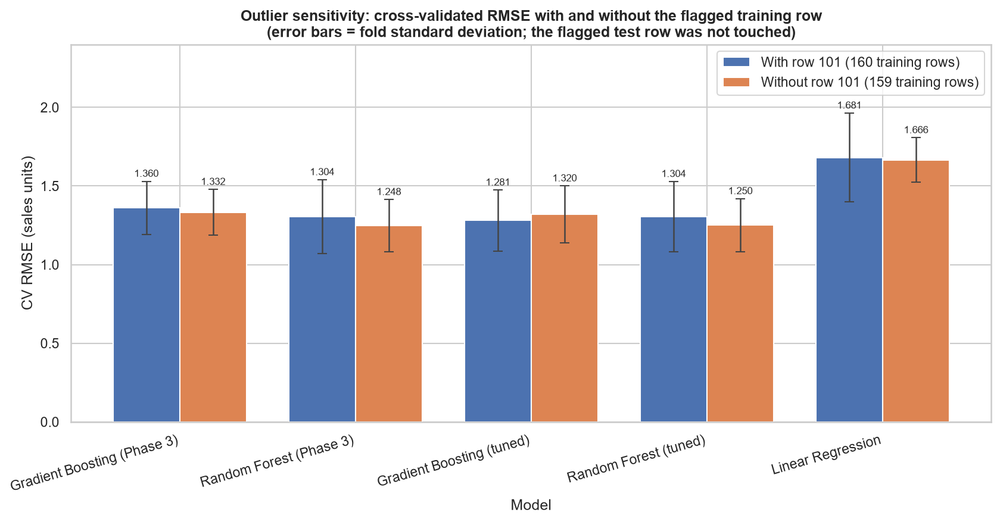

| Model | CV RMSE (160) | CV RMSE (159) | Change |
|---|---|---|---|
| Gradient Boosting (tuned) | 1.2808 | 1.3200 | **+0.0392 (worse)** |
| Random Forest (tuned) | 1.3043 | 1.2504 | −0.0538 (better) |
| Random Forest (Phase 3) | 1.3044 | 1.2479 | −0.0564 (better) |
| Gradient Boosting (Phase 3) | 1.3603 | 1.3320 | −0.0283 (better) |
| Linear Regression | 1.6808 | 1.6662 | −0.0146 (better) |

**Decision: keep all observations.** The direction is inconsistent — removal helps four models and hurts the
leading one — and every change is around an order of magnitude smaller than the fold-to-fold noise. Removing
real data to chase a change smaller than the measurement noise would be fitting the preprocessing to the
metric.

---

## 13. Phase 5 — Final Evaluation & Model Persistence

**Notebook:** [`notebooks/05_final_evaluation_persistence.ipynb`](notebooks/05_final_evaluation_persistence.ipynb) — 59 cells

### The distinction that matters

| | |
|---|---|
| **Phase 4** | Model **selection**, using 5-fold cross-validation on the 160 **training** rows only. The test set was never touched. |
| **Phase 5** | One-time final **evaluation** on the previously untouched 40-row hold-out. No selection, no tuning, no preprocessing changes. |

Before anything was fitted, the test set's fingerprint was re-verified against the value Phase 4 recorded —
the 40 rows evaluated are byte-for-byte those set aside.

Phase 4 pre-registered both the model and the rule for interpreting the result:

> Fit the selected configuration on all 160 training rows and evaluate it **once** on the 40-row test set.
> Report that number as the final result, without re-selecting afterwards. If the test score is worse than
> the CV estimate, that is information about a 40-row sample, not a reason to go back and pick the other
> model.

That rule turned out to matter — see [§15](#15-final-test-results).

---

## 14. Final Model

```python
Pipeline([
    ("preprocessor", ColumnTransformer([
        ("numeric", Pipeline([("scaler", StandardScaler())]), ["TV", "Radio", "Newspaper"]),
    ], remainder="drop")),
    ("model", GradientBoostingRegressor(
        n_estimators=200,
        learning_rate=0.02,
        max_depth=4,
        min_samples_leaf=2,
        subsample=0.8,
        random_state=42,
    )),
])
```

| | |
|---|---|
| **Algorithm** | `GradientBoostingRegressor` (scikit-learn) |
| **Selected by** | Phase 4 — 5-fold CV RMSE on the 160 training rows |
| **Preprocessing** | `StandardScaler` inside the pipeline, fitted on the 160 training rows only |
| **Features** | `TV`, `Radio`, `Newspaper` |
| **Target** | `Sales` |
| **Training rows** | 160 |
| **Test rows** | 40 |
| **Phase 4 CV** | RMSE **1.2808 ± 0.1936** · MAE **0.9393** · R² **0.9341** *(training set)* |

Verified at fit time: the scaler's `n_samples_seen_` is 160 and its mean matches the training mean, **not**
the full-dataset mean.

**Impurity-based feature importance** — `TV` 0.8428, `Radio` 0.1424, `Newspaper` 0.0147. Reported as
context, not as effect sizes: impurity importance favours continuous, high-cardinality features, and none of
it establishes causation.

---

## 15. Final Test Results

**Evaluated once on 40 held-out observations.**

| Metric | Value |
|---|---|
| **RMSE** | **1.2173** |
| **MAE** | **0.9354** |
| **R²** | **0.9520** |
| **MSE** | **1.4819** |

| | RMSE | MAE | R² |
|---|---|---|---|
| **Phase 4 CV** (5-fold, 160 training rows) | 1.2808 ± 0.1936 | 0.9393 | 0.9341 |
| **Phase 5 TEST** (once, 40 held-out rows) | **1.2173** | **0.9354** | **0.9520** |

The test figure came in 0.064 **better** than the cross-validated estimate — well inside the CV standard
deviation of 0.1936, so the two measurements are consistent rather than the test set being "easier".

Against the naive baseline, the final model reduces test **RMSE by 78.4%** and **MAE by 81.0%**.

### Comparison on the same 40-row hold-out

| Model | Test MAE | Test RMSE | Test R² |
|---|---|---|---|
| Gradient Boosting (Phase 3, untuned) | 0.8679 | 1.1451 | 0.9576 |
| Random Forest (Phase 3) | 0.9025 | 1.1798 | 0.9550 |
| **Gradient Boosting (tuned) — FINAL** | **0.9354** | **1.2173** | **0.9520** |
| Lasso (α = 0.01) | 1.2725 | 1.7050 | 0.9059 |
| Linear Regression | 1.2748 | 1.7052 | 0.9059 |
| Ridge (α = 1.0) | 1.2734 | 1.7074 | 0.9057 |
| Baseline (training mean) | 4.9315 | 5.6482 | −0.0324 |

### ⚠️ An honest note on the final result

**The tuned final model scored worse on this hold-out (1.2173) than the untuned Phase 3 Gradient Boosting
configuration (1.1451)** — a difference of 0.072 RMSE units.

**It was retained anyway, and that is deliberate.** Model selection had already been completed using
training-set cross-validation before the test set was opened. Switching now, on the strength of these 40
rows, would be selecting a model *using the test set* — precisely what a held-out set exists to prevent, and
it would make every number reported afterwards optimistic.

Phase 4 had already shown that these configurations **cannot be separated by this dataset**: across 25
repeated cross-validation folds they sat within 0.023 RMSE of each other, against fold-to-fold standard
deviations of roughly 0.19–0.25. Neither result establishes one as genuinely better.

It is worth noting this is the *second* time a single 40-row measurement produced an ordering that did not
replicate: the same hold-out ranked Gradient Boosting above Random Forest, and cross-validation reversed
that too. Following the pre-registered rule costs about 0.07 RMSE units of reported performance and buys a
number that means what it claims to.

---

## 16. Error Analysis

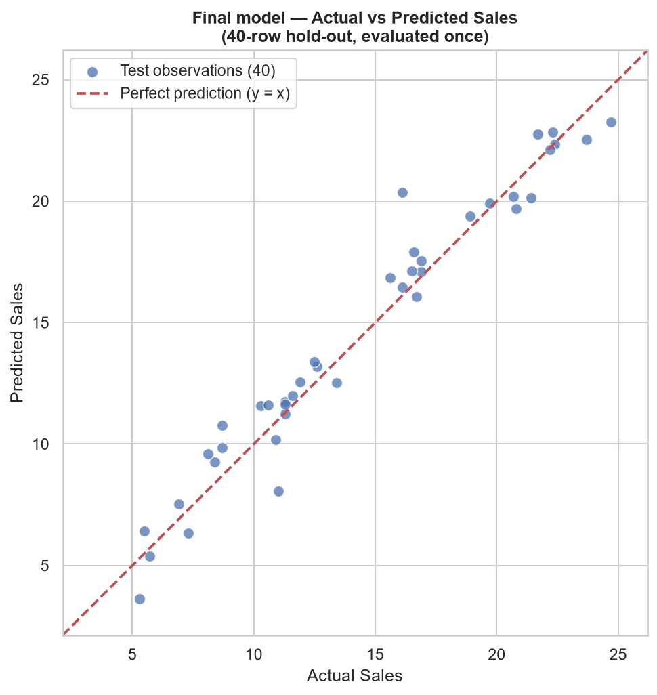

Each point is one of the 40 test observations; the dashed diagonal is where a perfect prediction would land.
Points track the diagonal closely across the observed range (5.3 to 24.7), with two visibly detached.

### Error descriptives

| Statistic | Value |
|---|---|
| Mean error (bias) | −0.2422 |
| Median absolute error | 0.7970 |
| Maximum absolute error | 4.2553 |
| Largest under-prediction | +2.9502 |
| Residual standard deviation | 1.2082 |
| Residual skewness | −0.3114 |
| Mean absolute % error (MAPE) | 8.11% |
| Median absolute % error | 5.36% |
| Observations with error > 2.0 | 3 of 40 |
| Observations with error > 3.0 | 1 of 40 |

### Prediction-error coverage

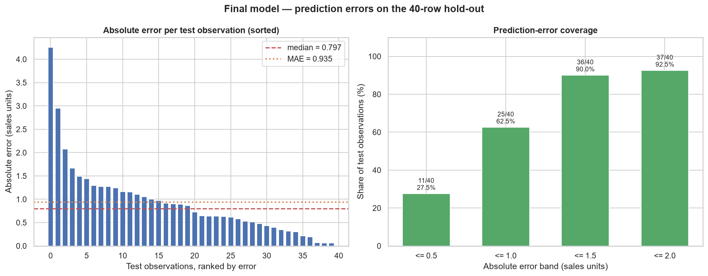

| Band | Observations | Coverage |
|---|---|---|
| within ± 0.5 | 11 / 40 | **27.5%** |
| within ± 1.0 | 25 / 40 | **62.5%** |
| within ± 1.5 | 36 / 40 | **90.0%** |
| within ± 2.0 | 37 / 40 | **92.5%** |

> These are **prediction-error coverage** figures — the share of held-out campaigns whose predicted `Sales`
> fell within that many units of the actual value. They are **not classification accuracy**: this is a
> regression problem and there are no classes. They describe one 40-row sample and are not guarantees about
> future predictions.

### Residual behaviour

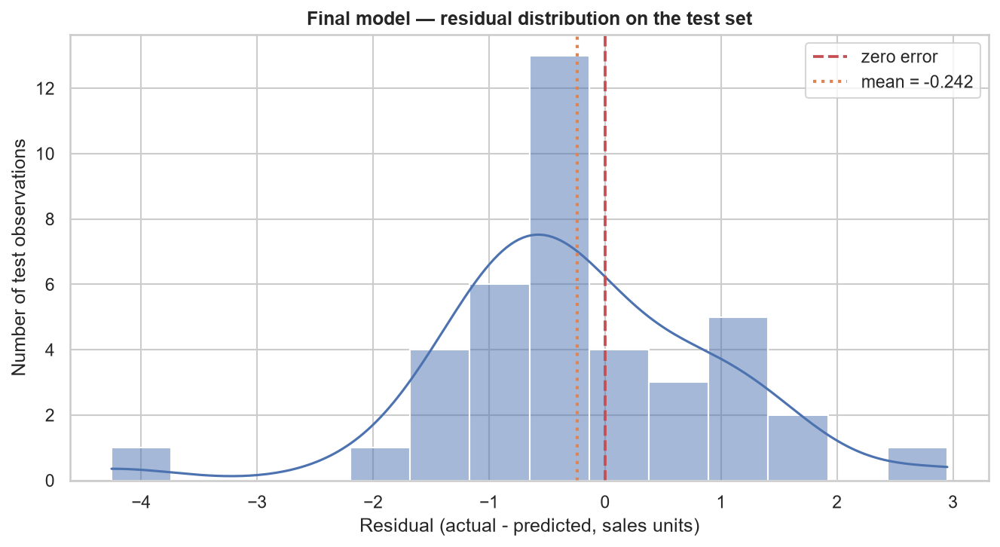

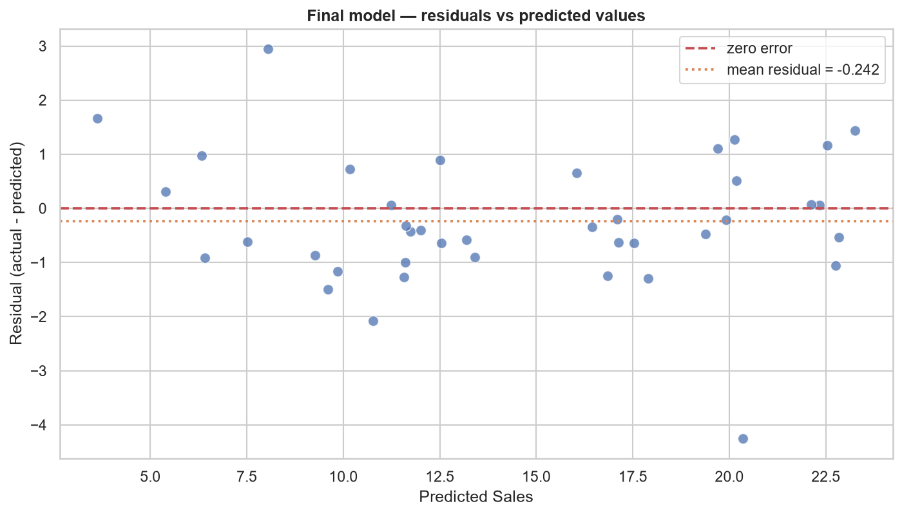

Residuals are mildly left-skewed (−0.3114), with 36 of 40 inside ±1.5 sales units. The mean residual of
−0.2422 indicates a slight tendency to over-predict — small against the target's standard deviation of 5.63,
and on 40 rows not distinguishable from zero.

The residuals-versus-predicted plot shows **no obvious funnel and no clear curvature**. The one mild pattern
is that the largest errors occur at both ends rather than in the middle, consistent with the prediction
range (3.63–23.26) being slightly narrower than the actual range (5.3–24.7) — the mild regression toward the
mean characteristic of tree ensembles, which cannot extrapolate beyond the target values seen in training.

### The two worst predictions

| Row | TV | Radio | Newspaper | Actual | Predicted | Error |
|---|---|---|---|---|---|---|
| 150 | 280.7 | 13.9 | 37.0 | 16.1 | 20.3553 | **−4.2553** |
| 66 | 31.5 | 24.6 | 2.2 | 11.0 | 8.0498 | **+2.9502** |

Both are observations whose sales do not follow the usual spend-to-sales pattern, in opposite directions:
row 150 had heavy TV spend that under-performed its profile; row 66 had minimal spend across all three
platforms and over-performed. These are the same rows Phase 3 struggled with — consistent behaviour, not a
defect introduced by tuning.

**The retained outlier.** Row 16 — the `Newspaper` = 114.0 observation Phase 1 flagged — was predicted at
13.3993 against an actual 12.5, an absolute error of **0.8993**, ranking **18th of 40**: squarely in the
middle of the error distribution. Retaining it cost nothing measurable here.

---

## 17. Model Persistence

| | |
|---|---|
| **Path** | `models/final_sales_prediction_pipeline.joblib` |
| **Size** | 452,631 bytes (442.0 KiB) |
| **SHA-256** | `5391ee326cf03ebc1257597e3b10abefae5f967d683371b469787d7a7cc3d4a4` |
| **Format** | `joblib` — `{"pipeline": <fitted Pipeline>, "metadata": {...}}` |

The **complete** pipeline is saved — the fitted `ColumnTransformer` (carrying the scaler's learned mean and
scale) together with the fitted model. Saving only the estimator would produce an artefact that silently
mis-predicts, because it would receive raw budgets where it expects standardised ones.

### Recorded metadata

Model type · hyperparameters · feature names · target name · training and test row counts · random state and
test size · dataset filename and SHA-256 · CV metrics · test metrics · training feature ranges · and the
versions of Python (3.13.0), scikit-learn (1.9.1), joblib (1.6.0), pandas (3.0.6) and numpy (2.5.3).

### Validation

The artefact was reloaded **in a completely fresh Python process** with no access to the notebook's state
and produced **bit-identical predictions** to those taken before saving (maximum difference 0.000e+00). The
notebook was executed twice from fresh kernels with all 36 code cells producing byte-identical output,
including the artefact's own checksum.

---

## 18. Prediction API

**Module:** [`src/predict.py`](src/predict.py)

A clean interface over the persisted pipeline. It never trains, never refits, never modifies the artefact,
and does not need the original dataset.

```python
import sys; sys.path.insert(0, "src")
from predict import predict_sales

predict_sales(tv=150.0, radio=25.0, newspaper=30.0)   # -> 14.0096
```

### Public functions

| Function | Purpose |
|---|---|
| `predict_sales(tv, radio, newspaper)` | Predict sales for one budget combination |
| `predict_batch(rows)` | Predict for a DataFrame or iterable of mappings |
| `load_artifact(path=None)` | Load `(pipeline, metadata)`, cached per path |
| `model_metadata(path=None)` | The metadata recorded at save time |
| `training_ranges(path=None)` | Min/max of each predictor in the training data |
| `ModelArtifactError` | Raised when the artefact is missing or unusable |

### Input validation

Inputs are validated rather than coerced silently. Rejected with specific errors:

| Input | Result |
|---|---|
| `None` | `ValueError: TV is required but was None.` |
| `NaN` | `ValueError: TV is missing (NaN). This model does not impute missing budgets…` |
| Non-numeric string | `TypeError: TV must be numeric, got the non-numeric string 'abc'.` |
| Empty string | `ValueError: TV is required but was an empty string.` |
| Boolean | `TypeError: TV must be a number, got a boolean (True).` |
| Infinity | `ValueError: TV must be finite, got inf.` |
| Negative budget | `ValueError: TV must be zero or positive, got -10.0.` |

Floats, integers and numeric strings all produce identical predictions. **There is deliberately no
imputer** — at prediction time a silent imputer would substitute a training mean for a genuinely absent
input and return a confident-looking number, hiding a real data problem.

### Command line

```bash
python src/predict.py --tv 150 --radio 25 --newspaper 30
python src/predict.py --smoke-test
```

The CLI exits non-zero with a clear message on invalid input and flags inputs outside the training ranges.

---

## 19. Streamlit Dashboard

**Application:** [`app.py`](app.py) · **Theme:** [`.streamlit/config.toml`](.streamlit/config.toml)

```bash
streamlit run app.py
```

**The dashboard is a presentation layer.** It loads the pipeline persisted in Phase 5 and calls the existing
`src/predict.py` API — it contains **no inference code of its own**, and it **never retrains, tunes or
modifies any model**. Neither the dataset nor the artefact is ever written to.

| | |
|---|---|
| **Model loading** | `@st.cache_resource` via `predict_api.load_artifact()` — loaded once per session, shared with the CLI |
| **Data caching** | `@st.cache_data` for the dataset and derived statistics |
| **Startup** | no training; the app is ready as soon as the artefact loads |
| **Navigation** | sidebar radio across six pages, one shared loading path |
| **Charts** | Plotly (interactive) for live data; the project's matplotlib/seaborn figures remain in `visualizations/` |

The chart palette was validated for colour-blind safety against the dashboard surface rather than chosen by
eye (CVD ΔE 9.4, normal-vision ΔE 20.9, contrast ≥ 3:1 on all pairs).

---

## 20. Dashboard Pages

| Page | Contents |
|---|---|
| **Overview** | Summary cards (200 observations, 3 features, target `Sales`, 160 train / 40 test, Gradient Boosting), a plain-language explanation of the project, the seven-stage ML pipeline, and the headline test result |
| **Predict Sales** | The interactive page — three budget inputs with training ranges shown, out-of-range warnings, a prominent prediction, and a chart of the entered budgets |
| **Data Analysis** | Live analysis of `dataset/advertising.csv`: summary statistics, Sales distribution, per-platform spend distributions, each predictor against Sales, a correlation matrix, and the Phase 1 data-quality audit |
| **Model Performance** | Final test metrics and Phase 4 CV metrics in **separate** sections, the test-RMSE comparison, prediction-error coverage, and residual behaviour |
| **Model Details** | Hyperparameters, preprocessing, training ranges, artefact information and recorded environment — read from the artefact's own metadata rather than hardcoded — plus the limitations |
| **About Project** | Task, problem, technology, ML methods, the full phase pipeline and dataset provenance |

### Prediction workflow

1. Enter a budget for **TV**, **Radio** and **Newspaper**. Defaults are the median training spend, and each
   input shows the range observed during training.
2. Inputs are floored at 0 — negative budgets are rejected, consistent with the prediction API.
3. Select **Predict Sales**. The app calls `predict_sales()`; no inference logic is duplicated.
4. If any budget falls outside the training range, a warning states the prediction is **extrapolation
   beyond the training data**. The prediction is still produced — it is flagged, not blocked.
5. The result appears alongside the entered budgets and a bar chart of them. That chart shows the inputs
   only; it is explicitly **not** a feature-importance chart.

### Honest reporting carried into the UI

The dashboard surfaces the project's caveats rather than hiding them: the small-dataset warning appears on
three pages; CV and test metrics are never combined into one figure; error bands are labelled
prediction-error coverage rather than accuracy; correlations are described as correlations; and the
tuned-worse-than-untuned finding is stated on the Model Performance page with the reasoning for retaining
the model.

### Testing

**68 automated checks** using `streamlit.testing.v1.AppTest`, all passing: every page renders without
exception, predictions match the API exactly, multiple valid predictions work, negative and invalid inputs
are rejected, out-of-range inputs warn while in-range inputs do not, and each page shows its documented
figures. The server was additionally started for real and served HTTP 200.

---

## 21. Project Visualizations

All 17 charts live in [`visualizations/`](visualizations/). Charts 02–05 describe the **dataset**; 06–19
describe **model behaviour**.

| File | Phase | What it shows |
|---|---|---|
| `02_sales_distribution.png` | 1 | Distribution and spread of the `Sales` target |
| `03_feature_vs_sales.png` | 1 | Each advertising platform against Sales, with fitted guides |
| `04_correlation_heatmap.png` | 1 | Pearson correlation between all numeric columns |
| `05_preprocessing_effect.png` | 2 | Training features before and after standardisation |
| `06_model_comparison.png` | 3 | Test RMSE across all six approaches |
| `07_model_mae_comparison.png` | 3 | Test MAE across all six approaches |
| `08_actual_vs_predicted.png` | 3 | Actual vs predicted for the Phase 3 candidate |
| `09_residual_distribution.png` | 3 | Residual distribution for the Phase 3 candidate |
| `10_residuals_vs_predicted.png` | 3 | Residuals against predicted values |
| `11_cv_model_comparison.png` | 4 | Cross-validated RMSE with fold standard deviations |
| `12_cv_rmse_distribution.png` | 4 | Fold-score distributions across 25 repeated evaluations |
| `13_hyperparameter_comparison.png` | 4 | Hyperparameter effects on cross-validated RMSE |
| `14_train_vs_cv_performance.png` | 4 | Training vs cross-validated RMSE, with gaps |
| `15_outlier_sensitivity.png` | 4 | CV RMSE with and without the flagged training row |
| `16_final_actual_vs_predicted.png` | 5 | Final model — actual vs predicted on the hold-out |
| `17_final_residual_distribution.png` | 5 | Final model — residual distribution |
| `18_final_residuals_vs_predicted.png` | 5 | Final model — residuals against predicted values |
| `19_final_prediction_errors.png` | 5 | Per-observation errors and coverage bands |

Two chart slots from the planned Phase 1 sequence were **deliberately left unused** rather than filled with
empty figures: a missing-values chart (there is no missingness to plot) and a sales-by-category chart (there
are no categorical variables). Both findings are reported in the notebook text instead.

---

## 22. Project Architecture

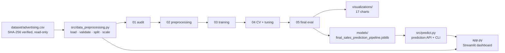

One preprocessing module is imported by every notebook and by the dashboard, so no two stages can disagree
about the split or the transformation. One prediction API is shared by the CLI and the dashboard, so no
inference logic is duplicated.

---

## 23. Technology Stack

| Category | Tools |
|---|---|
| **Language** | Python 3.13 |
| **Data** | pandas 3.0.6 · numpy 2.5.3 |
| **Machine learning** | scikit-learn 1.9.1 |
| **Static visualization** | matplotlib 3.11.2 · seaborn 0.13.2 |
| **Interactive visualization** | plotly 7.1.0 |
| **Application** | streamlit 1.64.0 |
| **Persistence** | joblib 1.6.0 |
| **Notebooks** | jupyter 1.1.1 |

**Machine learning methods:** Gradient Boosting Regression *(final)* · Random Forest Regression · Linear
Regression · Ridge Regression · Lasso Regression · mean baseline · 5-fold cross-validation · repeated
cross-validation · exhaustive grid search.

---

## 24. Project Structure

```
Task2_Sales_Prediction/
├── app.py                                    # Phase 6 — Streamlit dashboard
├── requirements.txt
├── README.md
├── .streamlit/
│   └── config.toml                           # dashboard theme
├── dataset/
│   └── advertising.csv                       # raw data — never modified
├── notebooks/
│   ├── 01_dataset_audit.ipynb                # Phase 1 — audit & EDA
│   ├── 02_data_preprocessing.ipynb           # Phase 2 — preprocessing & validation
│   ├── 03_model_training.ipynb               # Phase 3 — baseline & initial models
│   ├── 04_model_validation_tuning.ipynb      # Phase 4 — CV, tuning & stability
│   └── 05_final_evaluation_persistence.ipynb # Phase 5 — final test & persistence
├── src/
│   ├── data_preprocessing.py                 # reusable pipeline, imported everywhere
│   └── predict.py                            # prediction API + CLI
├── models/
│   └── final_sales_prediction_pipeline.joblib  # fitted pipeline + metadata
└── visualizations/                           # 17 charts (02–19)
```

---

## 25. Installation

```bash
# from the repository root
cd Task2_Sales_Prediction

# optional but recommended
python -m venv .venv
source .venv/Scripts/activate      # Windows (Git Bash)
# source .venv/bin/activate        # macOS / Linux

pip install -r requirements.txt
```

All versions in `requirements.txt` are pinned to those the project was developed and validated against.

---

## 26. Running the Jupyter Notebooks

```bash
jupyter notebook notebooks/01_dataset_audit.ipynb                 # Phase 1
jupyter notebook notebooks/02_data_preprocessing.ipynb            # Phase 2
jupyter notebook notebooks/03_model_training.ipynb                # Phase 3
jupyter notebook notebooks/04_model_validation_tuning.ipynb       # Phase 4  (~7 min: 1,440 model fits)
jupyter notebook notebooks/05_final_evaluation_persistence.ipynb  # Phase 5
```

Every notebook resolves its paths relative to the repository, contains no absolute paths, and runs top to
bottom from a fresh kernel with zero errors. Each one re-verifies the raw dataset's SHA-256 before
finishing.

To use the preprocessing directly:

```python
import sys; sys.path.insert(0, "src")
import data_preprocessing as dp

data = dp.prepare_modeling_data()   # validated, split 160/40, scaler fitted on X_train only
data.X_train_prepared, data.y_train, data.X_test_prepared, data.y_test
```

---

## 27. Running the Prediction API

```bash
# single prediction
python src/predict.py --tv 150 --radio 25 --newspaper 30
# -> 14.0096

# representative scenarios spanning the training ranges
python src/predict.py --smoke-test
```

```python
import sys; sys.path.insert(0, "src")
from predict import predict_sales, predict_batch, model_metadata
import pandas as pd

predict_sales(150.0, 25.0, 30.0)

predict_batch(pd.DataFrame([
    {"TV": 100.0, "Radio": 20.0, "Newspaper": 15.0},
    {"TV": 250.0, "Radio": 40.0, "Newspaper": 60.0},
]))

model_metadata()["hyperparameters"]
```

---

## 28. Running the Streamlit Dashboard

```bash
cd Task2_Sales_Prediction
streamlit run app.py
```

The app opens at `http://localhost:8501`. It loads the persisted model once and does not retrain at any
point. All paths resolve relative to `app.py`, so no machine-specific configuration is required.

---

## 29. Example Prediction

```bash
$ python src/predict.py --smoke-test

artefact : final_sales_prediction_pipeline.joblib
model    : GradientBoostingRegressor
trained  : 160 rows, scikit-learn 1.9.1

case                                      TV   Radio    News  predicted Sales
-----------------------------------------------------------------------------
low spend across all platforms          10.0     5.0     5.0           5.2750
medium spend across all platforms      150.0    25.0    30.0          14.0096
high TV, low other                     290.0     5.0     5.0          17.4267
high Radio, low other                   10.0    48.0     5.0           5.7700
high Newspaper, low other               10.0     5.0   110.0           7.0281  <- outside training range: Newspaper
high spend across all platforms        290.0    48.0   110.0          26.2111  <- outside training range: Newspaper
```

> These are **illustrative budget combinations chosen to span the training ranges — not rows from the
> dataset**, and not records of real campaigns. The predictions are what the model outputs for those
> hypothetical inputs, nothing more.

**Training ranges** (outside which a prediction is extrapolation): `TV` 0.7 – 296.4 · `Radio` 0.0 – 49.6 ·
`Newspaper` 0.3 – 100.9.

---

## 30. Limitations

These are stated plainly because they bound what the results above mean.

- **The dataset contains only 200 observations**, and the final test set only **40**. Every metric is an
  estimate from a small benchmark dataset, with wide uncertainty around it.
- **A different 40-row split would give noticeably different numbers.** This project demonstrated that
  twice: the hold-out ranked Gradient Boosting above Random Forest, and it ranked the untuned configuration
  above the tuned one — cross-validation reversed both.
- **The results are not guaranteed future campaign performance.** The dataset has no time dimension, no
  market, audience, geography, seasonality or campaign context, and no stated units. Nothing here supports
  extrapolating to campaigns, products or markets unlike those in the data.
- **Correlation does not establish causation.** The model describes association in observational data; it
  cannot say what would happen to sales if a budget were changed.
- **Predictions outside the training feature range represent extrapolation** and deserve more caution than
  the headline metrics suggest. The API and dashboard flag them.
- **Tree-based models regress toward the mean at extreme inputs.** Gradient boosting cannot predict beyond
  the range of target values it saw in training, so very high or very low campaigns are pulled inward — the
  prediction range on the test set (3.63–23.26) was narrower than the actual range (5.3–24.7).
- **The model is not perfect.** It missed one test observation by 4.26 sales units, 3 of 40 by more than
  2.0, and 4 of 40 by more than 1.5.
- **Audience segmentation is out of scope**, since the dataset carries no audience information at all.

---

## 31. Key Technical Learnings

**A single hold-out measurement is weaker evidence than it looks.** On 40 rows, differences of a few
hundredths of an RMSE unit are noise. This project produced two orderings from the hold-out that
cross-validation then reversed — which is the clearest argument possible for not selecting a model on one
small test set.

**Selection bias is measurable, not theoretical.** Picking the best of 216 configurations scored on the same
five folds made the winner look 0.0795 better; across 25 different folds only 0.0234 of that survived.
Roughly 70% of the apparent gain was the search fitting the fold partition.

**Preprocessing must be refitted inside every fold.** Fitting a scaler once on all of `X_train` before
cross-validating leaks each fold's validation statistics into its own training. Composing the transformer
and estimator into a `Pipeline` makes this automatic — and the project verifies it empirically rather than
trusting the description.

**Not every search finds an improvement, and that is a result.** Tuning the Random Forest across 72
configurations reproduced the default and improved CV RMSE by 0.0001. Reporting that as a success would have
been misleading.

**A large train/test gap is information, not a verdict.** Both ensembles lost 62–74% of their apparent
accuracy on unseen data, yet still predicted better than the linear models, whose 3% gaps reflected having
almost no capacity to memorise.

**Persist the whole pipeline, not the estimator.** An artefact holding only the model would receive raw
budgets where it expects standardised ones and silently mis-predict.

**Validate inputs rather than imputing them.** A silent imputer on a complete dataset transforms nothing at
training time but, at prediction time, invents a value for a genuinely missing input and returns a
confident-looking number.

---

## 32. Future Improvements

- **Interaction terms.** The ensembles' ~31% advantage over the linear models and the structure in the
  linear residuals both suggest non-additive behaviour — a `TV × Radio` term is the obvious hypothesis to
  test against cross-validation.
- **Nested cross-validation.** Would give a less optimistic estimate of tuned performance than the single
  CV used here, by wrapping the hyperparameter search inside an outer evaluation loop.
- **Confidence intervals on the metrics.** Bootstrapping the test set would quantify the uncertainty this
  README currently describes only in words.
- **Influence diagnostics.** Cook's distance on a linear fit would measure the influence of the two retained
  `Newspaper` observations directly, rather than inferring it from a single prediction.
- **Prediction intervals** in the dashboard, so a user sees a plausible range rather than a single number.
- **A larger, richer dataset.** Most of this project's limitations trace back to 200 rows with three
  columns. Time, market and audience fields would allow the audience-segmentation aspect of the original
  task to be addressed at all.

---

## 33. Conclusion

This project predicts sales from advertising expenditure across TV, Radio and Newspaper using gradient
boosted decision trees, reaching **RMSE 1.2173, MAE 0.9354 and R² 0.9520** on 40 observations the model had
never seen — a **78.4% reduction in RMSE** against a mean baseline, with 90% of predictions landing within
1.5 sales units of the actual value.

The more durable output is the methodology. The test set was locked at Phase 2 and opened once at Phase 5;
model selection happened entirely on training-set cross-validation; preprocessing was refitted inside every
fold and verified to be so; the raw dataset was checksum-verified as unchanged at every stage; and results
that were inconvenient — a tuned model that scored worse than its untuned predecessor, a hyperparameter
search that achieved nothing, a tuning gain that mostly evaporated under repeated validation — are reported
rather than quietly smoothed over.

The finished pipeline is persisted, exposed through a validated prediction API, and served by an interactive
dashboard that consumes the saved model without retraining.

The figures above are estimates from a 200-row benchmark dataset. They describe how this model performed on
40 specific held-out observations, and should not be read as guaranteed performance on future advertising
campaigns.

---

<div align="center">

**CodSoft Data Science Virtual Internship · Task 4 — Sales Prediction Using Python**

</div>
