# Credit Card Fraud Detection

**Detecting fraudulent card transactions in a dataset with 578 legitimate transactions for every fraud, using a
leakage-free, fully reproducible machine-learning workflow that runs from the raw data to an interactive
dashboard.**

**CodSoft Data Science Virtual Internship · Task 5: Credit Card Fraud Detection** · supervised binary
classification · fraud detection


> This folder is named `Task3_Credit_Card_Fraud_Detection` under my own project numbering. It corresponds to
> **CodSoft Task 5: Credit Card Fraud Detection**.

### Final result on the untouched test set

| PR-AUC | Precision | Recall | F1-score | ROC-AUC | Frauds caught | False alarms |
|:---:|:---:|:---:|:---:|:---:|:---:|:---:|
| **0.7932** | **0.9452** | **0.7263** | **0.8214** | 0.9369 | **69 of 95** | **4 of 56,651** |

The model is a random forest (100 trees, `min_samples_leaf=5`, `max_features=0.3`). It was selected by
cross-validation on the training data only, then locked and evaluated **once** on 56,746 held-out
transactions.

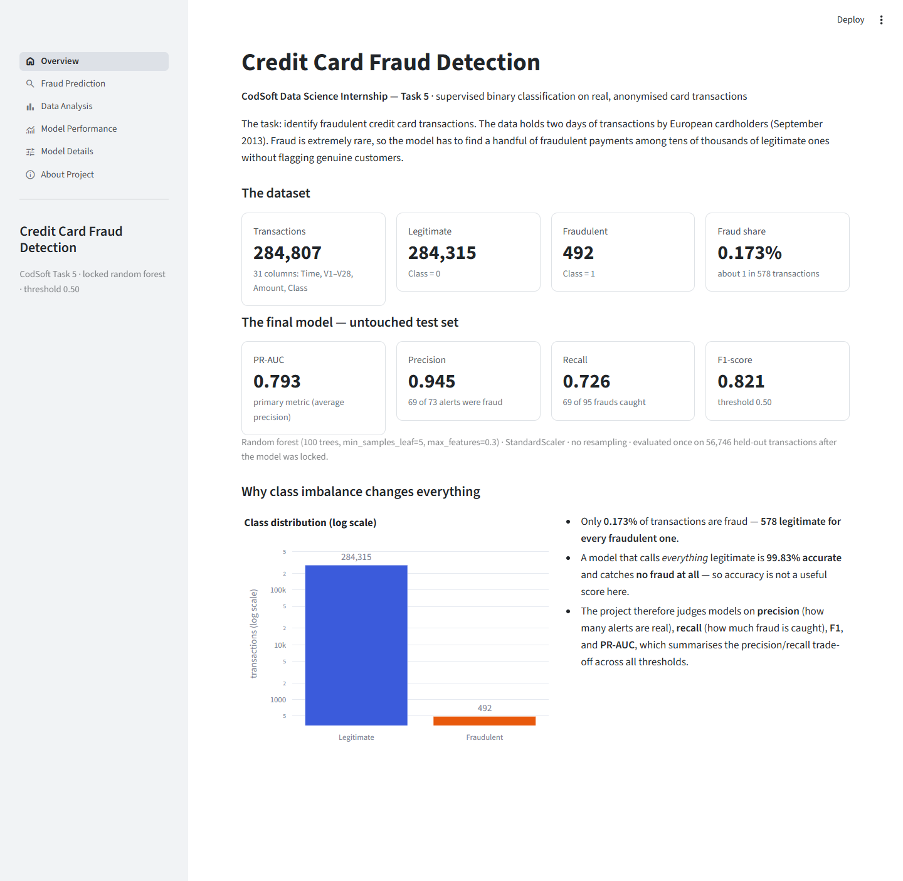

---

## Table of contents

| | | |
|---|---|---|
| [1. Project Overview](#1-project-overview) | [13. Phase 4: Cross-Validation and Tuning](#13-phase-4-cross-validation-and-tuning) | [25. Project Structure](#25-project-structure) |
| [2. Problem Statement](#2-problem-statement) | [14. Phase 5: Final Model Evaluation](#14-phase-5-final-model-evaluation) | [26. Installation](#26-installation) |
| [3. CodSoft Task Mapping](#3-codsoft-task-mapping) | [15. Phase 6: Streamlit Dashboard](#15-phase-6-streamlit-dashboard) | [27. Running the Project](#27-running-the-project) |
| [4. Project Objectives](#4-project-objectives) | [16. Final Model](#16-final-model) | [28. Reproducibility](#28-reproducibility) |
| [5. Dataset](#5-dataset) | [17. Final Test Results](#17-final-test-results) | [29. Data Leakage Prevention](#29-data-leakage-prevention) |
| [6. Why Fraud Detection Is Difficult](#6-why-fraud-detection-is-difficult) | [18. Confusion Matrix Analysis](#18-confusion-matrix-analysis) | [30. Limitations](#30-limitations) |
| [7. Technology Stack](#7-technology-stack) | [19. Precision-Recall Analysis](#19-precision-recall-analysis) | [31. Future Improvements](#31-future-improvements) |
| [8. Complete Project Workflow](#8-complete-project-workflow) | [20. ROC Analysis](#20-roc-analysis) | [32. Key Learnings](#32-key-learnings) |
| [9. System Architecture](#9-system-architecture) | [21. Error Analysis](#21-error-analysis) | [33. Phase-by-Phase Summary](#33-phase-by-phase-summary) |
| [10. Phase 1: Dataset Audit and EDA](#10-phase-1-dataset-audit-and-eda) | [22. Model Persistence](#22-model-persistence) | [34. Results Summary](#34-results-summary) |
| [11. Phase 2: Preprocessing](#11-phase-2-preprocessing) | [23. Prediction API](#23-prediction-api) | [35. Conclusion](#35-conclusion) |
| [12. Phase 3: Baseline Modeling](#12-phase-3-baseline-modeling) | [24. Dashboard Usage](#24-dashboard-usage) | |

---

## 1. Project Overview

The task: given the 30 numeric attributes of a credit card transaction, predict whether it is **fraudulent**
(`Class = 1`) or **legitimate** (`Class = 0`).

The dataset contains 284,807 real transactions made by European cardholders over two days in September 2013.
Only **492 of them (0.173%) are fraudulent**, and that imbalance shapes the whole project. A model that
predicts "legitimate" for every transaction is 99.83% accurate and catches no fraud at all. The split, the
metrics, the handling of imbalance and the choice of threshold all follow from this.

The project was built in six phases, and each one was validated before the next began:

1. **Audit** the raw data and its provenance.
2. **Preprocess**: remove duplicates, split, scale, and build an imbalance-handling framework that cannot
   leak.
3. **Baseline**: logistic regression and random forest, each under five imbalance strategies.
4. **Select** the model with cross-validation on training data only. This covers scaling, the imbalance
   strategy, hyperparameters and the decision threshold.
5. **Lock** the chosen model, save it, and evaluate it **once** on the untouched test set.
6. **Present** it in a Streamlit dashboard that loads the saved model. Nothing is retrained.

This is classical machine learning, not an AI system. The results are estimates from a 2013 benchmark dataset
and say nothing guaranteed about live payment traffic.

---

## 2. Problem Statement

The CodSoft task document states:

> Build a machine learning model to identify fraudulent credit card transactions. Preprocess and normalize
> the transaction data, handle class imbalance issues, and split the dataset into training and testing sets.
> Train a classification algorithm, such as logistic regression or random forests, to classify transactions
> as fraudulent or genuine. Evaluate the model's performance using metrics like precision, recall, and
> F1-score, and consider techniques like oversampling or undersampling for improving results.

| Requirement | Where it is addressed |
|---|---|
| Preprocess and normalise | Phase 2 builds a `StandardScaler` pipeline; Phase 4 compares three scaling strategies |
| Handle class imbalance | Phases 2–4 use class weights, random oversampling, random undersampling and SMOTE, always inside the training folds |
| Train/test split | Phase 2: stratified 80/20 split, `random_state=42` |
| Logistic regression and random forests | Phases 3–4 cover both families, as baselines and tuned |
| Precision, recall, F1 | Reported in every phase from Phase 3 on, with PR-AUC as the main ranking metric |
| Oversampling and undersampling | Phases 3–4, compared using cross-validation on training data only |

---

## 3. CodSoft Task Mapping

| | |
|---|---|
| Internship | CodSoft Data Science Virtual Internship |
| Official task | **Task 5: Credit Card Fraud Detection** |
| Local folder | `Task3_Credit_Card_Fraud_Detection` (my own numbering: Task 1 = CodSoft Task 2, Task 2 = CodSoft Task 4) |
| Dataset | The dataset linked from the CodSoft task document (see section 5) |

---

## 4. Project Objectives

* Verify where the dataset comes from, and audit it before modelling.
* Build preprocessing that cannot leak test information into training.
* Compare imbalance strategies fairly inside cross-validation, instead of resampling the whole dataset.
* Choose the model and decision threshold **from training data only**, using rules declared before any
  results were seen.
* Evaluate the locked model once, on data it has never seen.
* Save a single artefact that holds the model *and* its threshold, and provide a clean prediction API.
* Present the result in a dashboard where every number can be traced back to a notebook.

---

## 5. Dataset

### Dataset Source

| | |
|---|---|
| Name | Credit Card Fraud Detection |
| Kaggle identifier | [`mlg-ulb/creditcardfraud`](https://www.kaggle.com/datasets/mlg-ulb/creditcardfraud) |
| Owner | Machine Learning Group, Université Libre de Bruxelles (ULB) |
| Licence | Database Contents Licence (DbCL) 1.0 |
| Reference | Dal Pozzolo et al., *Calibrating Probability with Undersampling for Unbalanced Classification*, IEEE SSCI 2015 |

### Dataset Provenance

The dataset link was read from the annotation objects of the CodSoft `DATA SCIENCE.pdf` (page 11, "TASK 5:
CREDIT CARD FRAUD DETECTION"), not copied from the page's visible text. That confirms this is the exact dataset
CodSoft points to. It was downloaded from Kaggle's public endpoint as a 69,155,672-byte archive whose only member
is `creditcard.csv`, and the file was extracted without changes.

| | |
|---|---|
| File | `dataset/creditcard.csv`: 150,828,752 bytes (143.84 MiB) |
| **SHA-256** | `76274b691b16a6c49d3f159c883398e03ccd6d1ee12d9d8ee38f4b4b98551a89` |
| Modification status | **Never modified.** Every notebook checks the checksum at its start and end. |
| Storage | **Git LFS**, because the file is larger than GitHub's 100 MB object limit. See [Installation](#26-installation). |

The repository's `.gitattributes` contains exactly one LFS rule:

```
Task3_Credit_Card_Fraud_Detection/dataset/creditcard.csv filter=lfs diff=lfs merge=lfs -text
```

### Dataset Size

The file has **284,807 rows and 31 columns**. Every column is numeric, there are **no missing values**, and
1,081 rows are exact duplicates.

### Features

| Column | Description |
|---|---|
| `Time` | Seconds between this transaction and the first transaction in the file (0 to 172,792, about 48 hours). **This is not a clock time or a date.** |
| `V1` … `V28` | Anonymised **principal components** that the dataset owners produced with PCA. The original features were withheld for confidentiality, so no individual component has a known meaning. |
| `Amount` | Transaction amount (0 to 25,691.16, heavily right-skewed). |

### Target Variable

`Class`: `1` means fraudulent and `0` means legitimate.

### Class Distribution

| Class | Count | Share |
|---|---:|---:|
| Legitimate (0) | 284,315 | 99.827251% |
| Fraudulent (1) | **492** | **0.172749%** |
| **Imbalance** | **577.88 : 1** | 1 fraud in every 579 transactions |

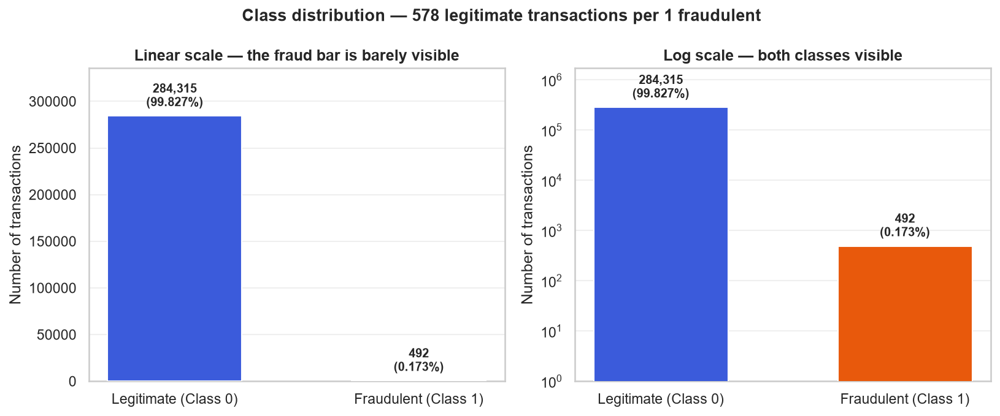

---

## 6. Why Fraud Detection Is Difficult

### Class Imbalance

When only 0.17% of transactions are fraud, a model can minimise its training error by never predicting fraud.
The imbalance also makes every fraud-class metric noisy. The test set holds only **95 frauds**, so a single
transaction moves recall by about one percentage point.

### False Positives

A **false positive** is a legitimate transaction flagged as fraud. The payment is blocked or challenged, the
customer is inconvenienced, and an analyst has to review it.

### False Negatives

A **false negative** is a fraudulent transaction the model lets through, so the fraudulent payment completes.

Which error costs more depends on the business context: the money lost, the effect on customers and how many
cases analysts can review. This dataset contains none of that information, so the project does **not** assume a
cost ratio. It reports both kinds of error, and it chooses the threshold by a transparent rule: maximum
out-of-fold F1.

### Why Accuracy Is Misleading

| Model | Accuracy | Frauds caught |
|---|---:|---:|
| Predict "legitimate" for everything (test set) | **99.8326%** | **0 of 95** |
| Final model (test set) | 99.9471% | 69 of 95 |

The useless model is only 0.11 percentage points less accurate. Accuracy is reported but never used for a
decision. **PR-AUC, precision, recall and F1** are used instead.

---

## 7. Technology Stack

| Area | Tools |
|---|---|
| Language | Python 3.13.0 |
| Data | pandas 3.0.6, NumPy 2.5.3, SciPy 1.18.1, pyarrow 25.0.1 |
| Machine learning | scikit-learn 1.9.1, imbalanced-learn 0.14.2 |
| Persistence | joblib 1.6.0 |
| Visualisation | Matplotlib 3.11.2, seaborn 0.13.2, Plotly 7.1.0 |
| Dashboard | Streamlit 1.64.0 |
| Notebooks | Jupyter 1.1.1 |
| Version control | Git, plus Git LFS for the dataset |

All versions are pinned in [`requirements.txt`](requirements.txt).

---

## 8. Complete Project Workflow

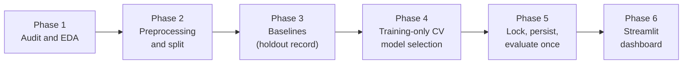
```mermaid
flowchart LR
    P1["Phase 1<br/>Audit and EDA"] --> P2["Phase 2<br/>Preprocessing<br/>and split"]
    P2 --> P3["Phase 3<br/>Baselines<br/>(holdout record)"]
    P3 --> P4["Phase 4<br/>Training-only CV<br/>model selection"]
    P4 --> P5["Phase 5<br/>Lock, persist,<br/>evaluate once"]
    P5 --> P6["Phase 6<br/>Streamlit<br/>dashboard"]
```

| Phase | Notebook | Output |
|---|---|---|
| 1 | [`01_dataset_audit.ipynb`](notebooks/01_dataset_audit.ipynb) | Audit, EDA, figures 01–07 |
| 2 | [`02_data_preprocessing.ipynb`](notebooks/02_data_preprocessing.ipynb) | [`src/data_preprocessing.py`](src/data_preprocessing.py), figures 08–10 |
| 3 | [`03_model_training.ipynb`](notebooks/03_model_training.ipynb) | [`src/model_training.py`](src/model_training.py), figures 11–16 |
| 4 | [`04_model_validation_tuning.ipynb`](notebooks/04_model_validation_tuning.ipynb) | [`results/phase4_*`](results/), figures 17–24 |
| 5 | [`05_final_model_evaluation.ipynb`](notebooks/05_final_model_evaluation.ipynb) | [`models/`](models/), [`src/predict.py`](src/predict.py), [`results/phase5_*`](results/), figures 25–27 |
| 6 | None | [`app.py`](app.py), [`tests/test_dashboard.py`](tests/test_dashboard.py), [`docs/images/`](docs/images/) |

---

## 9. System Architecture

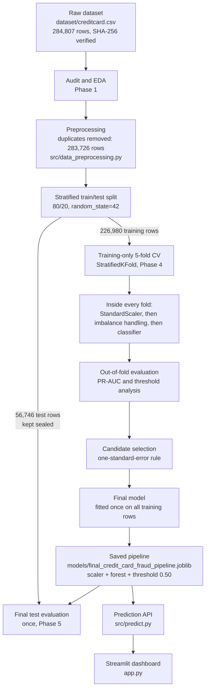
```mermaid
flowchart TD
    A["Raw dataset<br/>dataset/creditcard.csv<br/>284,807 rows, SHA-256 verified"] --> B["Audit and EDA<br/>Phase 1"]
    B --> C["Preprocessing<br/>duplicates removed: 283,726 rows<br/>src/data_preprocessing.py"]
    C --> D["Stratified train/test split<br/>80/20, random_state=42"]
    D -->|"226,980 training rows"| E["Training-only 5-fold CV<br/>StratifiedKFold, Phase 4"]
    D -->|"56,746 test rows<br/>kept sealed"| K
    E --> F["Inside every fold:<br/>StandardScaler, then imbalance handling, then classifier"]
    F --> G["Out-of-fold evaluation<br/>PR-AUC and threshold analysis"]
    G --> H["Candidate selection<br/>one-standard-error rule"]
    H --> I["Final model<br/>fitted once on all training rows"]
    I --> J["Saved pipeline<br/>models/final_credit_card_fraud_pipeline.joblib<br/>scaler + forest + threshold 0.50"]
    J --> K["Final test evaluation<br/>once, Phase 5"]
    J --> L["Prediction API<br/>src/predict.py"]
    L --> M["Streamlit dashboard<br/>app.py"]
```

At prediction time the path is short, and there is one source of truth:

```
app.py  ──►  src/predict.py  ──►  saved pipeline (StandardScaler → random forest)  ──►  P(fraud)  ──►  P(fraud) ≥ 0.50 ?
```

---

## 10. Phase 1: Dataset Audit and EDA

**Objective:** establish exactly what the data is before modelling it.

**Implementation:** [`notebooks/01_dataset_audit.ipynb`](notebooks/01_dataset_audit.ipynb), which includes
22 automated integrity checks.

**Findings:**

| Check | Result |
|---|---|
| Layout | `Time`, `V1`–`V28`, `Amount`, `Class`, verified against the file rather than assumed |
| Missing values | **0** in 8,829,017 cells. No infinities, empty strings or sentinel values. |
| Duplicates | **1,081** exact duplicate rows (0.3796%) in 773 groups. **0** of the groups have conflicting labels. |
| Imbalance | 284,315 legitimate and 492 fraud: **577.88 : 1** |
| PCA evidence | Component means are about 0. Standard deviations fall steadily from 1.9587 (`V1`) to 0.3301 (`V28`). The components are mutually uncorrelated. |
| `Amount` | Median 22.00, mean 88.35, maximum 25,691.16, **skewness 16.98**. Fraud has a *lower* median (9.25 vs 22.00) but a higher mean (122.21 vs 88.29). |
| `Time` | 0 to 172,792 s, or 47.998 hours. Legitimate volume follows a day/night rhythm; fraud is spread more evenly. |
| Scale | `Time` spans 737 times the component range and `Amount` 110 times, so scaling is required. |
| Correlation with `Class` | Strongest: `V17` −0.3265, `V14` −0.3025, `V12` −0.2606, `V10` −0.2169. `Amount` +0.0056, `Time` −0.0123. |
| Outliers (1.5 × IQR) | 138,473 rows (48.62%) are flagged, including **477 of the 492 frauds**. Outliers concentrate in fraud: `V14` flags 87.40% of fraud but 4.83% of legitimate transactions. |
| Leakage | 10/10 checks pass. No feature copies, encodes or perfectly separates the target. |

**Important decisions:**

* **Outliers were kept.** Removing them would discard half the data and 97% of the fraud. In fraud detection,
  extreme values *are* the signal.
* **Duplicates were left for Phase 2**, where the decision could take the split into account.
* `V1`–`V28` are described only as anonymised components. No meanings were invented for them.

| | |
|---|---|
| 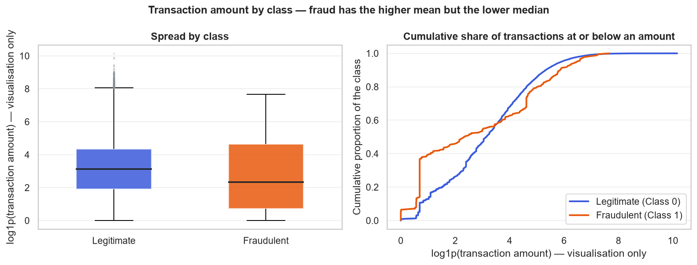 | 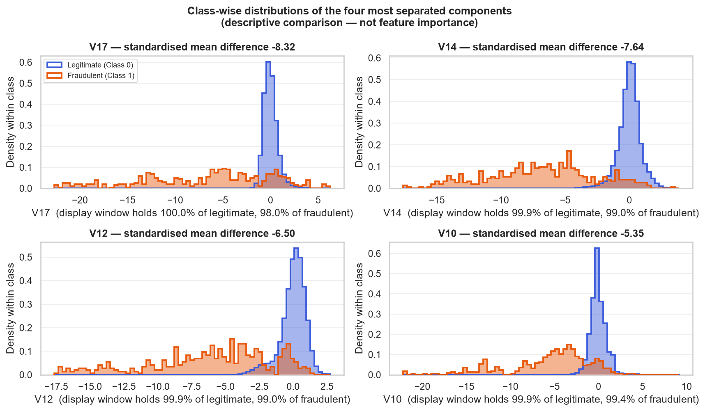 |

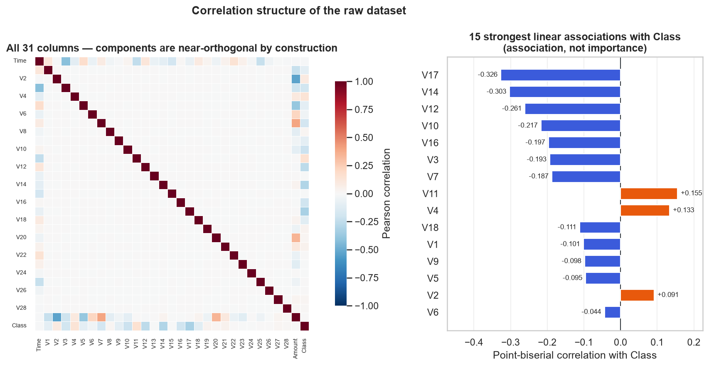

---

## 11. Phase 2: Preprocessing

**Objective:** a reusable preprocessing foundation that cannot leak.

**Implementation:** [`notebooks/02_data_preprocessing.ipynb`](notebooks/02_data_preprocessing.ipynb) and
[`src/data_preprocessing.py`](src/data_preprocessing.py).

**Duplicate handling.** The 1,081 extra copies (1,062 legitimate, **19 fraudulent**) are dropped **before the
split**, which leaves **283,726 rows** (283,253 legitimate, 473 fraud, an imbalance of **598.84 : 1**). They
are dropped because an identical row on both sides of the split would let the test score reward memorisation,
not because they are bad data: none of them carries a conflicting label.

**Stratified split:** 80/20, stratified on `Class`, `random_state=42`.

| | Rows | Legitimate | Fraudulent | Fraud % |
|---|---:|---:|---:|---:|
| Train | 226,980 | 226,602 | 378 | 0.166534% |
| **Test** | **56,746** | **56,651** | **95** | 0.167413% |

Both splits keep a fraud rate close to the deduplicated dataset's. The notebook also shows how far an
*unstratified* split of the same data drifts.

**Scaling.** `Time` and `Amount` have to be scaled. Whether to standardise `V1`–`V28` as well is a real choice,
because their spread carries the PCA variance. Three strategies were therefore implemented and the choice was
left to cross-validation in Phase 4:

* `standard` (the default): all 30 features.
* `minimal`: `Time` and `Amount` only.
* `log_amount`: `log1p(Amount)` first.

The scaler is fitted on the 226,980 training rows only (`n_samples_seen_ = 226,980`, verified).

**Imbalance framework.** Five strategies, measured on the **training split only**:

| Strategy | Training rows | Class 0 | Class 1 |
|---|---:|---:|---:|
| Original | 226,980 | 226,602 | 378 |
| Class weights | 226,980 | 226,602 | 378 (the loss is reweighted; the rows are unchanged) |
| Random oversampling | 453,204 | 226,602 | 226,602 |
| SMOTE | 453,204 | 226,602 | 226,602 |
| Random undersampling | 756 | 378 | 378 |

The resamplers sit inside an `imblearn` pipeline, so they only ever act on training folds.

**Validation: 65/65 checks** covering structure, module tests (including failure paths), 7 leakage tests,
determinism and data integrity.

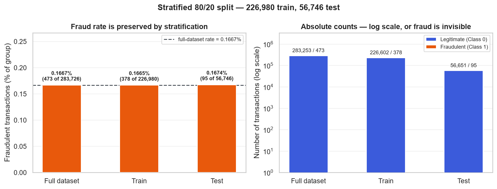

| | |
|---|---|
| 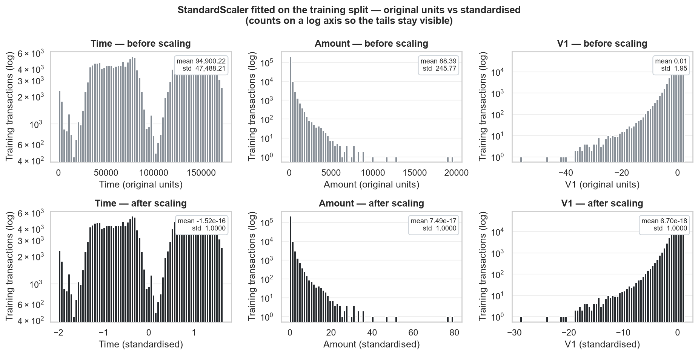 | 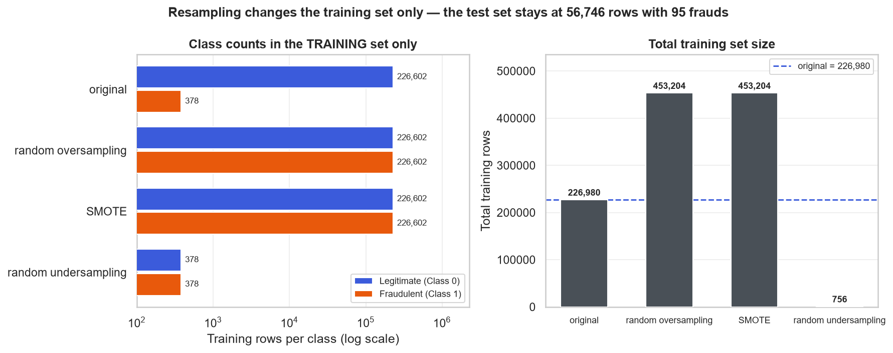 |

---

## 12. Phase 3: Baseline Modeling

**Objective:** a disciplined baseline record covering both model families under all five imbalance strategies,
with library defaults and the default threshold of 0.5.

**Implementation:** [`notebooks/03_model_training.ipynb`](notebooks/03_model_training.ipynb) and
[`src/model_training.py`](src/model_training.py).

**Phase 3 holdout baseline.** Ten configurations, fixed in advance, were each scored once on the test set.
These numbers are a **historical baseline, not the final result**, and they were never used to choose the
final model.

| Model | Strategy | Precision | Recall | F1 | PR-AUC | ROC-AUC |
|---|---|---:|---:|---:|---:|---:|
| Logistic regression | Original | 0.846154 | 0.578947 | 0.687500 | 0.691967 | 0.956047 |
| Logistic regression | Class weights | 0.056386 | 0.873684 | 0.105935 | 0.671924 | 0.965655 |
| Logistic regression | Oversampling | 0.056540 | 0.873684 | 0.106206 | 0.668936 | 0.965957 |
| Logistic regression | SMOTE | 0.053035 | 0.873684 | 0.100000 | 0.675041 | 0.962618 |
| Logistic regression | Undersampling | 0.050425 | 0.873684 | 0.095348 | 0.589557 | 0.957108 |
| Random forest | Original | 0.971831 | 0.726316 | 0.831325 | 0.787618 | 0.923949 |
| Random forest | Class weights | 0.945205 | 0.726316 | 0.821429 | 0.801196 | 0.939101 |
| Random forest | Oversampling | 0.958333 | 0.726316 | 0.826347 | 0.802386 | 0.929150 |
| Random forest | SMOTE | 0.912500 | 0.768421 | 0.834286 | 0.811967 | 0.969390 |
| Random forest | Undersampling | 0.084780 | 0.873684 | 0.154562 | 0.698284 | 0.976697 |

**What the baselines showed:**

* **Rebalancing the linear model moved its operating point, not its ranking.** Recall rose from 0.58 to 0.87,
  but precision fell from 0.85 to 0.06 and PR-AUC went slightly *down*.
* **Forests rank fraud better**, with PR-AUC of 0.79–0.81 against at most 0.69 and far fewer false alarms. But
  default forests memorise their training data: training recall was at least 0.997.
* **ROC-AUC points the wrong way here.** Its highest value (0.977) belongs to a configuration with 896 false
  alarms.
* **There is a hard core of frauds.** All ten configurations missed the same 11 test frauds. On `V14`, `V17`,
  `V12` and `V10` those frauds look like legitimate traffic.

| | |
|---|---|
| 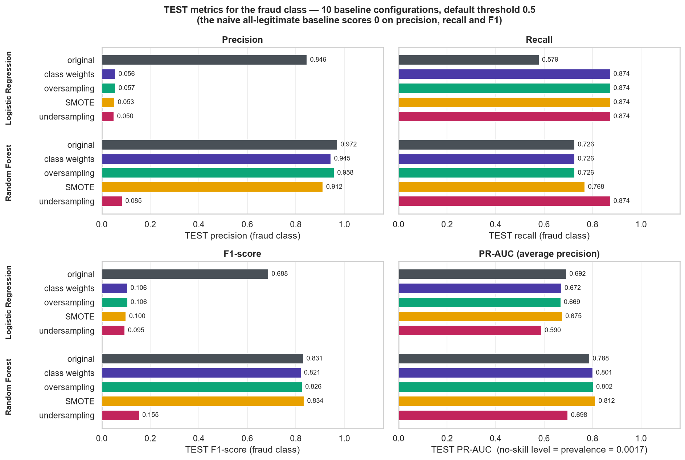 | 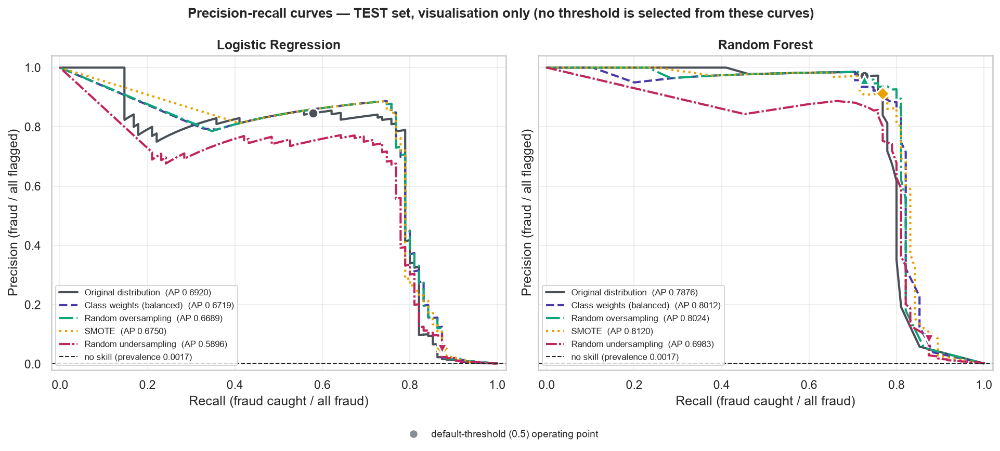 |

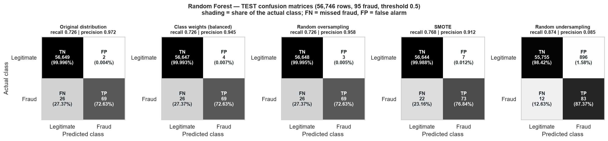

---

## 13. Phase 4: Cross-Validation and Tuning

**Objective:** make every model-selection decision using **training data only**.

**Implementation:** [`notebooks/04_model_validation_tuning.ipynb`](notebooks/04_model_validation_tuning.ipynb).
The cross-validation, out-of-fold and threshold helpers are in [`src/model_training.py`](src/model_training.py),
and the results are in [`results/`](results/).

**Method.** `StratifiedKFold(5, shuffle=True, random_state=42)` on the 226,980 training rows, which puts 75 or 76
frauds in each validation fold. The whole pipeline (scaler, resampler, classifier) is fitted again inside every
fold, and validation folds are never resampled. The test set was fingerprinted, removed from the notebook's
namespace, and verified to be untouched.

**Rules declared before any result was computed:**

1. The primary metric is **mean CV PR-AUC**.
2. **One-standard-error rule** (Hastie, Tibshirani & Friedman, *ESL* §7.10): among the configurations within
   one standard error of the best, choose the simplest, using a fixed order. Logistic regression counts as
   simpler than a forest. For resampling the order is none, then undersampling, then oversampling, then SMOTE.
   Fewer trees count as simpler than more, and the default scaling comes first.
3. **Threshold:** the one with maximum F1 on out-of-fold training predictions, with ties going to the lower
   threshold.

**Results (training-only cross-validation):**

| Question | Evidence | Decision |
|---|---|---|
| Scaling | Logistic regression PR-AUC moves by at most 0.0032 across the three strategies for four imbalance strategies (0.020 for undersampling), far below one standard error. Forest PR-AUC is 0.8341 / 0.8334 / 0.8342. | Keep `standard` |
| Imbalance (logistic regression) | Original 0.7527, SMOTE 0.7431, class weights 0.7382, undersampling 0.5715 | Rebalancing buys recall, not ranking |
| Imbalance (forest) | SMOTE 0.8425, class weights 0.8347, original 0.8341, oversampling 0.8331, all **tied within one standard error**. Undersampling 0.7579. | No resampling |
| Logistic regression tuning | 24 configurations, 120 fits. Best: L1, C = 0.1, PR-AUC 0.7559 | Logistic regression is flat across the grid |
| Forest tuning | Full grid of 12 configurations, 60 fits. Best: `min_samples_leaf=5`, `max_features=0.3`, PR-AUC 0.8386 | The recall overfitting gap falls from 0.177–0.225 (default forests) to 0.051 |
| 300 vs 100 trees | 0.8403 vs 0.8386, a difference smaller than one standard error at 3 times the cost | Keep 100 |
| Threshold | Out-of-fold F1 peaks at **0.50** (0.846043) and is flat between 0.35 and 0.50 | **0.50** |

The candidate forest beats the tuned logistic regression **in all five folds**. Its CV PR-AUC by fold is
0.822568, 0.853667, 0.768254, 0.879792 and 0.868619, for a mean of **0.838580 ± 0.044807**.

**A reproducibility fix from this phase.** scikit-learn's parallel `predict_proba` adds up the tree
probabilities in whatever order the threads finish. Repeated predictions therefore differed in the last bit
(in 20 of 20 calls, by up to 2.2e-16), and this caused one validation run to fail. The project's
`FixedOrderRandomForestClassifier` still trains in parallel but adds the trees up in a fixed order, so
predictions are now repeatable bit for bit.

**Validation: 29/29 checks**, and two fresh-kernel runs produced identical results.

| | |
|---|---|
| 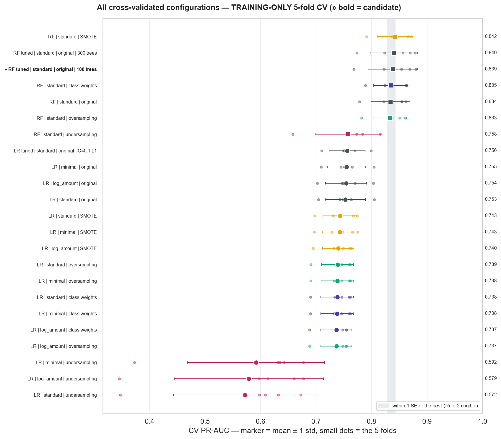 | 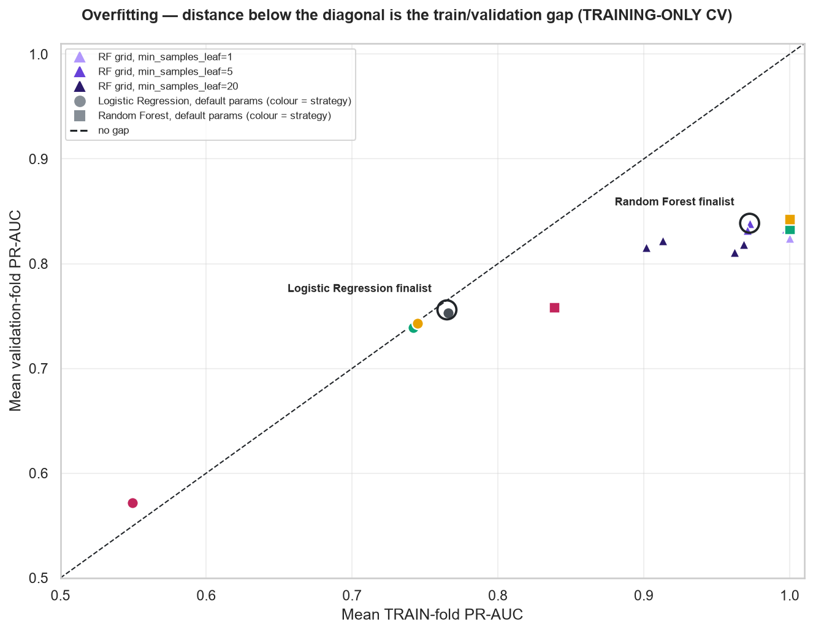 |

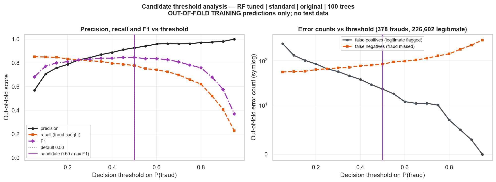

---

## 14. Phase 5: Final Model Evaluation

**Objective:** lock the Phase 4 candidate, save it, and evaluate it **once** on the untouched test set.

**Implementation:** [`notebooks/05_final_model_evaluation.ipynb`](notebooks/05_final_model_evaluation.ipynb).

The order of operations is what guarantees a fair test, and the notebook checks that order by reading its own
source:

1. **Lock.** The configuration is read from [`results/phase4_candidate.json`](results/phase4_candidate.json)
   and checked field by field. The decision rule `P(fraud) ≥ 0.50` is fixed before any test data is read.
2. **Train.** The model is fitted once on all 226,980 training rows (scaler `n_samples_seen_ = 226,980`, no
   resampling step).
3. **Save.** The artefact is written and its SHA-256 recorded.
4. **Validate.** The artefact is reloaded through `src/predict.py`, compared with the in-memory model, loaded
   in a separate Python process, and tested with valid and invalid inputs.
5. **Evaluate.** Only now is the test set opened. It is scored once, using the artefact **loaded from disk**,
   after its hash has been checked again.

**Validation:**

* 18/18 test-set integrity checks and 9/9 prediction smoke tests pass.
* Predictions from a fresh process are identical bit for bit on all 56,746 test rows.
* The raw data is unchanged.
* Three independent trainings produced the **same artefact SHA-256**.

The results are in sections [16](#16-final-model) to [21](#21-error-analysis).

---

## 15. Phase 6: Streamlit Dashboard

**Objective:** a professional interface to the saved model, with no retraining and no re-evaluation.

**Implementation:** [`app.py`](app.py), [`.streamlit/config.toml`](.streamlit/config.toml) and
[`tests/test_dashboard.py`](tests/test_dashboard.py).

| Page | Content |
|---|---|
| **Overview** | The task, the dataset size and imbalance, and the final test metrics as cards |
| **Fraud Prediction** | 30 inputs, grouped into transaction information and PCA components. Demonstration examples. A box for pasting a full row as JSON or CSV. The probability, verdict and threshold. |
| **Data Analysis** | Amount, time, per-component and correlation views of the raw dataset |
| **Model Performance** | Final test metrics with bootstrap intervals, the confusion matrix, PR and ROC curves, and a Phase 3/4/5 comparison |
| **Model Details** | The locked pipeline, hyperparameters, artefact checksum, selection method and CV results |
| **About Project** | The internship, task, provenance, workflow, technologies, limitations and future work |

**Design principles:**

* Every prediction goes through `src/predict.py`.
* Every metric is read from `results/phase5_final_metrics.json`, `models/final_model_metadata.json` or
  `results/phase4_candidate.json`. The one exception is Phase 3's historical holdout values, which are labelled
  with their source.
* The model and dataset are cached, and the dashboard writes nothing.

**Validation:** the Streamlit `AppTest` suite passes **42/42 checks**:

* Every page renders, and the metrics and charts display.
* All four demonstration predictions and a pasted row are **identical to what `src/predict.py` returns**.
* Eight kinds of invalid input produce clear error messages instead of crashes.

---

## 16. Final Model

| Component | Setting |
|---|---|
| Algorithm | Random forest (`FixedOrderRandomForestClassifier`, a `RandomForestClassifier` that adds up its trees in a fixed order) |
| Preprocessing | `StandardScaler` on all 30 features, fitted on the training split only |
| Imbalance strategy | None: the original class distribution, `class_weight=None` |
| Hyperparameters | `n_estimators=100`, `min_samples_leaf=5`, `max_features=0.3`, `max_depth=None`, `random_state=42` |
| **Decision threshold** | **0.50**: fraud if P(fraud) ≥ 0.50 |
| Trained on | 226,980 training rows (226,602 legitimate, 378 fraud) |

**Why this model.** The selection used **cross-validation on training data only, with PR-AUC as the primary
metric**, followed by the one-standard-error rule. The highest mean CV PR-AUC (0.842494) belonged to a default
forest with SMOTE. Six forests scored within one standard error (0.014373) of it, and the simplest of them (no
resampling, 100 trees) was chosen.

Precision, recall, F1, fold stability, overfitting and cost were then checked:

* The candidate needs no synthetic data.
* It overfits least: a recall gap of 0.051, against 0.177 for the SMOTE forest.
* It beats the tuned logistic regression in every fold.

It is not claimed to be better than the SMOTE forest, because the data cannot tell the two apart.

**Training-only CV estimates for this configuration** (from Phase 4; these are not test results):

| PR-AUC | Precision @0.5 | Recall @0.5 | F1 @0.5 | ROC-AUC |
|---:|---:|---:|---:|---:|
| 0.838580 ± 0.044807 | 0.926667 ± 0.023880 | 0.777719 ± 0.090171 | 0.843867 ± 0.060610 | 0.953749 ± 0.022195 |

---

## 17. Final Test Results

**Phase 5: the locked model, evaluated once on the test set.** The test set is 56,746 untouched transactions
(56,651 legitimate, 95 fraud), scored at a threshold of 0.50. The bootstrap intervals come from 2,000
resamples of the test rows (`random_state=42`) and are descriptive only.

| Metric | Value | 95% bootstrap interval |
|--------|------:|:---:|
| Accuracy | 0.999471 | n/a |
| Precision | **0.945205** | 0.886 – 0.988 |
| Recall | **0.726316** | 0.633 – 0.813 |
| F1 | **0.821429** | 0.753 – 0.879 |
| PR-AUC | **0.793217** | 0.713 – 0.868 |
| ROC-AUC | 0.936863 | 0.901 – 0.968 |
| Specificity | 0.999929 | n/a |
| False positive rate | 0.000071 | n/a |
| False negative rate | 0.273684 | n/a |

| Confusion Matrix | Count |
|------------------|------:|
| TN: legitimate, passed | 56,647 |
| FP: legitimate, flagged | 4 |
| FN: fraud, missed | 26 |
| TP: fraud, caught | 69 |

**The three evaluations, kept separate:**

| Evaluation | What it is | PR-AUC | Precision | Recall | F1 |
|---|---|---:|---:|---:|---:|
| Phase 3 holdout baseline (default random forest) | Untuned baseline on the same test set | 0.787618 | 0.971831 | 0.726316 | 0.831325 |
| Phase 4 training-only CV | Mean over 5 validation folds | 0.838580 | 0.926667 | 0.777719 | 0.843867 |
| **Phase 5 final test** | **Locked model, evaluated once** | **0.793217** | **0.945205** | **0.726316** | **0.821429** |

**Reading the result.**

* **The test PR-AUC is below the CV estimate, as Phase 4 anticipated.** A CV score belongs to the
  configuration chosen on those same folds, so it is optimistic. This test split had also already scored below
  CV for nine of the ten Phase 3 configurations.
* **The two estimates are still consistent.** The test PR-AUC lies inside the candidate's CV fold range
  (0.768–0.880), and the CV mean lies inside the test bootstrap interval.
* **Tuning reduced overfitting substantially but gave only a small test gain** over the Phase 3 forests. That
  matches Phase 4, where those forests were within one standard error of each other.
* **The comparison operator does not matter.** No test transaction scored exactly 0.50, so `≥` and `>` give
  the same result.

**Nothing was changed after this evaluation.**

---

## 18. Confusion Matrix Analysis

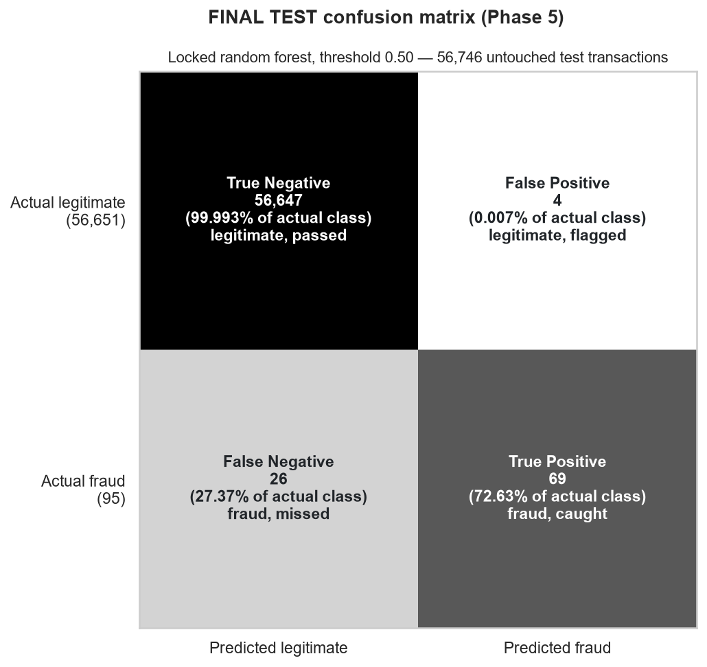

* **4 false positives.** 0.007% of legitimate transactions were flagged. Each one would mean a challenged
  payment and an analyst review.
* **26 false negatives.** 27.37% of the fraud in the test set got through undetected.
* At this threshold the model is conservative: very few false alarms, and about three-quarters of the fraud
  caught. A lower threshold would catch more fraud at the cost of more alerts. Where to sit on that trade-off
  is a business decision, and the threshold was not moved after these results were seen.

---

## 19. Precision-Recall Analysis

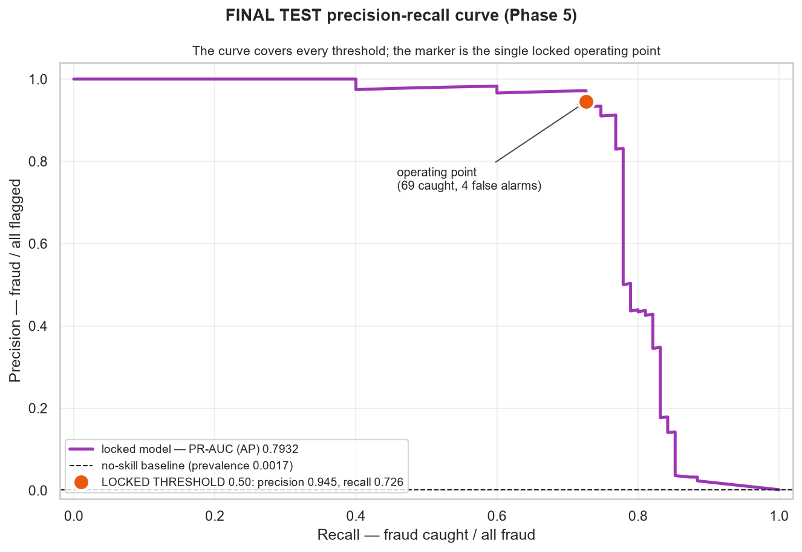

Along the curve:

* Precision stays near 1.0 up to a recall of about 0.40.
* Precision stays above 0.9 until just past the locked operating point (precision 0.945, recall 0.726).
* Beyond a recall of about 0.78, precision falls steeply. Phase 4 found the same cliff out-of-fold.

The PR-AUC of 0.793217 is about **474 times** the no-skill level, which equals the fraud prevalence of 0.0017.
PR-AUC is the primary metric because its precision axis counts every false alarm against the alerts raised.

---

## 20. ROC Analysis

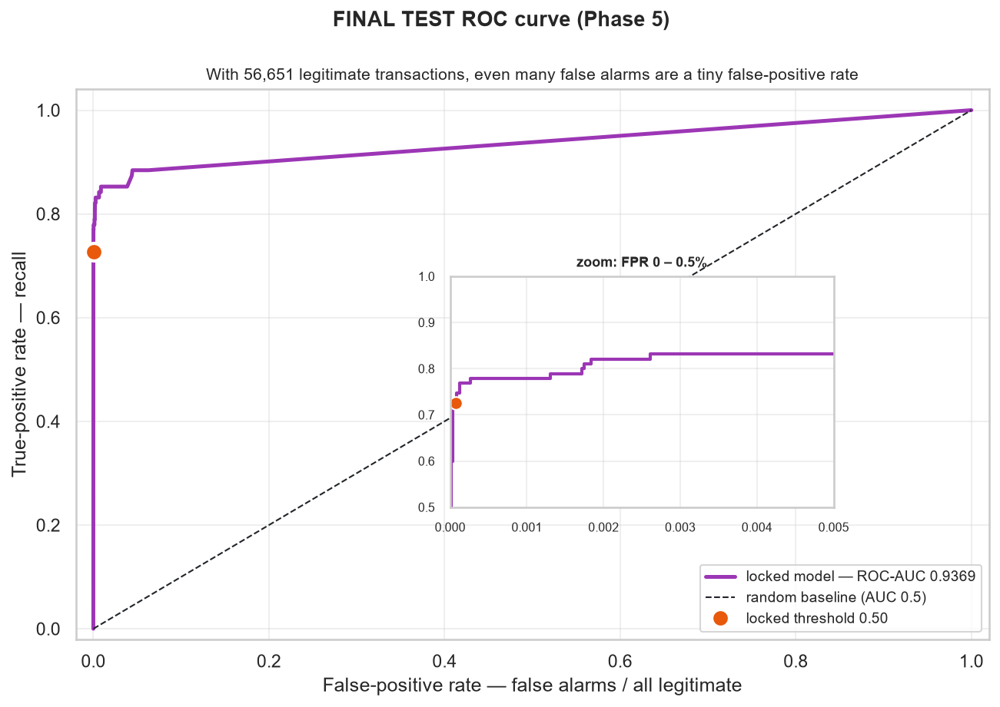

ROC-AUC is **0.936863**. The operating point sits at a false-positive rate of **0.000071**, which is only
visible in the zoomed inset. The long straight segment comes from frauds that the forest scores at or near
zero, tied with most legitimate transactions.

ROC measures false alarms against *all* 56,651 legitimate transactions, so even hundreds of false alarms would
barely move it. That is why ROC-AUC is recorded as a secondary metric and PR-AUC is the primary one.

---

## 21. Error Analysis

This analysis is descriptive only. The patterns show *which* transactions are misclassified, not *why*.

| Outcome | Count | Median P(fraud) | Median Amount | Median `V14` | Median `V17` |
|---|---:|---:|---:|---:|---:|
| Fraud caught (TP) | 69 | 0.9255 | 33.59 | −7.28 | −5.70 |
| Fraud missed (FN) | 26 | 0.0020 | 2.99 | −1.02 | 0.92 |
| False alarm (FP) | 4 | 0.6568 | 510.50 | −4.95 | −6.71 |
| Legitimate passed (TN) | 56,647 | 0.0000 | 21.60 | 0.06 | −0.07 |

* **Most missed frauds look legitimate to the model.** 15 of the 26 score below 0.01. On the components that
  separate the classes best, they sit close to legitimate traffic and far from the frauds that were caught.
  Four missed frauds scored 0.40–0.47 (to two decimals), just under the threshold.
* **False alarms look like fraud** on those same components. One of them is the largest transaction in the
  dataset (25,691.16).
* **The model's confidence is informative.** Of the 42 transactions scored at 0.90 or above, 41 are fraud. Of
  the 56,219 scored below 0.01, 15 are fraud.
* `Time` shows no clear pattern across the outcomes.

---

## 22. Model Persistence

| | |
|---|---|
| Artefact | [`models/final_credit_card_fraud_pipeline.joblib`](models/final_credit_card_fraud_pipeline.joblib) |
| Format | joblib (compression level 3) |
| Size | 501,175 bytes (0.48 MiB) |
| **SHA-256** | `fb538208042767a69c8a897e0824784cd513bfcadfa6cb63b10435471c8274f9` |
| Metadata | [`models/final_model_metadata.json`](models/final_model_metadata.json), a human-readable companion |

The artefact is a dictionary that holds everything needed for prediction:

```python
{
    "pipeline":        StandardScaler → FixedOrderRandomForestClassifier,   # fitted on training rows
    "threshold":       0.5,
    "decision_rule":   "fraud if P(fraud) >= threshold",
    "feature_columns": ["Time", "V1", ..., "V28", "Amount"],
    "metadata":        {...configuration, CV metrics, provenance, package versions...},
}
```

* **Storing the threshold inside the artefact** means the prediction rule cannot drift away from the rule that
  was evaluated.
* **No timestamp is stored**, so an identical fit reproduces an identical file. This was verified across three
  independent trainings.
* **The pickled forest class lives in `src/model_training.py`.** `src/predict.py` makes it importable
  automatically.

---

## 23. Prediction API

[`src/predict.py`](src/predict.py) loads the artefact once (cached), validates the input, scores it and applies
the stored threshold. It does not duplicate any preprocessing; the saved pipeline handles that.

**As a library** (run from the project folder):

```python
import json, sys
sys.path.insert(0, "src")
import predict

# A real transaction from the held-out test set (the dashboard's first demonstration example)
transaction = json.load(open("results/phase5_demo_examples.json"))["examples"][0]["features"]

predict.predict_transaction(transaction)
# {'fraud_probability': 0.8107662476412476, 'predicted_class': 1, 'label': 'FRAUD', 'threshold': 0.5}

predict.predict_batch(dataframe_with_the_30_columns)   # columns: fraud_probability, predicted_class, label
predict.model_threshold()                               # 0.5, read from the artefact
```

**From the command line** (run from the project folder):

```powershell
python src/predict.py --input transaction.json     # a JSON object with the 30 features
python src/predict.py --json '{"Time": 0, "V1": 0.1, ..., "Amount": 12.5}'   # all 30 features, inline
python src/predict.py --smoke-test                  # 12 end-to-end checks
```

**Input validation.** A transaction can be either a mapping of the 30 feature names or a sequence of exactly 30
values in `Time, V1…V28, Amount` order. `InvalidTransactionError` is raised, with a specific message, for:

* missing features, or unexpected ones (including a `Class` column);
* the wrong number of values;
* non-numeric or empty values;
* NaN or infinity;
* a negative `Amount` or `Time`.

---

## 24. Dashboard Usage

```powershell
cd Task3_Credit_Card_Fraud_Detection
streamlit run app.py
```

Streamlit opens the dashboard in a browser, by default at `http://localhost:8501`.

1. Open the **Fraud Prediction** page.
2. Enter the 30 features, or click a demonstration example. The four examples are real transactions from the
   held-out test split, chosen after the final evaluation: one caught fraud, one missed fraud, one legitimate
   transaction and one false alarm.
3. Click **Analyze Transaction**.

You can also paste a full transaction as JSON or as 30 comma-separated values.

The screenshots below were captured from the running application, using headless Chrome to drive the live app.

| | |
|---|---|
| 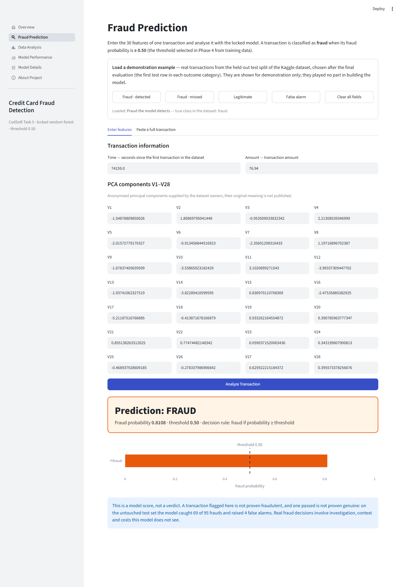 | 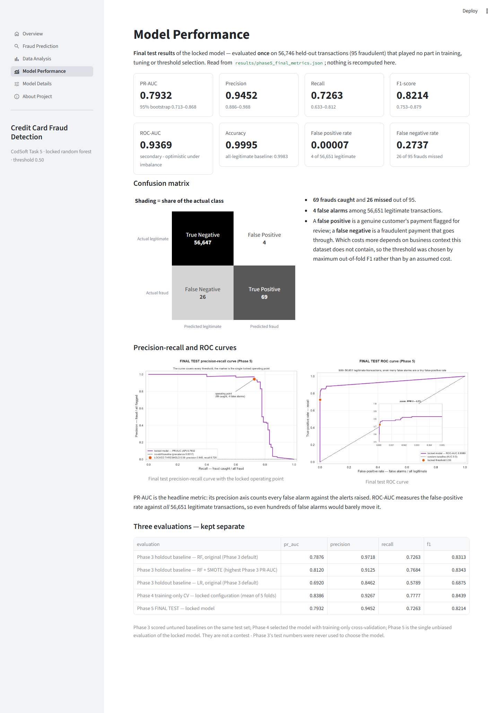 |
| **Fraud Prediction:** a real test transaction scored 0.8108, so it is classed as FRAUD | **Model Performance:** final test metrics, confusion matrix and curves |
| 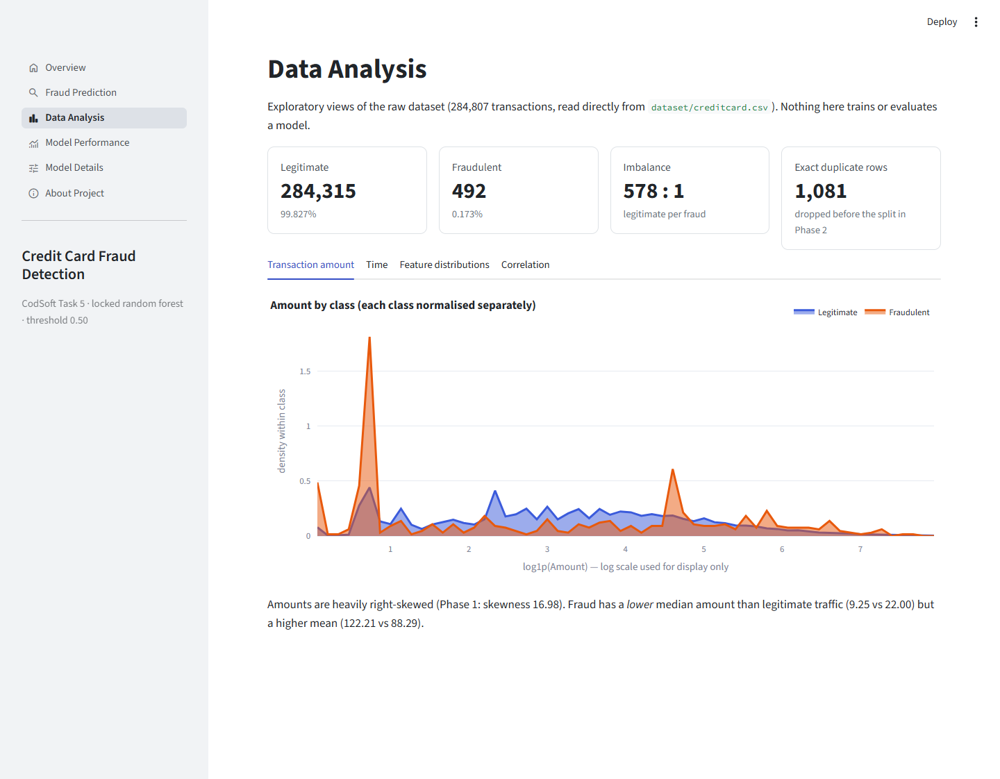 | 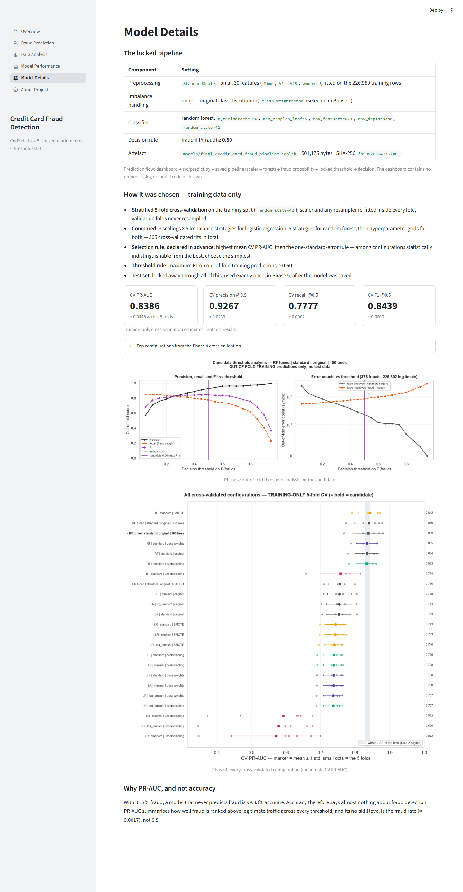 |
| **Data Analysis:** distributions of the raw dataset | **Model Details:** the locked pipeline and the selection method |

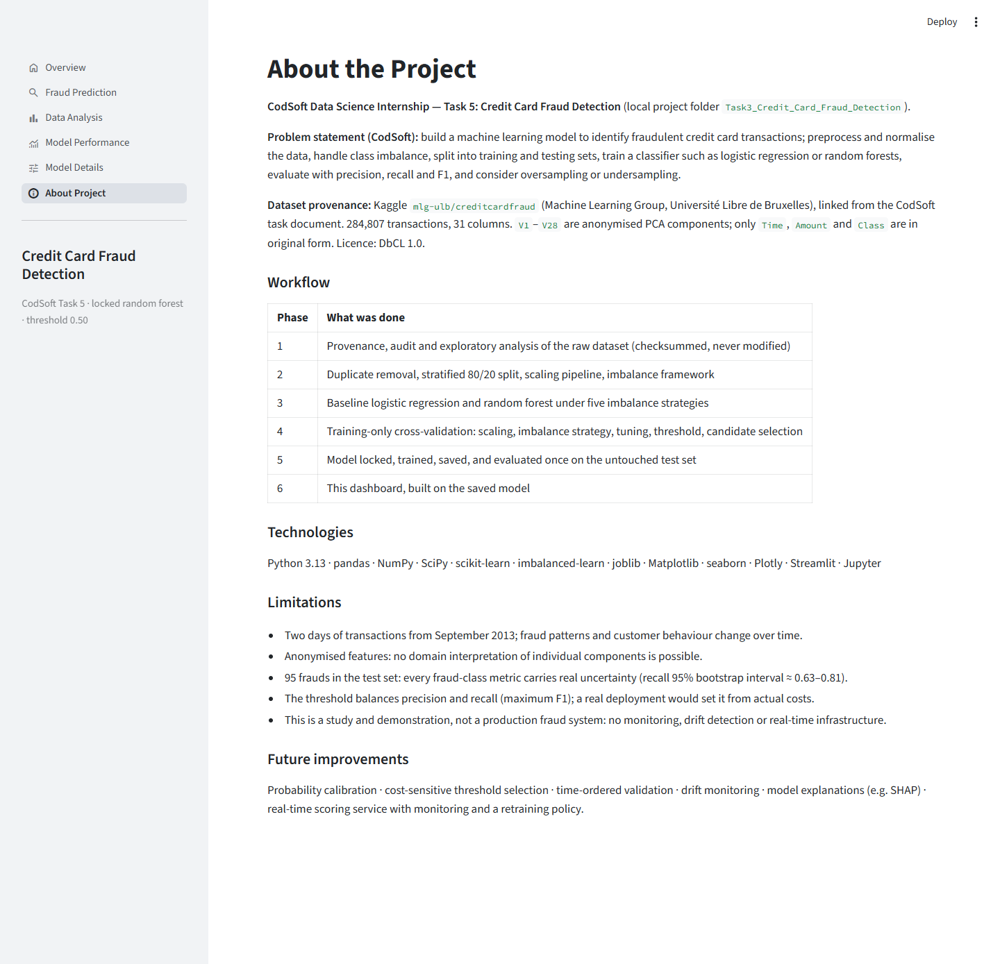

> Every prediction is a model score, not a verdict. On the test set the model caught 69 of 95 frauds and raised
> 4 false alarms.

---

## 25. Project Structure

```
Task3_Credit_Card_Fraud_Detection/
├── .streamlit/
│   └── config.toml                         # dashboard theme
├── dataset/
│   └── creditcard.csv                      # raw data (Git LFS), SHA-256 76274b69…, never modified
├── docs/
│   └── images/                             # real dashboard screenshots (6)
├── models/
│   ├── final_credit_card_fraud_pipeline.joblib   # locked pipeline + threshold
│   └── final_model_metadata.json           # human-readable model card
├── notebooks/
│   ├── 01_dataset_audit.ipynb              # Phase 1
│   ├── 02_data_preprocessing.ipynb         # Phase 2
│   ├── 03_model_training.ipynb             # Phase 3
│   ├── 04_model_validation_tuning.ipynb    # Phase 4
│   └── 05_final_model_evaluation.ipynb     # Phase 5
├── results/
│   ├── phase4_candidate.json               # the selected configuration and threshold
│   ├── phase4_candidate_threshold_analysis.csv
│   ├── phase4_cv_summary.csv
│   ├── phase4_lr_search.csv
│   ├── phase4_rf_search.csv
│   ├── phase5_demo_examples.json           # dashboard demonstration transactions
│   └── phase5_final_metrics.json           # final test results (read by the dashboard)
├── src/
│   ├── data_preprocessing.py               # loading, validation, split, preprocessors, resamplers
│   ├── model_training.py                   # pipelines, metrics, CV / OOF / threshold helpers
│   └── predict.py                          # prediction API and CLI
├── tests/
│   └── test_dashboard.py                   # Streamlit AppTest suite (42 checks)
├── visualizations/                         # 27 figures, numbered by phase (01–27)
├── app.py                                  # Streamlit dashboard
├── requirements.txt
└── README.md
```

---

## 26. Installation

These instructions are for Windows with PowerShell. [Git LFS](https://git-lfs.com) is required, because the
143.84 MiB dataset is stored with it.

```powershell
git lfs install                                        # once per machine
git clone https://github.com/harsha282004/CODSOFT.git
cd CODSOFT\Task3_Credit_Card_Fraud_Detection

python -m venv .venv
.\.venv\Scripts\Activate.ps1
pip install -r requirements.txt
```

If you cloned the repository before installing Git LFS, `dataset\creditcard.csv` will be a small pointer file.
Fetch the real file with:

```powershell
git lfs pull
```

Then verify the dataset. The hash must match exactly; every notebook also checks it and stops if it differs.

```powershell
Get-FileHash dataset\creditcard.csv -Algorithm SHA256
# 76274B691B16A6C49D3F159C883398E03CCD6D1EE12D9D8EE38F4B4B98551A89
```

You can also download the dataset directly from Kaggle
([`mlg-ulb/creditcardfraud`](https://www.kaggle.com/datasets/mlg-ulb/creditcardfraud)) and place it at
`dataset/creditcard.csv`.

---

## 27. Running the Project

Run all commands from the `Task3_Credit_Card_Fraud_Detection` folder with the virtual environment active.

**Dashboard**

```powershell
streamlit run app.py
```

**Prediction API and CLI**

```powershell
python src/predict.py --smoke-test
python src/predict.py --input transaction.json
```

**Tests**

```powershell
python tests/test_dashboard.py          # 42 dashboard checks (Streamlit AppTest)
```

**Notebooks.** Run them in order. Each one is self-contained and runs from a fresh kernel.

```powershell
jupyter notebook
```

| Order | Notebook | Approximate runtime* |
|---|---|---|
| 1 | `01_dataset_audit.ipynb` | about 6 min |
| 2 | `02_data_preprocessing.ipynb` | about 1 min |
| 3 | `03_model_training.ipynb` | 7–8 min |
| 4 | `04_model_validation_tuning.ipynb` | about 40 min at full machine speed (2 h 17 min in the final run, under heavy background load) |
| 5 | `05_final_model_evaluation.ipynb` | 2–5 min (rewrites the model artefact, byte-identical) |

\*Measured on a 12-core Windows laptop. Wall-clock times varied considerably with background system load during
this project, so treat them as rough guides only.

---

## 28. Reproducibility

| | |
|---|---|
| Python | 3.13.0 |
| Packages | Pinned in [`requirements.txt`](requirements.txt) |
| Random state | `random_state=42` for the split, the CV splitter, every sampler and every classifier |
| Split | Stratified 80/20. The test-set fingerprint `50a7a7a9…187f27e` was verified in Phases 3, 4 and 5. |
| CV | `StratifiedKFold(5, shuffle=True, random_state=42)`. Fold-assignment fingerprint `30b0865a…`. |
| Raw data | SHA-256 `76274b69…51a89`, checked at the start and end of every notebook |
| Model artefact | SHA-256 `fb538208…8274f9`, identical across three independent trainings |

**Evidence from repeated runs:**

* **Phases 1 and 2:** each notebook was run twice from a fresh kernel, and the outputs were identical.
* **Phase 3:** the prediction fingerprint `4ad550cd…` was identical in four runs.
* **Phase 4:** the two final fresh-kernel runs were identical apart from wall-clock timings, and all five
  `results/phase4_*` files were byte-identical.
* **Phase 5:** three independent trainings produced the same artefact hash. A separate Python process
  reproduces every test probability bit for bit.
* **Final validation:** notebooks 01 to 05 were all run again from fresh kernels, in order. Every result file,
  figure and the model artefact came out byte-identical, and every notebook's output text matched its saved
  version apart from timings.
* **Random-forest predictions** are added up in a fixed tree order (`FixedOrderRandomForestClassifier`), because
  scikit-learn's parallel summation does not repeat bit for bit.

---

## 29. Data Leakage Prevention

Leakage produces excellent scores and worthless models, so it was designed out and then tested for.

| Stage | Safeguard | How it was verified |
|---|---|---|
| **Train/test split** | Split once in Phase 2 (stratified, `random_state=42`). Duplicates were removed *before* the split, so no row can appear on both sides. | The train and test row indices are disjoint, and the test fingerprint is identical in Phases 3, 4 and 5. |
| **Scaler fitting** | `StandardScaler` sits inside the pipeline and is fitted only on the data passed to `fit`. | `n_samples_seen_` is 226,980 for the final model and 181,584 (each fold's training rows) in CV. The training-only fit also learns different statistics from a full-data fit (`Amount` scale 245.77 vs 250.40). |
| **Resampling inside CV** | Samplers sit inside an `imblearn` pipeline, so each training fold is resampled on its own and validation folds never are. | Each fitted sampler's strategy equals the value derived from its own fold's training counts. |
| **Training-only pipelines** | Scaling, resampling and the imbalance choices are all pipeline steps, fitted again in every fold. | No preprocessing statistic is computed outside a fitted pipeline. |
| **Out-of-fold predictions** | Each training row is scored exactly once, by the one fold model that did not train on it. | 226,980 out-of-fold predictions, one per row, aligned by index. |
| **Hyperparameter search** | Grid searches receive training data only, and a recording scorer logs every row that is scored. | 226,980 rows recorded per search: every training row and no test rows. |
| **Threshold selection** | Chosen by maximum F1 on out-of-fold training predictions. | The threshold can be reproduced from the out-of-fold vector alone. |
| **Model selection** | The declared one-standard-error rule is applied to the CV summaries. | The selection can be reproduced from the CV table alone. |
| **Untouched test set** | Fingerprinted and removed from the Phase 4 namespace. Opened in Phase 5 only after the artefact was saved and hashed. | Source scans show the test split is referenced only in designated cells, and none of them comes before the artefact lock. |
| **Final test evaluation** | Scored once, with the artefact loaded from disk. Nothing was changed afterwards. | The artefact hash is identical before and after the evaluation. |

The Phase 3 scores are the one place where the test set was seen before Phase 5. They were recorded as a baseline
and **never used for any decision**. Every Phase 4 choice was made on cross-validation, and the Phase 3
configurations were fixed before their test results existed.

---

## 30. Limitations

* **The data is historical.** It covers two days of European card transactions from September 2013. Fraud
  tactics and customer behaviour change, and performance on current transactions has not been shown.
* **The features are anonymised.** `V1`–`V28` have no published meaning, so the model cannot be explained in
  business terms. Features a real system would use, such as merchant, location, device and history, are absent.
* **Distribution shift and concept drift were not tested.** The random split mixes both days. A time-ordered
  evaluation, which is closer to how a deployed model is used, was not performed.
* **The positive class is small.** With 95 test frauds, recall's 95% bootstrap interval is 0.633 to 0.813.
* **The threshold rests on an assumption.** Maximum F1 weights false alarms and missed fraud equally. A real
  deployment would set the threshold from actual costs and review capacity.
* **The probabilities are not calibrated.** Random-forest scores rank transactions well, but they are not
  calibrated probabilities.
* **This is not a production system.** There is no real-time serving, monitoring, alerting, drift detection or
  retraining infrastructure, and the project does not claim to be production-ready.

---

## 31. Future Improvements

*These are all future work. None of them is implemented.*

* **Probability calibration**, using isotonic or Platt scaling fitted on training data.
* **Cost-sensitive learning and threshold selection**, based on real fraud-loss and review costs.
* **Temporal validation**: train on earlier transactions and test on later ones.
* **Drift monitoring** of feature distributions and score distributions.
* **Explainability**: per-prediction explanations, for example with SHAP values.
* **A real-time inference service**, with latency and throughput monitoring.
* **An automated retraining policy**, with a locked evaluation protocol.

---

## 32. Key Learnings

* **Accuracy is misleading under imbalance.** The model that predicts "legitimate" for everything scores
  99.83% and catches nothing.
* **PR-AUC is the right ranking metric here**, because precision counts every false alarm. ROC-AUC ranked the
  Phase 3 configurations almost in reverse.
* **Stratification matters** when positives are this rare. An unstratified split visibly distorts the fraud
  rate.
* **Preventing leakage is a matter of structure.** Split first, fit every transformation inside a pipeline, and
  resample only the training folds.
* **Rebalancing often moves the operating point without improving the model**, which is the same effect a
  different threshold would have.
* **The threshold should be chosen on training data** (out-of-fold predictions), never on the test set.
* **Cross-validation estimates for a selected model are optimistic.** The locked, once-only test evaluation is
  the honest number, and it came in lower.
* **The saved model should carry its decision rule.** Storing the threshold in the artefact keeps prediction
  consistent with evaluation.
* **Reproducibility has to be checked, not assumed.** Parallel floating-point summation broke bit-level
  reproducibility until the prediction order was fixed.
* **The trade-off between false positives and false negatives is a business decision**, not a modelling one.
  The model exposes the trade-off; it does not resolve it.

---

## 33. Phase-by-Phase Summary

| Phase | Objective | Key decisions | Validation | Outputs |
|---|---|---|---|---|
| 1 | Audit and EDA | Keep outliers; leave duplicates for Phase 2 | 22/22 integrity checks | Figures 01–07 |
| 2 | Preprocessing | Drop duplicates before the split; stratified 80/20; three scalings; resampling inside pipelines | 65/65 checks | `data_preprocessing.py`, figures 08–10 |
| 3 | Baselines | 10 configurations fixed in advance, default threshold | 22/22 checks; 4 identical runs | `model_training.py`, figures 11–16 |
| 4 | Model selection | Training-only CV; one-standard-error rule; threshold 0.50; random forest | 29/29 checks; 2 identical runs | `results/phase4_*`, figures 17–24 |
| 5 | Lock and evaluate | Configuration locked; evaluated once | 18/18 integrity checks, 9/9 smoke tests; 3 identical artefacts | Model artefact, `predict.py`, figures 25–27 |
| 6 | Dashboard | Presentation only; results read from files | 42/42 AppTest checks | `app.py`, screenshots |

---

## 34. Results Summary

| | Value |
|---|---|
| Dataset | 284,807 transactions, 492 of them fraud (0.173%) |
| Final model | Random forest: 100 trees, `min_samples_leaf=5`, `max_features=0.3`, StandardScaler, no resampling |
| Threshold | 0.50 (maximum out-of-fold F1) |
| CV PR-AUC (training only) | 0.838580 ± 0.044807 |
| **Test PR-AUC** | **0.793217** |
| **Test precision / recall / F1** | **0.945205 / 0.726316 / 0.821429** |
| Test ROC-AUC / accuracy | 0.936863 / 0.999471 |
| Test confusion matrix | TN 56,647, FP 4, FN 26, TP 69 |

---

## 35. Conclusion

The project covers everything the CodSoft brief asks for:

* preprocessing and normalisation;
* a stratified train/test split;
* class-imbalance handling, including oversampling and undersampling;
* logistic regression and random forests;
* evaluation by precision, recall and F1.

It also adds the discipline that makes the result trustworthy: a verified dataset, pipelines that cannot leak,
model selection on training data only, and a single, honest test evaluation.

The final random forest catches **69 of 95 frauds (recall 0.726)** and flags only **4 of 56,651 legitimate
transactions (precision 0.945)**, with a test PR-AUC of **0.793**. Most of the frauds it misses look like
legitimate traffic on the available features, which is as much a limit of the data as of the model.

The whole pipeline reproduces bit for bit. It is saved as a single artefact that includes its threshold, served
through a validated prediction API, and presented in a tested Streamlit dashboard.

---

<div align="center">

**CodSoft Data Science Virtual Internship · Task 5: Credit Card Fraud Detection**

*Local folder `Task3_Credit_Card_Fraud_Detection`*

</div>
