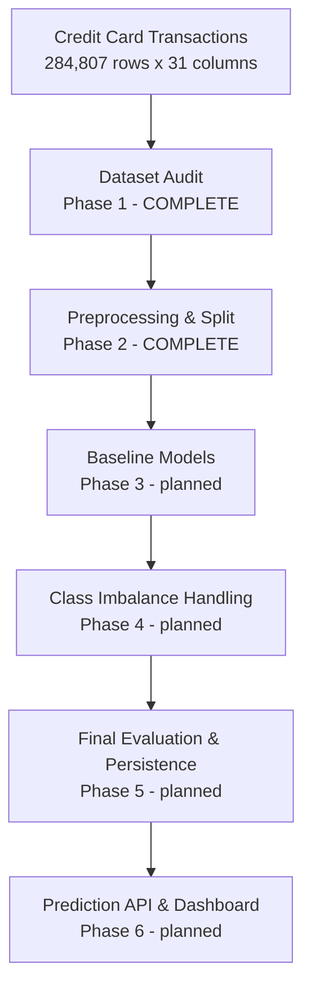

# Credit Card Fraud Detection

**CodSoft Data Science Virtual Internship — Task 5: Credit Card Fraud Detection**

> This folder is named `Task3_Credit_Card_Fraud_Detection` as my own project numbering; it corresponds to
> **CodSoft Task 5: Credit Card Fraud Detection**.

A supervised binary classification project that identifies fraudulent credit card transactions. The
dataset holds 284,807 real transactions made by European cardholders over two days in September 2013,
of which **492 — 0.173% — are fraudulent**. That ratio, roughly **578 legitimate transactions for every
1 fraudulent one**, is the entire difficulty of the problem and the reason the CodSoft brief calls out
class imbalance explicitly.

> ### ⚠️ Status: Phase 2 of 6 complete — dataset audit, preprocessing and imbalance framework
>
> **No model has been trained yet.** A stratified train/test split and a scaling pipeline now exist, and
> the class-imbalance strategies have been built and measured — but no classifier has been fitted, no
> evaluation metric has been computed, and **the test set has not been scored.** Every
> performance-related section below is marked *Planned for later phases* and contains no numbers,
> because no numbers exist to report. Everything that *is* reported below is reproducible from
> [`notebooks/01_dataset_audit.ipynb`](notebooks/01_dataset_audit.ipynb) and
> [`notebooks/02_data_preprocessing.ipynb`](notebooks/02_data_preprocessing.ipynb).

---

## Table of contents

**Phase 1 — dataset audit & EDA**

| | |
|---|---|
| [1. Project Overview](#1-project-overview) | [10. Class-wise Feature Comparison](#10-class-wise-feature-comparison) |
| [2. Problem Statement](#2-problem-statement) | [11. Correlation Structure](#11-correlation-structure) |
| [3. Dataset Provenance](#3-dataset-provenance) | [12. Outlier Audit](#12-outlier-audit) |
| [4. Dataset Structure](#4-dataset-structure) | [13. Data Leakage Audit](#13-data-leakage-audit) |
| [5. Target and Class Imbalance](#5-target-and-class-imbalance) | [14. Data Integrity Checks](#14-data-integrity-checks) |
| [6. Data Quality Findings](#6-data-quality-findings) | [15. Visualizations](#15-visualizations) |
| [7. Feature Audit](#7-feature-audit) | [16. Phase 1 Findings](#16-phase-1-findings) |
| [8. Transaction Amount Analysis](#8-transaction-amount-analysis) | [17. Phase 1 Limitations](#17-phase-1-limitations) |
| [9. Transaction Time Analysis](#9-transaction-time-analysis) | |

**Phase 2 — preprocessing & imbalance framework**

| | |
|---|---|
| [18. Preprocessing Objective](#18-phase-2--preprocessing-objective) | [22. Preprocessing Pipeline](#22-phase-2--preprocessing-pipeline) |
| [19. The Duplicate Decision](#19-phase-2--the-duplicate-decision) | [23. Class Imbalance Framework](#23-phase-2--class-imbalance-framework) |
| [20. Train / Test Split](#20-phase-2--train--test-split-and-stratification) | [24. Leakage Prevention and Validation](#24-phase-2--leakage-prevention-and-validation) |
| [21. Feature Scaling Strategy](#21-phase-2--feature-scaling-strategy) | [25. Visualizations & Reproducibility](#25-phase-2--visualizations-reproducibility-and-limitations) |

**Project**

| | | |
|---|---|---|
| [26. Project Structure](#26-project-structure) | [27. Installation and Reproduction](#27-installation-and-reproduction) | [28. Roadmap — Later Phases](#28-roadmap--later-phases) |

---

## 1. Project Overview

Given 30 numeric attributes of a credit card transaction, predict whether it is **fraudulent (Class 1)**
or **legitimate (Class 0)**.

This is a **supervised binary classification** problem on severely imbalanced data. It is classical
machine learning — the planned models are logistic regression and random forests, as the CodSoft brief
names. It is not an AI system, and when results eventually exist they will be estimates from a two-day
2013 benchmark dataset, not guarantees about live payment traffic.



---

## 2. Problem Statement

The CodSoft task statement:

> Build a machine learning model to identify fraudulent credit card transactions. Preprocess and
> normalize the transaction data, handle class imbalance issues, and split the dataset into training
> and testing sets. Train a classification algorithm, such as logistic regression or random forests, to
> classify transactions as fraudulent or genuine. Evaluate the model's performance using metrics like
> precision, recall, and F1-score, and consider techniques like oversampling or undersampling for
> improving results.

Phase 1 addresses none of the modelling requirements deliberately. It establishes what the data is
before anything is fitted to it.

---

## 3. Dataset Provenance

The dataset is the one CodSoft's own task document links to, traced end to end:

| | |
|---|---|
| **CodSoft source document** | `DATA SCIENCE.pdf`, page 11 — "TASK 5 — CREDIT CARD FRAUD DETECTION — DATASET CLICK HERE" |
| **Link behind "CLICK HERE"** | https://www.kaggle.com/datasets/mlg-ulb/creditcardfraud |
| **Kaggle dataset identifier** | `mlg-ulb/creditcardfraud` |
| **Owner** | Machine Learning Group — ULB (Université Libre de Bruxelles) |
| **Downloaded archive** | `archive.zip`, 69,155,672 bytes, from Kaggle's public dataset download endpoint |
| **Archive member** | `creditcard.csv` — the archive's only file |
| **Stored at** | `dataset/creditcard.csv` |
| **File size** | 150,828,752 bytes (143.84 MiB) |
| **SHA-256** | `76274b691b16a6c49d3f159c883398e03ccd6d1ee12d9d8ee38f4b4b98551a89` |
| **Format** | Comma-delimited CSV, plain ASCII, LF line endings, quoted header, unquoted values |
| **Licence** | Database Contents Licence (DbCL) 1.0, as stated on the Kaggle dataset page |

The hyperlink was read out of the PDF's annotation objects rather than typed from the visible text, so
the target is the one CodSoft actually embedded. No substitute, mirror, look-alike Kaggle dataset,
GitHub CSV or synthetic sample was used.

**What the data is.** Transactions made by European cardholders using credit cards in September 2013,
covering two days. It is the dataset described in Dal Pozzolo et al., *Calibrating Probability with
Undersampling for Unbalanced Classification* (IEEE SSCI, 2015), collected in a research collaboration
between Worldline and the ULB Machine Learning Group.

**Raw data immutability.** The CSV is checksummed at the top of the audit notebook and again at the
bottom, after every analysis cell has run:

| | |
|---|---|
| Initial SHA-256 | `76274b691b16a6c49d3f159c883398e03ccd6d1ee12d9d8ee38f4b4b98551a89` |
| Final SHA-256 | `76274b691b16a6c49d3f159c883398e03ccd6d1ee12d9d8ee38f4b4b98551a89` |
| **Status** | **UNCHANGED** |

> **Note on repository size.** `creditcard.csv` is 143.84 MiB, which is above GitHub's 100 MiB
> per-file limit for a normal push. Committing it directly will be rejected unless Git LFS is used or
> the file is excluded from version control. This is a repository-hosting decision, not a data
> decision, and is left open.

---

## 4. Dataset Structure

**284,807 rows × 31 columns**, 8,829,017 cells. Every column is numeric (30 × `float64`, `Class` as
`int64`), so there is no categorical encoding work anywhere in this project.

| Column | Type | Description |
|---|---|---|
| `Time` | float64 | Seconds elapsed between this transaction and the first transaction in the file. **Not a clock timestamp and not a date.** |
| `V1` … `V28` | float64 | Anonymised **principal components**. The original features could not be released for confidentiality reasons; these 28 columns are the principal components obtained with PCA. |
| `Amount` | float64 | Transaction amount. |
| `Class` | int64 | **Target.** `0` = legitimate, `1` = fraudulent. |

Because `V1`–`V28` are transformed and anonymised, no domain meaning can be attached to any individual
component. This project describes how they behave and does not speculate about what they represent.

The audit verifies the layout rather than assuming it: the column list is compared against the expected
`Time` / `V1`–`V28` / `Amount` / `Class` order, and the comparison passes.

**Evidence that the components really are PCA output:**

| Check | Result |
|---|---|
| Largest absolute component mean | 4.87 × 10⁻¹⁵ (i.e. all centred on zero) |
| Standard deviations monotonically decreasing `V1` → `V28` | True — 1.9587 down to 0.3301 |
| Largest absolute correlation between any two components | ~2 × 10⁻¹⁵ (mutually orthogonal) |

---

## 5. Target and Class Imbalance

`Class` is binary, contains both classes, and has no missing values.

| Class | Meaning | Count | Percentage |
|---|---|---|---|
| 0 | Legitimate | **284,315** | 99.827251% |
| 1 | Fraudulent | **492** | 0.172749% |
| | **Total** | **284,807** | 100% |

| | |
|---|---|
| **Imbalance ratio** | **577.8760 legitimate : 1 fraudulent** (≈ 578:1) |
| Fraud rate | 1 in every 579 transactions |
| Majority class size | 284,315 rows |
| Minority class size | 492 rows |

### Why accuracy is the wrong metric here

A model that predicts "legitimate" for every transaction, learns nothing and catches zero fraud still
scores:

| Metric | Value for the always-legitimate model |
|---|---|
| Accuracy | **99.8273%** |
| Recall | 0% — it misses all 492 frauds |
| Precision | undefined — it never predicts fraud |

So 99.83% accuracy is the *floor*, not an achievement. The metrics that carry information here are the
ones the CodSoft brief names, plus one more:

| Metric | What it answers | Why it matters |
|---|---|---|
| **Recall** | of all actual frauds, how many were caught? | a missed fraud is a direct financial loss |
| **Precision** | of all flagged transactions, how many were really fraud? | false alarms block genuine customers and cost review time |
| **F1-score** | harmonic mean of the two | one number when both errors matter |
| **PR-AUC** | precision–recall trade-off across thresholds | threshold-free, and not flattered by the huge negative class the way ROC-AUC is |

### Imbalance handling — *planned for later phases*

**No balancing of any kind was applied in Phase 1.** No oversampling, no undersampling, no SMOTE, no
class weights. This is not an omission: resampling must be applied **inside the training fold only**.
Resampling the full dataset now and splitting later would put synthetic or duplicated minority rows on
both sides of the split and produce a test score that cannot be trusted.

Strategies to be compared in **Phase 4**, once a stratified split exists:

- `class_weight="balanced"` on logistic regression and random forest — cheapest option, invents no data
- `RandomUnderSampler` on the majority class — fast, discards a great deal of legitimate data
- `RandomOverSampler` on the minority class — duplicates the 492 fraud rows, risks overfitting them
- `SMOTE` — synthesises new minority points; the features are PCA components, so interpolating between
  them is at least geometrically coherent, though still synthetic
- decision-threshold tuning on predicted probabilities — often the largest single lever, and it needs no
  resampling at all

---

## 6. Data Quality Findings

### Missing values

**No missing values were found in the raw dataset** — zero across all 8,829,017 cells, in every one of
the 31 columns. No imputation strategy is needed anywhere in this project.

Disguised placeholders were checked for separately, since a `NaN` scan would not catch them:

| Check | Result |
|---|---|
| Infinite values | 0 |
| Empty-string cells | 0 |
| `Amount == -999` (classic sentinel) | 0 |
| Negative `Amount` | 0 |
| Negative `Time` | 0 |

### Duplicates

| | |
|---|---|
| Exact duplicate rows (extra copies) | **1,081** (0.3796% of the dataset) |
| Rows involved in a duplicate group | 1,854 (0.6510%) |
| Distinct duplicated groups | 773 |
| Largest duplicate group | 18 identical rows |
| Duplicates by class | 1,822 legitimate · 32 fraudulent |
| Duplicates on features only, `Class` ignored | 1,081 — **identical to the full-row count** |
| **Rows with identical features but conflicting labels** | **0** |

That last line matters. Had duplicated feature vectors carried contradictory labels, the dataset would
contain irreducible label noise that no classifier could resolve. It does not.

Duplicated rows are also overwhelmingly small-value: median amount 15.98 against 22.00 for the dataset
as a whole, maximum 1,848.06 against 25,691.16.

**Decision: duplicates are retained in Phase 1, not removed.** In a fraud dataset a repeated-looking row
is not automatically an error — the features are PCA components stored at finite precision, so two
genuinely distinct small transactions can legitimately collapse onto identical values. Phase 2 will
decide what to do with them, and the argument for dropping the extra copies is not "duplicates are
dirty" but "identical rows landing on both sides of the train/test split would leak information and
inflate the test score." That is a splitting concern and will be handled at the split.

---

## 7. Feature Audit

### Scale differences

| Feature group | Columns | Min | Max | Range | Mean | Std |
|---|---|---|---|---|---|---|
| `Time` (seconds) | 1 | 0.00 | 172,792.00 | 172,792.00 | 94,813.86 | 47,488.15 |
| `Amount` (currency) | 1 | 0.00 | 25,691.16 | 25,691.16 | 88.35 | 250.12 |
| `V1`–`V28` (PCA components) | 28 | −113.74 | 120.59 | 234.33 | ~0 | ~1 |

`Time` spans roughly **737×** the full component range and `Amount` roughly **110×** it. For any
gradient- or distance-based model — logistic regression above all — those two columns would dominate
the objective purely through magnitude.

**Implication for Phase 2:** `Time` and `Amount` require scaling. The components are already
approximately standardised as a by-product of PCA, but scaling them too is harmless and keeps the
pipeline uniform. **No scaler was fitted in Phase 1** — when one is fitted it must be fitted on the
training split alone, inside a `Pipeline`.

---

## 8. Transaction Amount Analysis

| Statistic | Value |
|---|---|
| Count | 284,807 |
| Mean | 88.3496 |
| Std | 250.1201 |
| Min | 0.00 |
| 25% | 5.60 |
| **Median** | **22.00** |
| 75% | 77.1650 |
| 95% | 365.00 |
| 99% | 1,017.97 |
| Max | 25,691.16 |
| **Skewness** | **16.9777** |
| Zero-amount transactions | **1,825** (1,798 legitimate · 27 fraudulent) |
| Negative amounts | 0 |

The distribution is heavily right-skewed: a large mass of small transactions with a thin tail reaching
past 25,000. The zero-amount transactions appear in both classes and are plausibly card authorisation
checks rather than corrupt records, so they are kept and noted.

### Amount by class

| | Legitimate | Fraudulent |
|---|---|---|
| Count | 284,315 | 492 |
| Mean | 88.2910 | **122.2113** |
| **Median** | **22.00** | **9.25** |
| Std | 250.1051 | 256.6833 |
| 25% | 5.65 | 1.00 |
| 75% | 77.05 | 105.89 |
| Max | **25,691.16** | 2,125.87 |

Stated carefully, because the two facts point in opposite directions: fraudulent transactions have the
**higher mean** but the **lower median**, and no fraud in this dataset exceeds ~2,126 while legitimate
transactions reach 25,691. `Amount` alone is therefore not a clean separator in either direction —
confirmed by its correlation with `Class` of just **+0.0056**.

Where a logarithm appears in a figure it is `log1p` applied **inside the plotting call, for display
only**. The `Amount` column and the file on disk are untouched.

---

## 9. Transaction Time Analysis

`Time` is **not a clock timestamp, not a date and carries no time zone.** It is the number of seconds
elapsed between each transaction and the first transaction in the file.

| Statistic | Value |
|---|---|
| Min | 0 seconds |
| Max | 172,792 seconds |
| Mean | 94,813.86 seconds |
| Median | 84,692 seconds |
| **Range** | **172,792 seconds = 47.998 hours = 1.9999 days** |
| Distinct values | 124,592 |
| File stored in time order | **True** (monotonically non-decreasing) |

| | Legitimate | Fraudulent |
|---|---|---|
| Mean `Time` | 94,838.20 | 80,746.81 |
| Median `Time` | 84,711 | 75,568.5 |
| Min / Max | 0 / 172,792 | 406 / 170,348 |

Legitimate volume shows a clear daily rhythm with two deep overnight troughs across the two days
covered. Fraudulent transactions are spread far more evenly and continue through those troughs, so
fraud makes up a much larger *share* of activity at night even though its absolute count stays low.
That is a description of this 48-hour window, not a general law about fraud.

The file being in time order is recorded because it means a shuffled random split and a chronological
split are genuinely different experiments. Phase 2 will use a **stratified random split**, matching the
CodSoft brief, and will say so explicitly rather than leaving the choice implicit.

---

## 10. Class-wise Feature Comparison

For every feature the mean, median and standard deviation were computed per class, along with a
standardised mean difference (Cohen's *d*) so that features on different scales can be compared.

| Feature | Standardised mean difference (fraud − legitimate) |
|---|---|
| `V17` | −8.32 |
| `V14` | −7.64 |
| `V12` | −6.50 |
| `V10` | −5.35 |
| `V16` | −4.83 |
| … | … |
| `Amount` | +0.1356 |
| `Time` | −0.2968 |

> **This is exploratory description, not feature importance.** A large standardised difference says the
> two class distributions sit apart on that axis. It does not say the feature is predictive, it ignores
> correlation between features, and it does not survive contact with a model that sees all features
> jointly. Nothing here was used to select features, no target encoding was used, and no train/test
> split exists yet, so no test data influenced any of it.

---

## 11. Correlation Structure

Pearson correlation across all 31 columns. Against the binary `Class` this is a point-biserial
correlation: a **linear, marginal, one-feature-at-a-time** association.

| Feature | Correlation with `Class` |
|---|---|
| `V17` | −0.3265 |
| `V14` | −0.3025 |
| `V12` | −0.2606 |
| `V10` | −0.2169 |
| `V16` | −0.1965 |
| `V3` | −0.1930 |
| `V7` | −0.1873 |
| `V11` | +0.1549 |
| `V4` | +0.1334 |
| `Amount` | **+0.0056** |
| `Time` | **−0.0123** |

Strongest feature-to-feature correlations, all of which involve `Time` or `Amount`:

| Pair | \|r\| |
|---|---|
| `V2` ~ `Amount` | 0.5314 |
| `Time` ~ `V3` | 0.4196 |
| `V7` ~ `Amount` | 0.3973 |
| `V5` ~ `Amount` | 0.3864 |
| `V20` ~ `Amount` | 0.3394 |

The 28 principal components are mutually near-orthogonal by construction — the largest absolute
correlation between any two of them is ~2 × 10⁻¹⁵ — which is exactly what PCA guarantees.

> Correlation with `Class` is **not** causation and **not** importance. A feature with near-zero
> marginal correlation can still be valuable in combination with others. **No feature was removed on
> the strength of a correlation in Phase 1.**

---

## 12. Outlier Audit

The 1.5 × IQR rule was applied to all 30 features as a **measuring instrument, not a cleaning step**.

| | |
|---|---|
| Total outlier cells across all features | **370,372** |
| Rows flagged on at least one feature | **138,473 — 48.62% of the dataset** |
| Fraudulent rows flagged | **477 of 492 — 96.95% of all fraud** |
| Legitimate rows flagged | 137,996 of 284,315 — 48.54% |
| Feature with zero outliers | `Time` |
| Feature with most outliers | `V27` — 39,163 (13.75%) |
| `Amount` outliers (above the 184.5125 upper fence) | 31,904 (11.20%), of which 91 are fraudulent |

The flags concentrate sharply in the minority class:

| Feature | % of fraud flagged | % of legitimate flagged | Concentration |
|---|---|---|---|
| `V14` | **87.40%** | 4.83% | +82.58 pp |
| `V12` | **83.13%** | 5.25% | +77.88 pp |
| `V27` | 69.92% | 13.65% | +56.27 pp |
| `V11` | 59.76% | 0.17% | +59.59 pp |
| `V28` | 55.28% | 10.58% | +44.71 pp |

### Decision: outliers are retained

"Removing outliers" here would mean discarding roughly half the dataset, including 477 of the 492
fraudulent transactions. These flags are not errors — for heavy-tailed PCA components and a
right-skewed `Amount`, the 1.5 × IQR fence is simply narrow. More importantly, in fraud detection
extremity in the feature space is **part of the signal being searched for**. Deleting it would remove
the thing the model is supposed to learn.

**Outliers will be retained unless later evidence supports a specific, principled treatment** — and if
any is ever applied it must be fitted on the training split only.

---

## 13. Data Leakage Audit

All 10 preliminary leakage checks pass:

| Check | Result |
|---|---|
| Target column is exactly `Class` | PASS |
| No other column name suggests an outcome or label | PASS |
| No feature is a perfect copy of the target | PASS |
| No feature correlates with the target above \|r\| 0.95 (strongest is `V17` at 0.3265) | PASS |
| No feature separates the classes perfectly (disjoint value ranges) | PASS |
| No duplicated feature column | PASS |
| No identical feature rows carrying conflicting labels | PASS |
| No train/test split has been performed in this phase | PASS |
| No scaler, encoder or resampler has been fitted in this phase | PASS |
| `Class` was not used to construct any feature | PASS |

Every feature is either a PCA component of the original transaction attributes or one of `Time` /
`Amount` — all known at the moment the transaction occurs, so no post-outcome information is present.

### Safeguards recorded for later phases

Leakage in this project will come from process, not from the columns. These are commitments Phase 2
onwards must honour:

1. **Split first**; fit every transformation afterwards, on the training split alone.
2. Every scaler lives inside a scikit-learn `Pipeline` so `fit` can never touch the test fold.
3. Resampling (SMOTE, over/under-sampling) is applied **only to the training fold** — a resampled test
   set reports a fraud rate that does not exist in reality.
4. Threshold selection and hyperparameter tuning use cross-validation on the training data, never the
   test set.
5. The split is **stratified** on `Class`; with only 492 positives, an unstratified split can leave a
   fold with a badly distorted fraud rate.
6. If the extra copies of duplicated rows are dropped, they are dropped **before** the split.

---

## 14. Data Integrity Checks

The notebook runs an automated assertion suite and reports the phase as failed if any check returns
`False`. **22 of 22 checks passed.**

| # | Check | Status |
|---|---|---|
| 1 | Dataset file still exists | PASS |
| 2 | File size unchanged | PASS |
| 3 | SHA-256 unchanged after the full audit | PASS |
| 4 | Dataset loaded successfully | PASS |
| 5 | Row count is positive | PASS |
| 6 | Column count is positive | PASS |
| 7 | Row count is 284,807 as expected | PASS |
| 8 | Column count is 31 as expected | PASS |
| 9 | Target column `Class` present | PASS |
| 10 | All expected feature columns present, in order | PASS |
| 11 | No duplicate column names | PASS |
| 12 | All 28 components `V1`–`V28` present | PASS |
| 13 | Target is binary | PASS |
| 14 | Target contains both classes | PASS |
| 15 | Target has no missing values | PASS |
| 16 | All columns are numeric | PASS |
| 17 | No missing values anywhere | PASS |
| 18 | No infinite values anywhere | PASS |
| 19 | `Amount` is non-negative throughout | PASS |
| 20 | `Time` is non-negative throughout | PASS |
| 21 | Class counts sum to the row count | PASS |
| 22 | No leakage check failed | PASS |

---

## 15. Visualizations

Seven figures, written to [`visualizations/`](visualizations/) by the audit notebook and verified to
exist on disk at the end of it.

| File | Visualization | Purpose |
|---|---|---|
| [`01_class_distribution.png`](visualizations/01_class_distribution.png) | Class distribution | Legitimate vs fraudulent counts on linear and log scales, counts labelled directly — makes the 578:1 imbalance visually unmissable |
| [`02_amount_distribution.png`](visualizations/02_amount_distribution.png) | Amount distribution | Raw histogram plus a `log1p` view (display only), showing the extreme right skew |
| [`03_amount_by_class.png`](visualizations/03_amount_by_class.png) | Amount by class | Box plot and per-class cumulative distribution — fraud's higher mean but lower median |
| [`04_time_distribution.png`](visualizations/04_time_distribution.png) | Time distribution | Transactions per elapsed hour, legitimate and fraudulent on separate panels sharing an x-axis |
| [`05_feature_scale_summary.png`](visualizations/05_feature_scale_summary.png) | Feature scale summary | Per-component standard deviation and observed range for `V1`–`V28` — the PCA signature |
| [`06_correlation_heatmap.png`](visualizations/06_correlation_heatmap.png) | Correlation structure | Full 31×31 correlation matrix plus the 15 strongest associations with `Class` |
| [`07_class_separation.png`](visualizations/07_class_separation.png) | Class separation | Class-wise densities of the four most separated components — descriptive, not importance |

Design notes, since imbalance makes several default chart choices actively misleading here:

- Class counts are shown on **two scales**, because a linear chart hides the fraud bar entirely and a
  log chart alone understates the gap to the eye.
- Fraud is never stacked onto legitimate counts on a shared y-axis — 492 against 284,315 cannot share
  a scale and stay readable, so those comparisons use separate panels or per-class normalisation.
- The two class colours are fixed across every figure and were checked for colour-vision-deficiency
  separation before use (worst case protanopia ΔE 30.1, normal vision ΔE 37.8).
- In `07`, out-of-window points are **omitted rather than clipped** — clipping piles the tail into the
  edge bin and invents a spike that is not in the data. Each panel states what share of each class it
  displays.

---

## 16. Phase 1 Findings

**Provenance.** The dataset is the exact one linked from page 11 of CodSoft's `DATA SCIENCE.pdf`:
Kaggle `mlg-ulb/creditcardfraud`. Downloaded as a 69,155,672-byte archive whose only member is
`creditcard.csv`, extracted unmodified to `dataset/creditcard.csv` (150,828,752 bytes). SHA-256 recorded
before the audit and re-verified after it: **unchanged**.

**Structure.** 284,807 rows × 31 columns, all numeric. Layout confirmed as `Time`, `V1`–`V28`,
`Amount`, `Class` — checked, not assumed. `V1`–`V28` confirmed as PCA output by their zero means,
monotonically decreasing standard deviations and mutual orthogonality.

**Imbalance.** 284,315 legitimate (99.827251%) against 492 fraudulent (0.172749%) — **577.8760:1**. An
always-legitimate model scores 99.8273% accuracy while catching none of the 492 frauds, so accuracy is
unusable as a headline metric.

**Quality.** No missing values, no infinities, no placeholders, no negative amounts. 1,081 exact
duplicate rows (0.3796%), none carrying a conflicting label — retained for now.

**Features.** `Time` is a 47.998-hour elapsed-seconds counter, not a timestamp. `Amount` is heavily
right-skewed (skewness 16.98, median 22.00, mean 88.35, max 25,691.16). `Time` and `Amount` sit on
scales 110–737× wider than the components, so scaling is required.

**Association.** Strongest marginal associations with `Class` are `V17` (−0.3265), `V14` (−0.3025),
`V12` (−0.2606). `Amount` (+0.0056) and `Time` (−0.0123) are essentially uncorrelated on their own.
None approaches a level that would signal leakage.

**Outliers.** 138,473 rows (48.62%) flagged by the IQR rule, including 96.95% of all fraud. Flags
concentrate in the minority class. **Retained.**

**Leakage.** All 10 checks pass. No split, scaler, encoder or resampler was fitted.

**Integrity.** 22 of 22 automated checks pass, including the before/after checksum comparison.

### What this phase establishes

The data is clean in the conventional sense — complete, numeric, well-formed, with a verified provenance
chain back to the CodSoft source document. The difficulty in this problem is **not dirt**. It is the
578:1 imbalance, the `Amount`/`Time` scale mismatch against the principal components, and a minority
class of only 492 examples to learn from.

---

## 17. Phase 1 Limitations

- `V1`–`V28` are anonymised, so no domain interpretation of any individual component is possible. This
  project describes their behaviour and stops there.
- Everything reported is **descriptive and marginal**. Nothing here establishes that any feature is
  predictive, because no model has been fitted.
- All statistics were computed on the full dataset. That is legitimate for an audit, but it means none
  of them may be reused as a fitted preprocessing parameter later — those must be re-derived from the
  training split alone.
- The 48-hour window is a single short recording from September 2013 in one region. Conclusions about
  the *timing* of fraud describe this window and should not be generalised.
- **No model results of any kind exist yet.** Any number in this README describing model performance
  would be fabricated; there are none.

---

## 18. Phase 2 — Preprocessing Objective

Phase 1 established what the data is. Phase 2 builds the foundation the modelling phases stand on: a
stratified train/test split, a scaling pipeline fitted on training data alone, and a *framework* for
handling class imbalance safely.

**No classifier was trained.** No metric was computed, no model was selected, tuned or persisted, and
the test set has not been scored. Resamplers were constructed and their effect on the training
distribution was measured, but nothing was fitted to predict anything.

Everything below is reproducible from [`notebooks/02_data_preprocessing.ipynb`](notebooks/02_data_preprocessing.ipynb)
and implemented in [`src/data_preprocessing.py`](src/data_preprocessing.py).

---

## 19. Phase 2 — The Duplicate Decision

Phase 1 found 1,081 exact duplicate rows and deliberately deferred the decision. **Decision: the extra
copies are dropped, before the split.**

| | |
|---|---|
| Rows before deduplication | 284,807 |
| Extra copies dropped | **1,081** (1,062 legitimate · 19 fraudulent) |
| **Rows after deduplication** | **283,726** |
| Legitimate | 283,253 (99.833290%) |
| Fraudulent | **473** (0.166710%) |
| Imbalance ratio | **598.8436 : 1** (was 577.8760 : 1) |

The reason is not that duplicates are dirty — Phase 1 established they carry no conflicting labels and
are plausible collisions of small transactions in a finite-precision PCA space. The reason is **split
contamination**: an identical row appearing in both the training and the test set means the model is
scored on a row it has already memorised.

The cost is stated rather than glossed over: deduplication removes **19 of the 492 fraud examples** and
pushes the imbalance from 577.88:1 to 598.84:1. It is still the right trade — a slightly harder honest
problem beats an easier dishonest one. Dropping *after* the split would not work, since it would leave
the copies that had already crossed the boundary.

The reasoning is recorded in the module itself as `dp.DUPLICATE_DECISION`, so it travels with the code.

---

## 20. Phase 2 — Train / Test Split and Stratification

**80/20, stratified on `Class`, `random_state=42`.** With 473 positives, an 80/20 draw leaves ~95 frauds
in the test set — few, but enough for precision/recall to mean something. A smaller test fraction would
make those metrics too noisy to act on; a larger one would starve training of the minority class.

| | Rows | Legitimate | Fraudulent | Fraud % | Ratio |
|---|---|---|---|---|---|
| Full (deduplicated) | 283,726 | 283,253 | 473 | 0.166710% | 598.84 : 1 |
| **Train** | **226,980** | 226,602 | **378** | 0.166534% | 599.48 : 1 |
| **Test** | **56,746** | 56,651 | **95** | 0.167413% | 596.33 : 1 |

### Stratification verified, not assumed

| Split | Fraud rate | Deviation from full dataset |
|---|---|---|
| Full dataset | 0.166710% | — |
| Train | 0.166534% | **−0.000176 pp** |
| Test | 0.167413% | **+0.000703 pp** |

The notebook also demonstrates what an **unstratified** split of the same data would have produced,
varying only the seed. The test fraud count swings substantially from seed to seed; with only ~95
positives expected, that swing moves recall by several points for reasons that have nothing to do with
the model. The unstratified split is computed purely to show the risk and is discarded immediately.

---

## 21. Phase 2 — Feature Scaling Strategy

Scale statistics were **re-measured on the training split only**. Phase 1 measured the full dataset,
which was correct for an audit but is not a legitimate basis for a preprocessing decision — choosing a
transformation from full-dataset statistics is a mild form of leakage, and it costs nothing to avoid.

### What is not a judgement call

| Feature group | Training range | vs component range |
|---|---|---|
| `Time` | 172,792 | **1,534×** |
| `Amount` | 25,691 | **175×** |
| `V1`–`V28` | 112.64 | 1× |

Those multiples are larger than the 737× and 110× Phase 1 reported, for a mundane reason: the two rows
holding the most extreme component values (`V5` at −113.74, `V7` at +120.59) happen to sit in the test
split, so the *training* component range is 112.64 rather than 234.33. The conclusion is unaffected and
only gets stronger.

For logistic regression — the model the CodSoft brief names first — coefficients are fitted against an
L2 penalty that treats every coefficient the same, and gradient descent on wildly different scales
converges badly. **`Time` and `Amount` must be scaled.** Every strategy implemented does it.

### What genuinely is a judgement call: `V1`–`V28`

The components are zero-centred but **not** unit-variance — their standard deviations fall
monotonically from **1.9473** (`V1`) to **0.3257** (`V28`), a spread of about **6.0×**. Two defensible
readings:

| Leave them unscaled | Standardise them |
|---|---|
| The 6.0× spread *is* the PCA variance ordering — real information about how much of the original data each component carries | L2 regularisation penalises all coefficients equally, so a low-variance component needs a larger coefficient for the same effect and is penalised harder for it |
| 6.0× is small next to the 1,534× mismatch that actually needed fixing | That penalty asymmetry is an artefact of the units, not a property of the data |
| Preserves the geometry SMOTE interpolates through | Puts every feature on equal footing before distance-based resampling |

**Resolution: both are implemented, and the choice is deliberately left open.** It cannot be settled
without fitting a model, and settling it by peeking at the test set would destroy the value of the
split.

| Strategy | What it does | Status |
|---|---|---|
| **`"standard"`** | `StandardScaler` on all 30 features | **default** |
| `"minimal"` | `StandardScaler` on `Time` and `Amount`; `V1`–`V28` passed through | implemented |
| `"log_amount"` | `log1p(Amount)` first, then `StandardScaler` on all 30 | implemented |

`"standard"` is the default because regularised logistic regression is the primary planned model and
uniform treatment under the penalty is the safer default there; tree-based models are scale-invariant
and unaffected either way. `"log_amount"` exists because `Amount` has a **skewness of 16.98** — scaling
recentres it but leaves the shape untouched — and `log1p` is safe since Phase 1 confirmed `Amount ≥ 0`.

A `RobustScaler` would be a fourth reasonable candidate given the heavy tails; it is deliberately left
out to keep the Phase 3 comparison small enough to be meaningful. **The empirical comparison between
these strategies is planned for Phase 3, by cross-validation on the training split only.**

---

## 22. Phase 2 — Preprocessing Pipeline

All preprocessing logic lives in [`src/data_preprocessing.py`](src/data_preprocessing.py) rather than
in a notebook, so Phases 3–6 import the *same* definitions instead of re-deriving a split that might
differ.

### The order, and why it is not negotiable

```
RAW DATA (284,807 rows, read-only)
      |
      +--> drop exact duplicates            (before the split, or copies cross the boundary)
      |
      +--> STRATIFIED TRAIN / TEST SPLIT    <-- everything below sees only one side at a time
      |
      +--> FIT preprocessing on X_train ONLY
      |
      +--> TRANSFORM X_train
      |
      +--> TRANSFORM X_test                 (transform only - never fit)
      |
      +--> OPTIONAL RESAMPLING of the TRAINING data only
      |
      +--> MODEL TRAINING                   (Phase 3 - not yet implemented)
```

Every arrow pointing *into* the test set is a `transform`. None is a `fit`.

### Module API

| Function | Purpose |
|---|---|
| `load_data(drop_duplicates=True)` | Verify checksum, read CSV, validate layout, drop duplicates |
| `validate_raw_dataframe(df)` | Raise on wrong columns, wrong row count, non-numeric, NaN, infinity, non-binary target |
| `split_features_target(df)` | Separate `X` from `Class`; raises if the target reaches `X` |
| `split_data(df)` | Stratified 80/20 split, returns a frozen `SplitData` object |
| `build_preprocessor(strategy)` | Unfitted `ColumnTransformer` — `"standard"` / `"minimal"` / `"log_amount"` |
| `build_resampler(strategy)` | Unfitted sampler, or `None` for strategies that change no rows |
| `validate_split` · `validate_preprocessor` · `validate_resampling` | Return `(check, passed)` pairs |
| `sha256_of_file` · `verify_raw_dataset_integrity` | Prove the raw CSV was not touched |

No classifier is defined or trained in the module, and nothing in it writes to `dataset/`.

### Transformation result

| | |
|---|---|
| Fitted on | **226,980 training rows** |
| Input features | 30 |
| Output features | **30** — no expansion, no encoding, no derived feature |
| NaN introduced | 0 |
| Infinities introduced | 0 |
| Transformed train mean / std | largest \|mean\| 1.52 × 10⁻¹⁶ · std 1.000002 |
| Transformed test mean / std | largest \|mean\| 0.011449 · std 0.983941 – 1.109790 |

That last row is the point: test statistics are **near but not equal to** 0 and 1. Had they come out
exactly 0 and 1, the scaler would have been fitted on them.

---

## 23. Phase 2 — Class Imbalance Framework

The training split holds **378 fraudulent** rows against **226,602 legitimate** — 599.48 : 1. Five
candidate approaches are documented and available through `dp.build_resampler`.

| | Strategy | Training rows | Class 0 | Class 1 | Minority % |
|---|---|---|---|---|---|
| **A** | Original (no resampling) | 226,980 | 226,602 | 378 | 0.1665% |
| **B** | Class weights | 226,980 | 226,602 | 378 | 0.1665% — reweights the *loss*, not the rows |
| **C** | Random oversampling | **453,204** | 226,602 | 226,602 | 50.00% |
| **D** | SMOTE | **453,204** | 226,602 | 226,602 | 50.00% |
| **E** | Random undersampling | **756** | 378 | 378 | 50.00% |

Reading the table honestly:

- **A and B change no rows at all.** `build_resampler` returns `None` for both; class weighting is a
  classifier argument applied in Phase 3, not a preprocessing step.
- **Oversampling and SMOTE** both double the training set to 453,204 rows, entirely minority rows.
  Oversampling repeats the same 378 frauds ~600× each; SMOTE interpolates new points. Same shape, very
  different content.
- **Undersampling** collapses 226,980 rows to **756**, discarding 226,224 legitimate transactions —
  99.83% of the majority class — to reach balance.

### The evaluation principle, recorded now so it is not rationalised later

> **A strategy is not better because it produces a 50/50 training set.**

All three row-changing strategies produce perfect balance. That is a property of the *training input*,
not evidence about output quality. The comparison that decides anything happens in **Phase 4**, judged
on **precision · recall · F1-score · confusion matrix · PR-AUC · ROC-AUC where appropriate** — and never
on accuracy, which Phase 1 showed sits at 99.83% for a model that catches no fraud at all.

### How resampling will actually be used

Applying a resampler by hand is fine for *measuring* a distribution change. It is the wrong way to use
one for modelling: hand-resampling before cross-validation puts duplicated or interpolated copies of the
same fraud into both the training and the validation fold, and the reported recall becomes fiction.

The fix is structural — the sampler sits inside an `imblearn.pipeline.Pipeline`, which applies its
samplers during `fit` only and skips them during `predict`/`score`. Each CV training fold is then
resampled independently and no validation fold ever sees a synthetic row. Phase 2 builds and inspects
this pipeline with its **classifier slot left empty**; filling it is Phase 3's job.

Order within the pipeline matters too: preprocessing is fitted on the training fold, *then* SMOTE
interpolates in the scaled space. Resampling before scaling would let synthetic rows influence the
scaler's mean and standard deviation.

---

## 24. Phase 2 — Leakage Prevention and Validation

### Leakage tests — 7 / 7 passed

Each is backed by a computation, not an assurance. The suite ends in an `assert` that fails the
notebook loudly if any test fails.

| # | Test | Evidence | Result |
|---|---|---|---|
| 1 | Scaler fitted on training rows only | `n_samples_seen_` = 226,980 = `len(X_train)` | PASS |
| 2 | Test rows never used for scaling statistics | train-fit vs full-fit statistics differ (`Amount` scale **245.77** vs **250.40**) | PASS |
| 3 | Resampling saw training data only | 226,980 rows in; 0 test rows passed to any sampler | PASS |
| 4 | Test class counts identical before and after | 56,651 / 95 both times | PASS |
| 5 | No target column in the feature matrix | `Class` absent from `X_train` and `X_test` | PASS |
| 6 | No target-derived feature created | 30 original columns, 30 out; strongest training \|r\| with `Class` = 0.3207 (`V17`) | PASS |
| 7 | No synthetic sample in the test set | `X_test.equals(split.X_test)` | PASS |

Test 2 deserves emphasis: a scaler fitted on the full dataset would learn `Amount` scale 250.40, and the
one actually used learned 245.77. That difference is the positive evidence that the test rows were
excluded — not merely an absence of evidence that they were included.

### Validation suites — 58 / 58 passed

| Suite | Checks | Passed |
|---|---|---|
| Structural validation (split, preprocessor, resampling, frame state) | 29 | **29** |
| Module tests (`src/data_preprocessing.py`, including failure paths) | 20 | **20** |
| Leakage tests | 7 | **7** |
| Determinism checks | 6 | **6** |
| Raw-data integrity checks | 3 | **3** |
| **Total** | **65** | **65** |

The 20 module tests cover the valid paths *and* the paths that must fail: an unknown scaling strategy,
an unknown resampling strategy, a missing dataset file, a frame with a missing column, a renamed target,
injected `NaN`, injected infinity, and a wrong row count. A module that silently accepts a malformed
frame is worse than one that raises.

### Raw data immutability

| | |
|---|---|
| SHA-256 before Phase 2 | `76274b691b16a6c49d3f159c883398e03ccd6d1ee12d9d8ee38f4b4b98551a89` |
| SHA-256 after Phase 2 | `76274b691b16a6c49d3f159c883398e03ccd6d1ee12d9d8ee38f4b4b98551a89` |
| **Status** | **UNCHANGED** — and still matching the Phase 1 value |

`dp.load_data()` refuses to read a file whose digest does not match the Phase 1 value, so a swapped or
corrupted dataset fails loudly rather than quietly changing every number downstream.

---

## 25. Phase 2 — Visualizations, Reproducibility and Limitations

### Visualizations

Numbering continues from Phase 1 rather than restarting, so no filename collides.

| File | Visualization | Purpose |
|---|---|---|
| [`08_train_test_class_distribution.png`](visualizations/08_train_test_class_distribution.png) | Split class distribution | Fraud rate across full dataset, train and test — shows stratification preserved the proportion |
| [`09_scaling_comparison.png`](visualizations/09_scaling_comparison.png) | Before/after scaling | `Time`, `Amount` and `V1` in original units and standardised, fitted on the training split |
| [`10_resampling_comparison.png`](visualizations/10_resampling_comparison.png) | Resampling comparison | Training-set class counts and totals under original / oversampling / SMOTE / undersampling |

Figure 9 makes a point worth stating: the distribution *shapes* are unchanged by scaling. `Amount` is as
right-skewed after standardisation as before — which is exactly why `"log_amount"` exists as a Phase 3
candidate.

### Reproducibility

`random_state=42` for every randomised operation: the train/test split, SMOTE, `RandomOverSampler` and
`RandomUnderSampler`. The notebook re-runs each from scratch and confirms it lands in the same place
(6/6 determinism checks).

| Component | Version |
|---|---|
| Python | 3.13.0 |
| pandas | 3.0.6 |
| numpy | 2.5.3 |
| scikit-learn | 1.9.1 |
| imbalanced-learn | **0.14.2** (added in Phase 2) |
| matplotlib | 3.11.2 |
| seaborn | 0.13.2 |
| jupyter | 1.1.1 |

The notebook was executed twice from a fresh kernel; **all 36 code cells produced byte-identical text
and table output on both runs.**

### Phase 2 limitations

- The scaling choice between `"standard"`, `"minimal"` and `"log_amount"` is **unresolved**. It cannot
  be resolved without fitting a model, and resolving it against the test set would destroy the split.
- Resampling was **measured, not evaluated**. Which strategy helps is a Phase 4 question.
- The 95 fraudulent transactions in the test set are a small sample. Recall estimated from them will
  carry real uncertainty, and Phase 5 should report that rather than quoting a point value as if it
  were precise.
- Deduplication removed 19 fraud rows — a deliberate, documented trade, not a cleaning side-effect.
- **No model results of any kind exist yet.** Any number in this README describing model performance
  would be fabricated; there are none.

---

## 26. Project Structure

Current state — only the files Phases 1–2 genuinely need exist. The remaining directories will be
created by the phase that first needs them, rather than being stubbed out now.

```
Task3_Credit_Card_Fraud_Detection/
│
├── dataset/
│   └── creditcard.csv                  # raw data, 150,828,752 bytes, unmodified
│
├── notebooks/
│   ├── 01_dataset_audit.ipynb          # Phase 1 - dataset audit & EDA
│   └── 02_data_preprocessing.ipynb     # Phase 2 - split, scaling, imbalance framework
│
├── src/
│   └── data_preprocessing.py           # Phase 2 - the reusable preprocessing API
│
├── visualizations/
│   ├── 01_class_distribution.png       # Phase 1
│   ├── 02_amount_distribution.png
│   ├── 03_amount_by_class.png
│   ├── 04_time_distribution.png
│   ├── 05_feature_scale_summary.png
│   ├── 06_correlation_heatmap.png
│   ├── 07_class_separation.png
│   ├── 08_train_test_class_distribution.png   # Phase 2
│   ├── 09_scaling_comparison.png
│   └── 10_resampling_comparison.png
│
├── requirements.txt                    # Phase 1-2 dependencies
└── README.md
```

Planned for later phases: `models/` (Phase 5), `app.py` (Phase 6). No model artefact, prediction API or
dashboard exists yet.

---

## 27. Installation and Reproduction

The project uses the repository-level virtual environment at `../.venv`, shared with Tasks 1 and 2.

```bash
# from the repository root
python -m venv .venv
.venv\Scripts\activate                                   # Windows
pip install -r Task3_Credit_Card_Fraud_Detection/requirements.txt
```

Reproducing the dataset download:

```bash
curl -L -o archive.zip "https://www.kaggle.com/api/v1/datasets/download/mlg-ulb/creditcardfraud"
# then extract creditcard.csv into Task3_Credit_Card_Fraud_Detection/dataset/
```

Running the notebooks (in order):

```bash
cd Task3_Credit_Card_Fraud_Detection/notebooks
jupyter notebook 01_dataset_audit.ipynb          # Phase 1 - or: jupyter lab
jupyter notebook 02_data_preprocessing.ipynb     # Phase 2
```

Using the preprocessing API directly:

```python
import sys; sys.path.insert(0, "Task3_Credit_Card_Fraud_Detection/src")
import data_preprocessing as dp

df = dp.load_data()                    # checksum-verified, validated, deduplicated
split = dp.split_data(df)              # stratified 80/20, random_state=42

pre = dp.build_preprocessor("standard").fit(split.X_train)   # fitted on TRAIN only
X_train_t = pre.transform(split.X_train)
X_test_t = pre.transform(split.X_test)                       # transform, never fit
```

### Environment the Phase 1 results were produced on

| Component | Version |
|---|---|
| Python | 3.13.0 |
| pandas | 3.0.6 |
| numpy | 2.5.3 |
| matplotlib | 3.11.2 |
| seaborn | 0.13.2 |
| jupyter | 1.1.1 |
| Platform | Windows 11 |

The notebook is deterministic — it fits nothing and samples nothing — and `RANDOM_STATE = 42` is fixed
for any display-only sampling. It was executed twice from a fresh kernel and the numeric outputs were
identical on both runs.

---

## 28. Roadmap — Later Phases

*Phase 2 is complete and documented in sections 18–25 above. Everything below is planned. None of it
has been implemented, and no results exist for any of it.*

| Phase | Planned work |
|---|---|
| **Phase 3** | Baseline classifiers — logistic regression and random forest, as the CodSoft brief names — evaluated on precision, recall, F1 and PR-AUC, never on accuracy alone |
| **Phase 4** | Class-imbalance strategies compared on equal footing: `class_weight="balanced"`, random over- and under-sampling, SMOTE, and decision-threshold tuning — all applied inside the training fold only |
| **Phase 5** | Final held-out evaluation, confusion matrix, and persistence of the chosen pipeline |
| **Phase 6** | Prediction interface and Streamlit dashboard, loading the persisted pipeline without retraining |

---

<div align="center">

**CodSoft Data Science Virtual Internship · Task 5 — Credit Card Fraud Detection**

*Local folder `Task3_Credit_Card_Fraud_Detection` · Phase 2 of 6 complete — dataset audit, preprocessing and imbalance framework*

</div>
